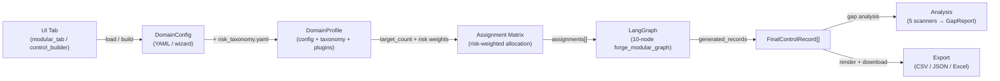
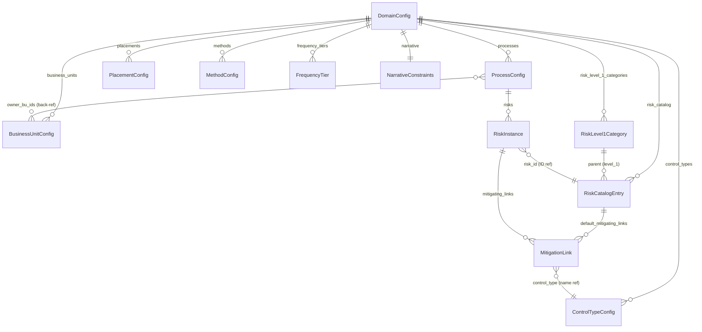
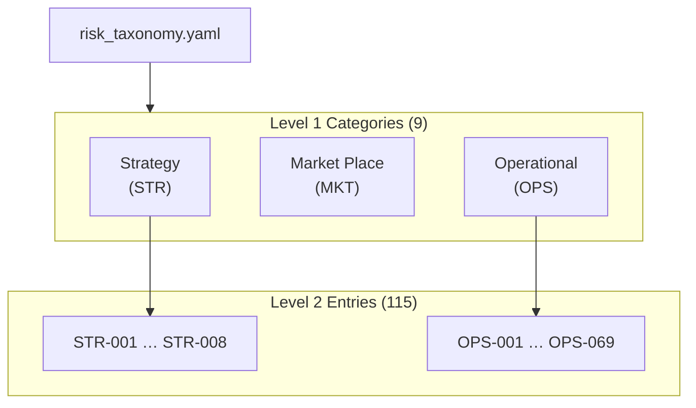
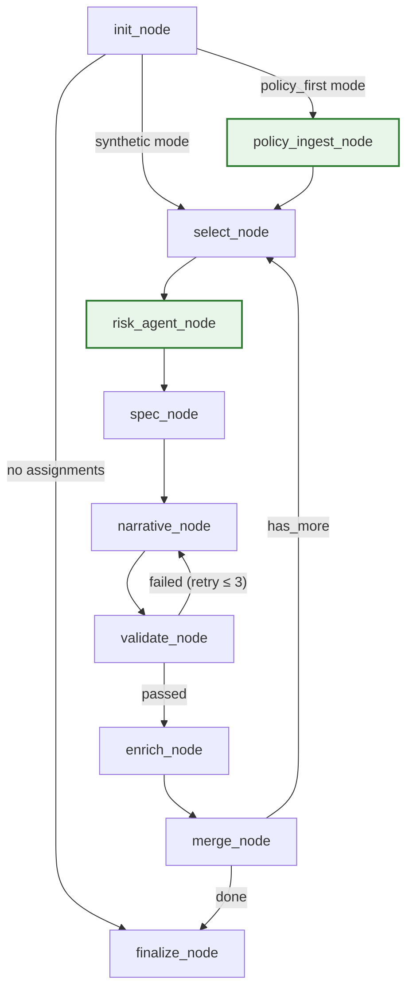
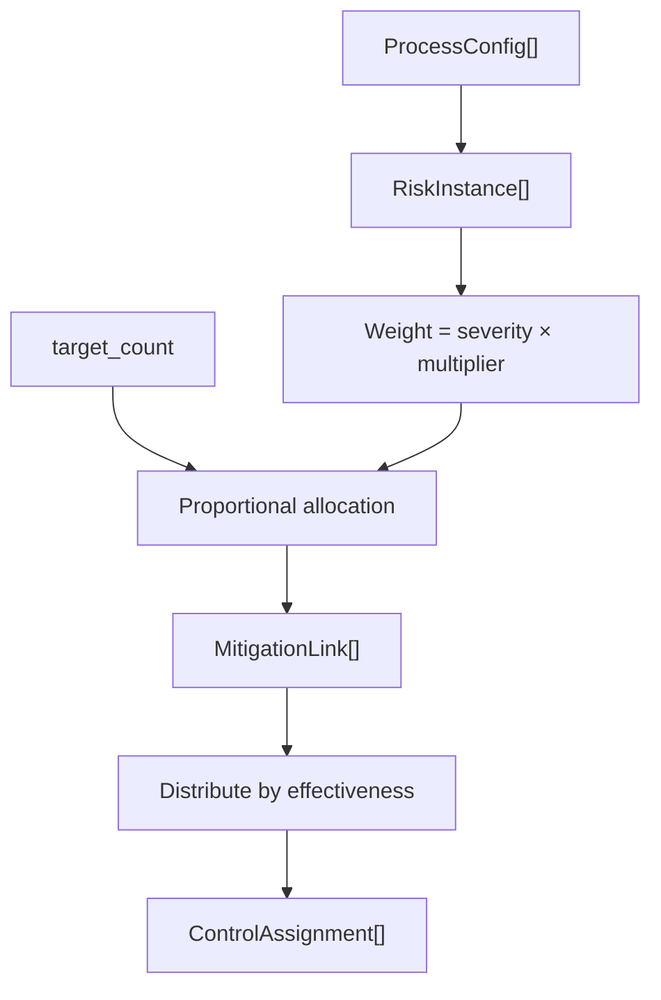
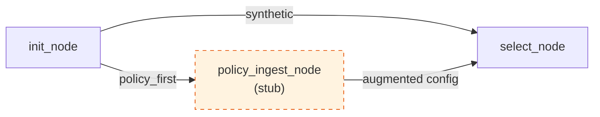

# ControlNexus Architecture — v3.0

> **Version 3.0** — Implemented state after the BU → Process → Risk → Control pivot.
>
> | Version | Document | Status |
> |---------|----------|--------|
> | v1 | [Architecture.md](Architecture.md) | Original system overview (ASCII art) |
> | v2 | [control-builder-architecture.md](control-builder-architecture.md) | Pivot blueprint / As-Is → To-Be plan |
> | **v3** | **This document** | **Implemented reality (481 tests green)** |
>
> **Mermaid diagrams**: [docs/architecture-v3-diagrams.md](docs/architecture-v3-diagrams.md)

---

## Table of Contents

1. [What Changed from v2](#1-what-changed-from-v2)
2. [System Overview](#2-system-overview)
3. [Entity Model — DomainConfig v3](#3-entity-model--domainconfig-v3)
4. [Two-Tier Risk Taxonomy](#4-two-tier-risk-taxonomy)
5. [ForgeState (Runtime)](#5-forgestate-runtime)
6. [Graph Topology — 10 Nodes](#6-graph-topology--10-nodes)
7. [Agent Roster](#7-agent-roster)
8. [Tool Belt](#8-tool-belt)
9. [Assignment Matrix — Risk-Weighted Allocation](#9-assignment-matrix--risk-weighted-allocation)
10. [DomainProfile Packaging](#10-domainprofile-packaging)
11. [Generation Modes](#11-generation-modes)
12. [Analysis Pipeline — 5 Scanners](#12-analysis-pipeline--5-scanners)
13. [Configuration Loading](#13-configuration-loading)
14. [UI Surface](#14-ui-surface)
15. [Export Layer](#15-export-layer)
16. [Test Coverage](#16-test-coverage)
17. [File Map](#17-file-map)

---

## 1. What Changed from v2

The v2 document described the *planned* pivot. v3 is the *implemented* reality. Key additions beyond the v2 blueprint:

| Feature | v2 (blueprint) | v3 (implemented) |
|---------|----------------|-------------------|
| RiskCatalogEntry | Two-tier (level_1, sub_group) | Same, plus `level_1_code`, `default_mitigating_links`, `grounding` |
| MitigationLink | Planned | Full model with `effectiveness` weighting and `line_of_defense` |
| ResolvedRisk | Not specified | Concrete model linking catalog entry → instance → selected control type |
| RiskLevel1Category | Not specified | Top-level category model with `code`, `definition`, `grounding`, `sub_groups` |
| ProcessConfig.domain_metadata | `apqc_section_id` only | Generic `domain_metadata: dict` replacing `apqc_section_id` |
| ProcessConfig.hierarchy_id | Numeric only (e.g. "1.2") | Any string (e.g. "AC.1", "HE.2") for non-banking domains |
| BusinessUnitConfig.processes | Not computed | Dynamically computed via `owner_bu_ids` back-reference |
| DomainProfile | Not specified | Full packaging: config + taxonomy + keywords + prompts + builder |
| DomainProfileRegistry | Not specified | Discovery and loading from directory layout |
| ControlIdBuilder | Not specified | Protocol + DefaultControlIdBuilder for domain-specific ID generation |
| PolicyIngestionAgent | Not specified | Stub agent for policy-first extraction mode |
| generation_mode | Not specified | Synthetic vs policy_first mode routing in ForgeState |
| risk_coverage_scan | Not specified | 5th scanner: identifies under-covered risks by severity |
| Graph nodes | 9 (planned) | 10 (policy_ingest_node added) |
| Healthcare profile | Not specified | Proves domain-agnosticism (`healthcare_demo.yaml`) |
| Risk taxonomy YAML | Not specified | 1956-line file: 9 L1 categories, 115 L2 entries |
| Backward compatibility | Aspirational | Implemented via model validators for all legacy field names |
| Test count | ~441 | **481** |

---

## 2. System Overview



**Data flow**: User configures a domain (banking, healthcare, etc.) via YAML or the wizard tab. The loader merges the base config with a sibling risk taxonomy. An assignment matrix allocates target controls proportionally across (process, risk) pairs, weighted by severity × multiplier. The LangGraph walks each assignment through 10 nodes to produce `FinalControlRecord` objects. Downstream scanners identify gaps; exporters render output.

---

## 3. Entity Model — DomainConfig v3

The `DomainConfig` Pydantic model is the single source of truth for any domain.

### 3.1 Core Entities

| Entity | Key Fields | Purpose |
|--------|-----------|---------|
| `DomainConfig` | `name`, `description`, `quality_ratings` | Top-level container |
| `ControlTypeConfig` | `name`, `code`, `definition`, `min_frequency_tier`, `placement_categories`, `evidence_criteria` | Type taxonomy (Detective, Preventive, etc.) |
| `BusinessUnitConfig` | `id`, `name`, `regulatory_exposure` | Organizational unit, processes computed from back-refs |
| `ProcessConfig` | `id`, `name`, `domain`, `hierarchy_id`, `domain_metadata`, `owner_bu_ids`, `risks[]`, `registry`, `exemplars[]` | Central join: process → risks → controls |
| `RiskLevel1Category` | `name`, `code`, `definition`, `grounding`, `sub_groups` | Top-level risk grouping (9 categories) |
| `RiskCatalogEntry` | `id`, `name`, `level_1`, `level_1_code`, `sub_group`, `default_severity`, `description`, `grounding`, `default_mitigating_links[]` | The 115-entry risk dictionary |
| `RiskInstance` | `risk_id`, `severity`, `multiplier`, `rationale`, `source_policy_clause`, `mitigating_links[]` | A risk *as used* in a specific process |
| `MitigationLink` | `control_type`, `effectiveness`, `line_of_defense` | How a control type mitigates a risk |
| `ResolvedRisk` | `risk_id`, `risk_name`, `level_1`, `sub_group`, `severity`, `multiplier`, `selected_control_type` | Fully resolved risk + catalog data for agent prompts |
| `PlacementConfig` | `id`, `name`, `description` | Where a control is placed |
| `MethodConfig` | `id`, `name`, `description` | How a control is executed |
| `FrequencyTier` | `name`, `description` | How often a control runs |
| `NarrativeConstraints` | `max_words`, `min_words`, `required_phrases`, `tone` | Guardrails for narrative generation |

### 3.2 Entity Diagram



### 3.3 Backward Compatibility

Model validators handle legacy field names transparently:

| Legacy Field | New Field | Validator |
|-------------|-----------|-----------|
| `apqc_section_id` | `domain_metadata["apqc_section_id"]` | `ProcessConfig._migrate_apqc` |
| `process_areas` | `processes` | `DomainConfig._migrate_process_areas` |
| Flat severity (no `multiplier`) | `multiplier=1.0` | `RiskInstance._default_multiplier` |

---

## 4. Two-Tier Risk Taxonomy

Loaded from `config/risk_taxonomy.yaml` (1956 lines) and auto-merged into `DomainConfig` by `load_domain_config()`.

### 4.1 Structure

| Tier | Count | Example |
|------|-------|---------|
| **Level 1** (categories) | 9 | STR (Strategy), OPS (Operational), CYB (Cyber) |
| **Level 2** (catalog entries) | 115 | OPS-042 (Vendor Lock-In Risk), CYB-003 (Ransomware Exposure) |
| **Sub-groups** (within L1) | Variable | OPS has 9: Transaction Ops, Fraud & Fiduciary, Technology & Infrastructure, … |

### 4.2 L1 Categories

| Code | Name | L2 Count |
|------|------|----------|
| STR | Strategy | 8 |
| MKT | Market Place | 4 |
| REP | Reputation | 3 |
| RCO | Regulatory Compliance | 8 |
| CYB | Cyber | 6 |
| FMK | Financial Markets | 7 |
| CRD | Credit | 5 |
| TAL | Talent | 5 |
| OPS | Operational | 69 |

### 4.3 Taxonomy Diagram



---

## 5. ForgeState (Runtime)

`ForgeState` is the `TypedDict` passed through the LangGraph. Key v3 additions highlighted:

| Field | Type | v3 Change |
|-------|------|-----------|
| `generation_mode` | `str` | **NEW** — "synthetic" (default) or "policy_first" |
| `policy_risks` | `list[dict]` | **NEW** — risks extracted from policy documents |
| `policy_processes` | `list[dict]` | **NEW** — processes inferred from policy documents |
| `domain_config` | `dict` | Now includes risk taxonomy, L1 categories, mitigating links |
| `current_risk` | `dict` | Now a `ResolvedRisk`-shaped dict (catalog + instance merged) |
| `distribution_config` | `dict` | Added risk-weighted allocation params |
| `target_count` | `int` | Drives assignment matrix sizing |
| `current_idx` | `int` | Index into assignments[] |
| `retry_count` | `int` | Validation retry counter (max 3) |
| `retry_appendix` | `str` | Feedback from failed validation |
| `generated_records` | `list[dict]` | Reducer: append-only accumulation |
| `plan_payload` | `dict` | Finalize-node output for export |

---

## 6. Graph Topology — 10 Nodes



### 6.1 Node Responsibilities

| Node | Agent | Key Logic |
|------|-------|-----------|
| `init_node` | — | Load config, build assignment matrix, set generation_mode |
| `policy_ingest_node` | `PolicyIngestionAgent` | Extract risks/processes from policy docs (stub) |
| `select_node` | — | Pick `assignments[current_idx]`, increment index |
| `risk_agent_node` | `RiskAgent` | Catalog lookup → `ResolvedRisk` with L1/sub_group context |
| `spec_node` | `SpecAgent` | Deterministic or LLM: placement, method, hierarchy |
| `narrative_node` | `NarrativeAgent` | Deterministic or LLM: who, what, when, where, why |
| `validate_node` | — | 6-rule validation; retry up to 3× |
| `enrich_node` | `EnricherAgent` | Quality rating, evidence, adversarial rationale |
| `merge_node` | — | Merge spec + narrative + enrichment → append FinalControlRecord |
| `finalize_node` | — | Build plan_payload for export |

### 6.2 Conditional Routing

| Edge | Condition | Implementation |
|------|-----------|----------------|
| `init → select` | `generation_mode == "synthetic"` | `_after_init()` router |
| `init → policy_ingest` | `generation_mode == "policy_first"` | `_after_init()` router |
| `init → finalize` | No assignments produced | `_after_init()` router |
| `validate → narrative` | Validation failed, `retry_count ≤ 3` | `_after_validate()` router |
| `validate → enrich` | Validation passed | `_after_validate()` router |
| `merge → select` | `current_idx < len(assignments)` | `_after_merge()` router |
| `merge → finalize` | All assignments processed | `_after_merge()` router |

---

## 7. Agent Roster

| Agent | Module | Role | v3 Change |
|-------|--------|------|-----------|
| `PolicyIngestionAgent` | `agents/policy_ingestion.py` | Extract risks/processes from policy documents | **NEW** (stub) |
| `RiskAgent` | `agents/risk.py` | Resolve risk instance → catalog; build ResolvedRisk | Enhanced: two-tier catalog, L1 context |
| `SpecAgent` | `agents/spec.py` | Generate control specification fields | Enhanced: domain_metadata, hierarchy_id |
| `NarrativeAgent` | `agents/narrative.py` | Generate 5W narrative from locked spec | Unchanged |
| `EnricherAgent` | `agents/enricher.py` | Quality rating, evidence, rationale | Unchanged |
| `ConfigProposerAgent` | `agents/config_proposer.py` | Wizard: suggest processes and risks | Enhanced: uses MitigationLink defaults |
| `DifferentiationAgent` | `agents/differentiator.py` | Ensure controls are distinct | Unchanged |
| `AdversarialReviewer` | `agents/adversarial.py` | Challenge control quality | Unchanged |

---

## 8. Tool Belt

All tools are LangChain `@tool` functions in `src/controlnexus/tools/`.

| Tool | File | Reads From |
|------|------|-----------|
| `taxonomy_validator` | `domain_tools.py` | `ControlTypeConfig[]` |
| `regulatory_lookup` | `domain_tools.py` | `RegistryConfig` |
| `hierarchy_search` | `domain_tools.py` | `ProcessConfig[]` |
| `frequency_lookup` | `domain_tools.py` | `FrequencyTier[]` |
| `placement_lookup` | `domain_tools.py` | `PlacementConfig[]` |
| `method_lookup` | `domain_tools.py` | `MethodConfig[]` |
| `evidence_rules_lookup` | `domain_tools.py` | `ControlTypeConfig.evidence_criteria` |
| `exemplar_lookup` | `domain_tools.py` | `ExemplarConfig[]` |
| `risk_catalog_lookup` | `domain_tools.py` | `RiskCatalogEntry[]` |
| `memory_retrieval` | `memory_tools.py` | `ChromaDB` |

---

## 9. Assignment Matrix — Risk-Weighted Allocation

The assignment matrix converts `(target_count, processes, risk_catalog)` into a flat list of `ControlAssignment` dicts.

### 9.1 Algorithm

1. Collect all `(process, risk_instance)` pairs.
2. Compute weight for each pair: `severity × multiplier`.
3. Allocate `target_count` proportionally across pairs (Huntington-Hill rounding).
4. For each pair's allocation, distribute across control types using `MitigationLink.effectiveness` weights.
5. Cycle `owner_bu_ids` to assign business unit ownership.

### 9.2 Diagram



---

## 10. DomainProfile Packaging

`DomainProfile` (in `core/domain_profile.py`) bundles everything the engine needs for a single domain.

### 10.1 Components

| Component | Source | Purpose |
|-----------|--------|---------|
| `DomainConfig` | `domain_config.yaml` | Entity model |
| Risk taxonomy | `risk_taxonomy.yaml` | Auto-merged into DomainConfig |
| `regulatory_keywords` | `regulatory_keywords.yaml` | Domain-specific vocabulary |
| `prompt_fragments` | `prompts/*.txt` | Domain-tuned prompt snippets |
| `ControlIdBuilder` | Protocol implementation | Domain-specific ID format |

### 10.2 DomainProfileRegistry

```python
registry = DomainProfileRegistry(base_dir=Path("domains"))
profile = registry.get("banking")
builder = registry.get_builder("banking")
```

Discovers profiles from a conventional directory layout:

```
domains/
  banking/
    domain_config.yaml
    risk_taxonomy.yaml
    regulatory_keywords.yaml
    prompts/
      spec_context.txt
      narrative_style.txt
  healthcare/
    domain_config.yaml
    ...
```

### 10.3 ControlIdBuilder Protocol

```python
@runtime_checkable
class ControlIdBuilder(Protocol):
    def build_id(self, hierarchy_id: str, type_code: str, sequence: int) -> str: ...

class DefaultControlIdBuilder:
    # Format: CTRL-{L1:02d}{L2:02d}-{TypeCode}-{Seq:03d}
    def build_id(self, hierarchy_id, type_code, sequence):
        ...
```

### 10.4 Proving Domain-Agnosticism — Healthcare

`config/profiles/healthcare_demo.yaml` demonstrates a non-banking domain:

- Process hierarchy uses string IDs: `AC.1`, `AT.1`, `CR.1`, `IR.1`
- `domain_metadata` replaces `apqc_section_id`
- Risk catalog references healthcare-specific risks
- Different control type emphasis (Access Control, Audit Trail, Clinical Review, Incident Reporting)

---

## 11. Generation Modes

| Mode | ForgeState field | Routing | Status |
|------|-----------------|---------|--------|
| `synthetic` (default) | `generation_mode="synthetic"` | init → select → … | Fully implemented |
| `policy_first` | `generation_mode="policy_first"` | init → policy_ingest → select → … | Stub (agent returns empty) |

### 11.1 Policy-First Flow



`PolicyIngestionAgent` will parse uploaded policy documents to extract risks and processes, injecting them into `ForgeState.policy_risks` and `ForgeState.policy_processes` before the standard generation loop.

---

## 12. Analysis Pipeline — 5 Scanners

All scanners live in `src/controlnexus/analysis/scanners.py`.

| Scanner | Input | Output | v3 Change |
|---------|-------|--------|-----------|
| `regulatory_coverage_scan` | records + section profiles | `RegulatoryGap[]` | Unchanged |
| `ecosystem_balance_analysis` | records + section profiles | `BalanceGap[]` | Unchanged |
| `frequency_coherence_scan` | records + section profiles | `FrequencyIssue[]` | Unchanged |
| `evidence_sufficiency_scan` | records + section profiles | `EvidenceIssue[]` | Unchanged |
| `risk_coverage_scan` | records + domain_config | `RiskCoverageGap[]` | **NEW** |

### 12.1 risk_coverage_scan

Identifies risks in the catalog that are under-covered relative to their severity. Returns `RiskCoverageGap` objects with:

- `risk_id`, `risk_name`, `level_1`, `sub_group`
- `severity`, `expected_controls`, `actual_controls`
- `gap_ratio` (1.0 = completely uncovered)

---

## 13. Configuration Loading

### 13.1 load_domain_config()

```python
config = load_domain_config(Path("config/profiles/banking_standard.yaml"))
```

1. Load the base YAML file → parse into `DomainConfig`.
2. Check for a sibling `risk_taxonomy.yaml`.
3. If found, merge `risk_level_1_categories` and extend `risk_catalog`.
4. Model validators handle legacy field migrations transparently.

### 13.2 YAML Files

| File | Purpose | Lines |
|------|---------|-------|
| `config/profiles/banking_standard.yaml` | Primary banking domain | — |
| `config/profiles/community_bank_demo.yaml` | Simplified demo | — |
| `config/profiles/healthcare_demo.yaml` | Healthcare proof | — |
| `config/risk_taxonomy.yaml` | Two-tier risk taxonomy | 1956 |
| `config/standards.yaml` | Regulatory standards | — |
| `config/taxonomy.yaml` | Control type taxonomy | — |
| `config/placement_methods.yaml` | Placement/method lookup | — |

---

## 14. UI Surface

`src/controlnexus/ui/modular_tab.py` — Streamlit-based forge tab.

### 14.1 v3 Additions

| Widget | Function | v3 Change |
|--------|----------|-----------|
| Generation mode radio | Toggle between synthetic / policy_first | **NEW** |
| Profile summary panel | Shows risk taxonomy metrics (L1 count, L2 count, process count) | **NEW** |
| Config path selector | Dropdown of available YAML profiles | Unchanged |
| Target count slider | Sets `target_count` | Unchanged |
| Section/process filter | Filter scope of generation | Unchanged |

---

## 15. Export Layer

`src/controlnexus/export/` — Renders `FinalControlRecord[]` to output formats.

| Format | File | Status |
|--------|------|--------|
| JSON | `json_exporter.py` | Implemented |
| CSV | `csv_exporter.py` | Implemented |
| Excel | `excel_exporter.py` | Implemented |

---

## 16. Test Coverage

**481 tests** across 22 test files:

| File | Focus |
|------|-------|
| `test_domain_config.py` | DomainConfig parsing, validators, backward compat |
| `test_domain_tools.py` | All 10 domain tools |
| `test_forge_modular_graph.py` | Graph topology, conditional routing, mode switching |
| `test_agents.py` | Agent invocations (spec, narrative, enricher) |
| `test_config_proposer.py` | ConfigProposerAgent suggestions |
| `test_scanners.py` | All 5 scanners including risk_coverage_scan |
| `test_models.py` | Pydantic model serialization |
| `test_validator.py` | 6-rule validation logic |
| `test_remediation.py` | Remediation workflows |
| `test_memory.py` | ChromaDB memory |
| `test_export.py` | All export formats |
| `test_pipeline.py` | End-to-end pipeline |
| `test_e2e.py` | Full integration |
| … | (10 additional test files) |

---

## 17. File Map

```
src/controlnexus/
├── core/
│   ├── domain_config.py       # DomainConfig + all entity models + load_domain_config()
│   ├── domain_profile.py      # DomainProfile, DomainProfileRegistry, ControlIdBuilder
│   ├── models.py              # FinalControlRecord, ControlAssignment
│   └── state.py               # ForgeState TypedDict, RiskCoverageGap
├── agents/
│   ├── base.py                # BaseAgent
│   ├── risk.py                # RiskAgent (catalog resolution → ResolvedRisk)
│   ├── spec.py                # SpecAgent (placement, method, hierarchy)
│   ├── narrative.py           # NarrativeAgent (5W narrative)
│   ├── enricher.py            # EnricherAgent (quality, evidence)
│   ├── policy_ingestion.py    # PolicyIngestionAgent (stub)
│   ├── config_proposer.py     # ConfigProposerAgent (wizard)
│   ├── differentiator.py      # DifferentiationAgent
│   └── adversarial.py         # AdversarialReviewer
├── graphs/
│   └── forge_modular_graph.py # 10-node LangGraph + routing functions
├── tools/
│   ├── domain_tools.py        # 9 domain-specific @tool functions
│   └── memory_tools.py        # memory_retrieval @tool
├── analysis/
│   └── scanners.py            # 5 scanners → GapReport
├── validation/                # 6-rule validator
├── export/                    # JSON, CSV, Excel exporters
├── memory/                    # ChromaDB integration
├── ui/
│   └── modular_tab.py         # Streamlit forge tab + mode toggle + profile panel
├── hierarchy/                 # Hierarchy navigation utilities
├── pipeline/                  # Orchestration pipeline
└── remediation/               # Remediation workflows

config/
├── profiles/
│   ├── banking_standard.yaml
│   ├── community_bank_demo.yaml
│   └── healthcare_demo.yaml
├── risk_taxonomy.yaml          # 1956 lines: 9 L1, 115 L2
├── standards.yaml
├── taxonomy.yaml
├── placement_methods.yaml
└── sections/                   # Section configs (1–13)
```

---

*Generated for ControlNexus v3.0 — 481 tests green.*
