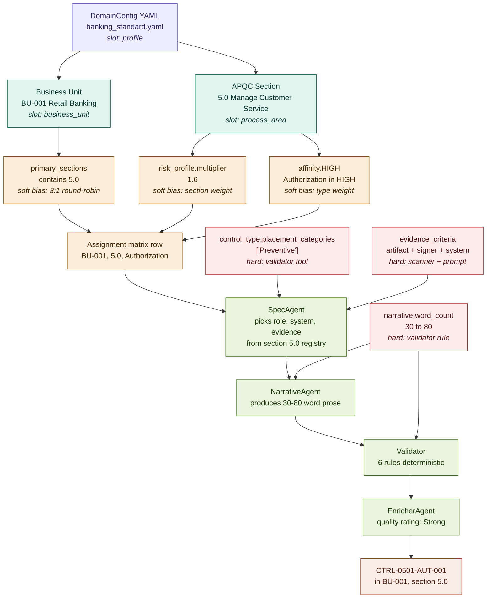
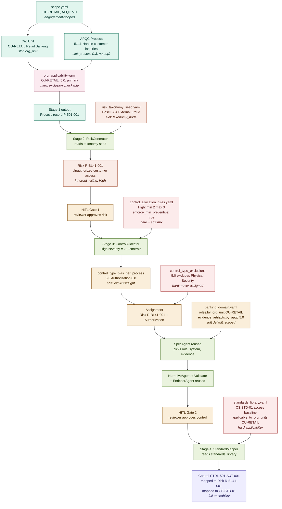

# Parameter Walkthrough — Current ControlNexus vs. New CTB System

> A single concrete example traced through both systems, with every parameter slot labeled and the full menu of options listed below.
>
> **Example used throughout:** Generate one control for the Retail Banking org unit, for customer-service-related work. In ControlNexus this corresponds to APQC section 5.0; in the CTB system this corresponds to process 5.1.1 under OU-RETAIL. The same institutional reality, two different decompositions.

---

## Part 1 — The Two Walkthroughs, Side by Side

Each walkthrough shows the same concrete outcome — a single Authorization control — arriving through different parameter paths. Solid boxes are parameter *slots*. The text inside each box is the specific value chosen for this example.

### 1.1 Current ControlNexus walkthrough

**What this shows:** The allocation to `5.0` happens because the `multiplier` biased this section (1.6 relative to others) and `primary_sections` biased Retail Banking as the BU. The type became Authorization because `affinity.HIGH` listed it. Every relationship between BU and section is a weighting, not a rule — which is why a non-primary BU could still receive this assignment, just less often.

### 1.2 New CTB System walkthrough

**What this shows:** OrgUnit → Process is a hard applicability check (pink box P), not a soft weighting. Risk is a first-class entity generated explicitly (not derived from a section attribute). Control count comes from risk severity × allocation rules (not section multiplier). Standards mapping is a separate stage with its own applicability check. Two HITL gates sit on the critical path.

### 1.3 The core shift, in one sentence

Current ControlNexus decides *BU-to-section fit* through a soft 3:1 weighted round-robin on `primary_sections`; the new CTB system decides *OrgUnit-to-process applicability* through an explicit three-state matrix (primary / secondary / excluded), with soft weights applied only within the legal set.

---

## Part 2 — Parameter Legend

What each slot in the walkthroughs actually represents.

### 2.1 Current ControlNexus slots

| Slot | Source YAML field | Restriction class | Enforced by |
|---|---|---|---|
| profile | `config/profiles/*.yaml` | Structural | File selection at startup |
| business_unit | `BusinessUnitConfig.id` | Structural | `model_validator` cross-ref |
| process_area | `ProcessAreaConfig.id` | Structural | `model_validator` cross-ref |
| business_unit × process_area fit | `BU.primary_sections` | Soft bias | `_build_bu_cycles()` 3:1 weighting |
| section allocation weight | `risk_profile.multiplier` | Soft bias | `_build_section_allocation()` |
| control type preference | `affinity.HIGH/MEDIUM/LOW/NONE` | Soft bias | assignment matrix weighting |
| control type placement | `control_type.placement_categories` | Hard runtime | `taxonomy_validator` tool |
| evidence shape | `control_type.evidence_criteria` | Hard runtime | scanner + SpecAgent prompt |
| narrative length | `narrative.word_count_min/max` | Hard runtime | `validator.py` rule |
| spec-narrative consistency | (implicit in SpecAgent contract) | Hard runtime | SPEC_MISMATCH validator rule |
| vocabulary pool | `ProcessArea.registry.*` | Soft default | deterministic builder cycles index |
| style anchor | `ProcessArea.exemplars` | Soft bias | NarrativeAgent prompt + tool |

### 2.2 New CTB system slots

| Slot | Source YAML field | Restriction class | Enforced by |
|---|---|---|---|
| engagement | `engagement.yaml` | Structural | app bootstrap |
| org_unit | `scope.yaml.org_units[].id` | Structural | `model_validator` cross-ref |
| apqc_scope_entry | `scope.yaml.apqc_scope[].apqc_id` | Structural | `model_validator` cross-ref |
| process | generated Stage 1, persisted | Structural | SQLite primary key |
| org-to-process applicability | `org_applicability.yaml.status` | **Hard** (excluded blocks) | Stage 1 generator skip |
| applicability weight | `org_applicability.yaml.weight` | Soft bias | Stage 1 process count |
| risk taxonomy node | `risk_taxonomy_seed.yaml` | Structural | Stage 2 agent reads seed |
| risk inherent rating | Per-Risk field (runtime, reviewer-editable) | Hard for Stage 3 allocation | controls count rule |
| control count rule | `control_allocation_rules.severity_to_control_count` | Hard | Stage 3 allocator |
| preventive minimum | `control_allocation_rules.enforce_min_preventive` | Hard | Stage 3 allocator |
| control type bias per process | `control_allocation_rules.control_type_bias_per_process` | Soft bias | Stage 3 allocator |
| control type exclusion per process | `control_allocation_rules.control_type_exclusions_per_process` | **Hard** | Stage 3 allocator skip |
| vocabulary by org unit | `banking_domain.yaml.roles.by_org_unit` | Soft default | SpecAgent prompt |
| vocabulary by apqc | `banking_domain.yaml.evidence_artifacts.by_apqc` | Soft default | SpecAgent prompt |
| narrative rules | `narrative_standards.yaml` | Hard (carried over) | Validator reused from ControlNexus |
| standards applicability | `standards_library.yaml.applicable_to_org_units` + `applicable_to_apqc` | **Hard** | Stage 4 mapper skip |
| mapping hints | `standards_library.yaml.mapping_hints` | Soft bias | Stage 4 mapper prompt |

---

## Part 3 — Option Keys

The full menu of what could have gone in each slot of the walkthrough. This is what your boss will want to scan to understand the cardinality of the system.

### 3.1 Business Units — current ControlNexus (17 total)

| ID | Name | Primary sections | Key control types |
|---|---|---|---|
| BU-001 | Retail Banking | 5.0, 6.0, 9.0 | Authorization, Reconciliation, Exception Reporting |
| BU-002 | Commercial Banking | 4.0, 5.0, 9.0 | Authorization, Verification & Validation, Reconciliation |
| BU-003 | Wealth Management | 4.0, 5.0, 11.0 | Authorization, Segregation of Duties, Reconciliation |
| BU-004 | Investment Banking | 4.0, 11.0 | Authorization, Segregation of Duties, Risk Escalation |
| BU-005 | Treasury | 4.0 | Reconciliation, Authorization, Verification & Validation |
| BU-006 | Capital Markets | 4.0, 11.0 | Segregation of Duties, Reconciliation, Risk Escalation |
| BU-007 | Risk Management | 11.0 | Risk Escalation Processes, Verification & Validation |
| BU-008 | Compliance | 11.0 | Policy Acknowledgment, Training Completion, Audit Trail |
| BU-009 | Internal Audit | 11.0 | Verification & Validation, Audit Trail Logging |
| BU-010 | Information Technology | 8.0 | Access Control, Change Management, Audit Trail |
| BU-011 | Cybersecurity | 8.0, 11.0 | Access Control, Exception Reporting, Incident Response |
| BU-012 | Operations | 6.0, 7.0, 9.0 | Reconciliation, Exception Reporting, Document Management |
| BU-013 | Human Resources | 10.0 | Segregation of Duties, Training Completion, Document Mgmt |
| BU-014 | Finance | 7.0 | Reconciliation, Authorization, Verification & Validation |
| BU-015 | Legal | 11.0 | Document Management, Policy Acknowledgment |
| BU-016 | Vendor Management | 2.0, 6.0 | Authorization, Verification & Validation, Doc Mgmt |
| BU-017 | Program Management | all | varies |

*In the walkthrough we used BU-001. The allocation chose BU-001 because section 5.0 is in its primary_sections list. BU-002 and BU-003 also have 5.0 as primary, so they would have been candidates in a different control within this run.*

### 3.2 Organizational Units — new CTB system (illustrative set for CTB)

| ID | Name | Assessment unit type | Domains | Regulatory jurisdictions |
|---|---|---|---|---|
| OU-RETAIL | Retail Banking | assessment_unit | deposit, lending, branch_ops | OSFI, FCAC |
| OU-COMMERCIAL | Commercial Banking | assessment_unit | lending, trade_finance | OSFI |
| OU-TREASURY | Treasury | assessment_unit | liquidity, funding | OSFI |
| OU-CYBER | Cybersecurity | assessment_unit | access_mgmt, threat_detection, vuln_mgmt | OSFI B-13 |
| OU-IT | Information Technology | supporting_unit | infrastructure, app_dev | OSFI B-13 |
| OU-COMPLIANCE | Compliance | supporting_unit | AML, regulatory_reporting | OSFI, FINTRAC |
| OU-RISK | Risk Management | supporting_unit | ORM, market_risk, credit_risk | OSFI |
| OU-AUDIT | Internal Audit | supporting_unit | all | OSFI |

*In the walkthrough we used OU-RETAIL. Note this list is shorter and cleaner than the BU list — CTB-specific and engagement-scoped. It also splits org units into assessment vs. supporting rather than grouping everything under "business unit."*

### 3.3 APQC Top-Level Sections (13 total, used in both)

| ID | Name | Current multiplier | In-scope for CTB |
|---|---|---|---|
| 1.0 | Develop Vision and Strategy | 1.2 | typically out of scope |
| 2.0 | Develop and Manage Products and Services | 1.8 | yes |
| 3.0 | Market and Sell Products and Services | 1.4 | yes |
| 4.0 | Deliver Physical Products | 1.6 | depends |
| 5.0 | Manage Customer Service | 1.6 | yes |
| 6.0 | Develop and Manage Human Capital | 1.4 | yes |
| 7.0 | Manage Information Technology | 2.4 | yes |
| 8.0 | Manage Financial Resources | 2.2 | yes |
| 9.0 | Acquire, Construct, and Manage Assets | 1.4 | depends |
| 10.0 | Manage Enterprise Risk, Compliance, Remediation, and Resilience | 3.0 | yes |
| 11.0 | Manage External Relationships | 2.2 | yes |
| 12.0 | Develop and Manage Business Capabilities | 1.4 | depends |
| 13.0 | Manage Knowledge, Improvement, and Change | 1.2 | optional |

*In the walkthrough we used 5.0. The CTB system goes one level deeper — 5.1 (customer service strategy), 5.2 (plan and manage customer service), 5.3 (measure and evaluate customer service). Process 5.1.1 was used in the example.*

### 3.4 Control Types — 25 total in current ControlNexus

| Name | Code | Min frequency | Placement |
|---|---|---|---|
| Authorization | AUT | Quarterly | Preventive |
| Reconciliation | REC | Monthly | Detective |
| Segregation of Duties | SOD | Quarterly | Preventive |
| Exception Reporting | EXR | Monthly | Detective |
| Verification and Validation | V&V | Quarterly | Preventive/Detective |
| Document Management | DOC | Annual | Preventive |
| Audit Trail Logging | ATL | Daily | Detective |
| Access Control | AC | Quarterly | Preventive |
| Change Management | CM | Quarterly | Preventive |
| Policy Acknowledgment | PA | Annual | Preventive |
| Training Completion | TC | Annual | Preventive |
| Risk Escalation Processes | RE | Quarterly | Detective |
| Incident Response | IR | Quarterly | Contingency |
| Business Continuity | BC | Annual | Contingency |
| Disaster Recovery | DR | Annual | Contingency |
| Vendor Due Diligence | VDD | Annual | Preventive |
| Data Quality | DQ | Monthly | Detective |
| Performance Monitoring | PM | Monthly | Detective |
| Compliance Monitoring | CMO | Monthly | Detective |
| Fraud Detection | FD | Monthly | Detective |
| Key Indicator Monitoring | KIM | Monthly | Detective |
| Model Risk Management | MRM | Quarterly | Preventive |
| Physical Security | PS | Quarterly | Preventive |
| Information Security | IS | Quarterly | Preventive |
| Third-Party Risk | TPR | Quarterly | Preventive |

*In the walkthrough we used Authorization (AUT). It was selected because it's in affinity.HIGH for section 5.0. In the CTB system, the same type would be selected via `control_type_bias_per_process["5.0"]["Authorization"] = 0.8`, a numeric weight rather than a bucket.*

### 3.5 Placements (3)

| Name | Purpose |
|---|---|
| Preventive | Stops an issue before it occurs (approval, access restriction) |
| Detective | Identifies issues after they occur (reconciliation, monitoring) |
| Contingency Planning | Responds to events that have occurred (BCP, DR) |

### 3.6 Methods (3)

| Name | Purpose |
|---|---|
| Automated | System enforces without human intervention |
| Manual | Human performs the control |
| Automated with Manual Component | System flags, human reviews/approves |

### 3.7 Frequency Tiers (7)

| Label | Rank | Keywords |
|---|---|---|
| Daily | 0 | daily, end-of-day, COB, each day |
| Weekly | 1 | weekly, each week |
| Monthly | 2 | monthly, month-end, each month |
| Quarterly | 3 | quarterly, each quarter |
| Semi-Annual | 4 | semi-annual, bi-annual, twice a year |
| Annual | 5 | annual, yearly, each year |
| Other | 6 | event-driven, ad-hoc (only if justified) |

### 3.8 Quality Ratings (4)

| Name | Meaning |
|---|---|
| Strong | Exemplary; all 5W fields complete, specific, enforceable |
| Effective | Meets criteria; minor style improvements possible |
| Satisfactory | Acceptable; clear but not exemplary |
| Needs Improvement | Missing specificity; should be revised |

### 3.9 Affinity Buckets (4)

| Bucket | Expected % of controls in section | Current treatment | Proposed CTB treatment |
|---|---|---|---|
| HIGH | 40–100% | Soft bias (weighted) | Numeric weight 0.8–1.0 |
| MEDIUM | 20–40% | Soft bias | Numeric weight 0.4–0.7 |
| LOW | 5–20% | Soft bias | Numeric weight 0.1–0.3 |
| NONE | 0–5% | **Soft bias (misleading)** | **Promoted to hard exclusion** |

### 3.10 Risk Taxonomy Seeds — Basel Operational Risk (new to CTB)

| Basel ID | Name | Level |
|---|---|---|
| BL1 | Internal Fraud | 1 |
| BL1.1 | Unauthorized Activity | 2 |
| BL1.2 | Theft and Fraud | 2 |
| BL2 | External Fraud | 1 |
| BL2.1 | Theft and Fraud | 2 |
| BL2.2 | Systems Security | 2 |
| BL3 | Employment Practices and Workplace Safety | 1 |
| BL4 | Clients, Products, and Business Practices | 1 |
| BL4.1 | Suitability, Disclosure, Fiduciary | 2 |
| BL4.2 | Improper Business Practices | 2 |
| BL5 | Damage to Physical Assets | 1 |
| BL6 | Business Disruption and System Failures | 1 |
| BL7 | Execution, Delivery, and Process Management | 1 |

*In the walkthrough we used BL4.1 (Suitability, Disclosure, Fiduciary) — relevant to unauthorized customer access. The Mizuho-sourced seeds are mapped into these Basel categories at import time, so the Basel ID is what appears in deliverables.*

### 3.11 Applicability Status — new to CTB (3)

| Status | Behavior | Example use |
|---|---|---|
| primary | Full weight in allocation; OrgUnit is accountable | OU-RETAIL for 5.0 |
| secondary | Reduced weight; OrgUnit supports but doesn't own | OU-RETAIL for 8.0 |
| excluded | **Hard exclusion** — never assigned | OU-RETAIL for 10.0 (not applicable) |

### 3.12 Mapping Strength — new to CTB for Stage 4 (3)

| Strength | Meaning |
|---|---|
| Strong | Control directly implements the standard's intent |
| Partial | Control contributes to the standard but doesn't fully satisfy |
| Referential | Control references the standard but primary alignment is elsewhere |

