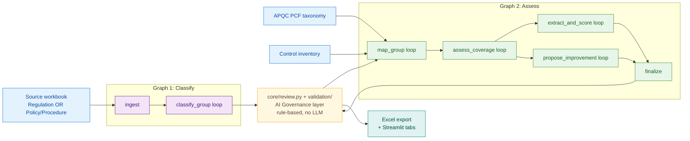

# regrisk -- Regulatory Obligation Control Mapper

> Two-graph LangGraph pipeline + Streamlit UI that maps regulatory
> obligations (or internal policies and procedures) to APQC business
> processes, assesses control coverage, proposes new controls for gaps,
> extracts and scores risks, and emits an AI-governance-stamped human-review queue.

## What problem this solves

Compliance teams routinely receive a regulation (or revise an internal
policy) and must answer four questions:

1. **What does each obligation actually require?** (Attestation, documentation, controls, awareness?)
2. **Which business processes does it touch?** (APQC PCF mapping)
3. **Is it covered by an existing control?** (Covered / Partial / Gap)
4. **What is the residual risk if uncovered?** (Impact x Frequency on a 4-point scale)

regrisk produces all four answers end-to-end and surfaces a "Needs
Review Queue" of items where a human still needs to look. It is an
LLM-driven pipeline (ICA or OpenAI) wrapped in an **AI Governance** layer
of rule-based software checks that validate every model output before it
is stamped, exported, or surfaced for review. It is intended for compliance
analysts, control owners, and the AI / data science engineers who
maintain the pipeline.

## Architecture

Two LangGraph state machines bridged via Streamlit `st.session_state`,
plus an **AI Governance** post-step that validates LLM output and stamps
human-review reasons on every artifact.



The full per-node diagram with every context fragment consulted by each
agent lives in [docs/architecture.mmd](docs/architecture.mmd).

ADRs for the non-obvious decisions:

- [0001 -- LangGraph orchestration with two graphs](docs/adr/0001-langgraph-orchestration.md)
- [0002 -- Config-driven agents](docs/adr/0002-config-driven-agents.md) *(superseded by 0006)*
- [0003 -- SQLite-backed tracing](docs/adr/0003-sqlite-tracing.md)
- [0004 -- AI Governance review layer as pure library](docs/adr/0004-ai-governance-review-layer.md)
- [0005 -- Checkpoint loading is the demo contract](docs/adr/0005-checkpoint-demo-loading-contract.md)
- [0006 -- LLM is required; AI Governance replaces deterministic fallbacks](docs/adr/0006-llm-required-and-ai-governance.md)

## Project structure

```
regrisk/
├── README.md
├── CHANGELOG.md
├── CONTRIBUTING.md
├── pyproject.toml
├── .env.example
├── config/
│   ├── default.yaml         # PipelineConfig: categories, scales, UI tabs
│   └── risk_taxonomy.json   # owner-managed risk taxonomy
├── data/                    # demo workbooks + checkpoints (gitignored)
│   ├── README.md
│   ├── APQC_Template.xlsx
│   ├── regulations yy.xlsx
│   ├── Control Dataset/
│   ├── checkpoints/         # preloadable demo states
│   └── traces.db            # local SQLite trace database
├── docs/
│   ├── architecture.mmd
│   ├── cleanup-audit.md
│   ├── EVALUATION_SYSTEM.md
│   └── adr/
├── scripts/                 # one-off + reusable utilities
│   ├── README.md
│   ├── fix_risk_dedup.py
│   ├── patch_checkpoint.py
│   └── ...
├── src/regrisk/
│   ├── agents/              # LLM agents (all require an LLM client)
│   ├── core/                # config, models, events, review, scoring, transport
│   ├── exceptions.py
│   ├── export/              # Excel writer
│   ├── graphs/              # classify_graph + assess_graph + state
│   ├── ingest/              # regulation, policy, APQC, control loaders
│   ├── tracing/             # SQLite TraceDB + decorators + transport wrapper
│   ├── ui/                  # Streamlit tabs
│   └── validation/
└── tests/
```

## Setup

Requires Python 3.11+.

```bash
python -m venv .venv
source .venv/bin/activate
pip install -e ".[dev]"

# Required: copy .env.example -> .env and provide an LLM key
# (ICA_API_KEY or OPENAI_API_KEY). The pipeline will refuse to launch
# without one -- see ADR 0006.
cp .env.example .env
```

## Run

```bash
python -m streamlit run src/regrisk/ui/app.py
```

The app opens at `http://localhost:8501`. Tabs visible by default are
controlled by `config.ui.visible_tabs` in [config/default.yaml](config/default.yaml).

### Demo dropdown

`Tab 1 -- Upload & Configure` includes a **"Resume from checkpoint"**
expander that lists every JSON file under `data/checkpoints/`. Selecting
one and clicking **Load** populates `st.session_state` with the full
pipeline output and renders every downstream tab without re-running the
agents. This is the canonical demo path -- nothing is auto-loaded at
startup. See [ADR 0005](docs/adr/0005-checkpoint-demo-loading-contract.md)
for the contract.

### Tests

```bash
python -m pytest tests/ -q
# -> 136 passed in ~3s; tests use a stub LLM client (tests/_stub_llm.py),
#    so no real API keys are required in CI.
```

## Demo walkthrough

Loading the most recent `Full_Assessment_*.json` (or any
`Improved_Patched_*.json`) checkpoint demonstrates, tab by tab:

1. **Upload & Configure** -- shows the source workbook, APQC taxonomy, and control inventory that produced the checkpoint, plus the scope filter that was applied.
2. **Classification Review** -- every obligation classified into category (Attestation / Documentation / Controls / General Awareness / Not Assigned), relationship type, and criticality tier. Rows flagged `needs_review` highlight in the table.
3. **Mapping Review** -- each obligation mapped to up to 5 APQC processes with confidence. Excessive-fanout flags surface here.
4. **Coverage** -- per-obligation coverage decision (Covered / Partial / Gap) joined with the candidate control. Partial coverage and pending-control-generation rows are flagged for review.
5. **Risk Register** -- 1-3 scored risks per gap with Impact x Frequency. Critical residual risks (Critical rating on uncovered obligations) are flagged.
6. **Traceability** -- per-obligation lineage from citation through APQC node, control, coverage decision, and risks.
7. **Evaluation** -- run history, per-run cost + quality, LLM call detail. Populated only by live pipeline runs; preloaded checkpoints do not carry traces (by design -- see [ADR 0003](docs/adr/0003-sqlite-tracing.md)).

## Extending regrisk

To add a new agent, follow the four-step pattern documented in
[CONTRIBUTING.md](CONTRIBUTING.md):

1. Subclass `BaseAgent` in `src/regrisk/agents/<your_agent>.py` and define its LLM prompt + response schema.
2. Register the class in the relevant graph's `_AGENT_CLASSES` dict.
3. Add a graph node function that uses `_infra.get_agent(...)` and emits `EventType` events.
4. Wire conditional edges and update state TypedDict if needed.
5. Add a `review_*` rule in `core/review.py` (the **AI Governance** layer) for any new output field that should be machine-checked before it reaches a human.

See [ADR 0006](docs/adr/0006-llm-required-and-ai-governance.md) for the rationale.

## Configuration

| Source | Purpose |
|---|---|
| Environment variables (`.env`) | LLM credentials only. See `.env.example`. |
| [config/default.yaml](config/default.yaml) | Domain knowledge: taxonomies, scoring scales, thresholds, UI tab visibility. Loaded into `PipelineConfig` (Pydantic). |
| [config/risk_taxonomy.json](config/risk_taxonomy.json) | Owner-managed risk taxonomy threaded into agents. |

## Known limitations

- The auto-load-on-startup helper `_load_demo_data()` exists in `ui/upload_tab.py` but is intentionally unwired -- users must click through the checkpoint dropdown to load demo data.
- Evaluation tab metrics require a **live** pipeline run; loading a preloaded checkpoint does not retroactively populate `data/traces.db`.
- No CI / pre-commit hooks (deliberately out of scope of the cleanup pass).
- Pinning in `pyproject.toml` is loose; production deployments should generate a lockfile.

## License

No license is currently declared. Decide before publishing.

---

For the full audit + architecture discovery that produced this cleanup
pass, see [docs/cleanup-audit.md](docs/cleanup-audit.md).
