# Control Builder Architecture — As-Is Reference & Pivot Blueprint

> **Scope**: ControlForge Modular tab (`src/controlnexus/ui/modular_tab.py`), the 5-step Control Builder wizard (`src/controlnexus/ui/control_builder.py`), and the 8-node LangGraph in `src/controlnexus/graphs/forge_modular_graph.py`.

---

## 1. Overview

The Control Builder is ControlNexus's primary control-generation pipeline. Users supply an organization-specific configuration (a `DomainConfig` YAML or one built interactively via the wizard), set a target control count, and trigger an 8-node LangGraph that allocates controls across APQC process areas, generates locked specifications via SpecAgent, converts them to 5W narrative prose via NarrativeAgent, validates against 6 deterministic rules, enriches with quality ratings via EnricherAgent, and exports the final records as CSV/JSON. The entire pipeline is config-driven: every role, system, evidence artifact, and control-type constraint comes from the `DomainConfig` knowledge base.

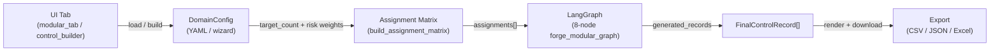

---

## 2. Entity Model (Data-First)

### 2.1 Pydantic ER Diagram

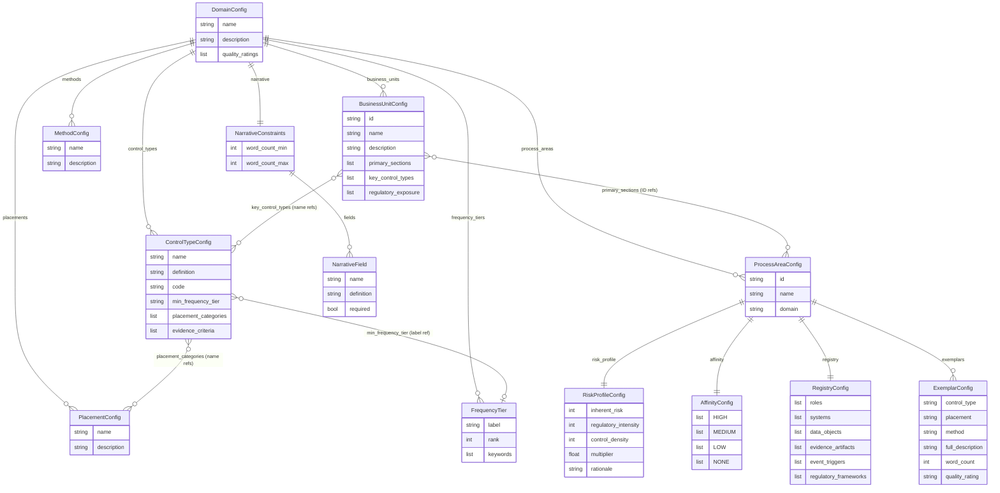

### 2.2 ForgeState (Runtime)

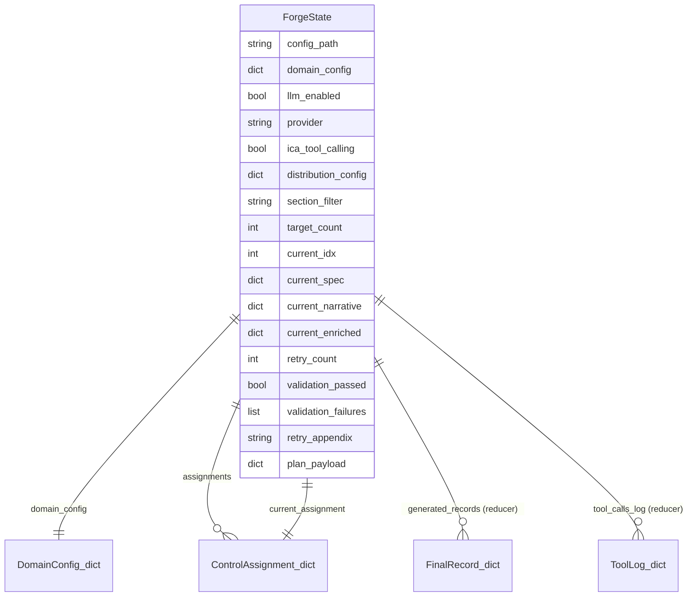

### 2.3 Cross-Reference Contracts (`DomainConfig._validate_cross_references`)

The `model_validator(mode="after")` on `DomainConfig` ([core/domain_config.py](src/controlnexus/core/domain_config.py#L255-L280)) enforces:

| Referencing Entity | Field | Must Exist In |
|---|---|---|
| `BusinessUnitConfig` | `key_control_types[*]` | `control_types[*].name` |
| `BusinessUnitConfig` | `primary_sections[*]` | `process_areas[*].id` (if `process_areas` is non-empty) |
| `ControlTypeConfig` | `placement_categories[*]` | `placements[*].name` |
| `ControlTypeConfig` | `min_frequency_tier` | `frequency_tiers[*].label` |
| `ProcessAreaConfig.affinity` | `HIGH/MEDIUM/LOW/NONE[*]` | `control_types[*].name` |

### 2.4 Entity → Owned-by → References

| Entity | Owned by | References |
|---|---|---|
| `DomainConfig` | (root) | — |
| `ControlTypeConfig` | `DomainConfig.control_types` | `PlacementConfig.name`, `FrequencyTier.label` |
| `BusinessUnitConfig` | `DomainConfig.business_units` | `ProcessAreaConfig.id`, `ControlTypeConfig.name` |
| `ProcessAreaConfig` | `DomainConfig.process_areas` | — |
| `RiskProfileConfig` | `ProcessAreaConfig.risk_profile` | — |
| `AffinityConfig` | `ProcessAreaConfig.affinity` | `ControlTypeConfig.name` |
| `RegistryConfig` | `ProcessAreaConfig.registry` | — |
| `ExemplarConfig` | `ProcessAreaConfig.exemplars` | `ControlTypeConfig.name`, `PlacementConfig.name` |
| `FrequencyTier` | `DomainConfig.frequency_tiers` | — |
| `NarrativeConstraints` | `DomainConfig.narrative` | — |
| `NarrativeField` | `NarrativeConstraints.fields` | — |
| `PlacementConfig` | `DomainConfig.placements` | — |
| `MethodConfig` | `DomainConfig.methods` | — |
| `ForgeState` | (runtime graph) | `DomainConfig` (serialized dict) |
| `ControlAssignment` (dict) | `ForgeState.assignments` | `ProcessAreaConfig.id`, `ControlTypeConfig.name`, `BusinessUnitConfig.id` |
| `FinalControlRecord` (dict) | `ForgeState.generated_records` | all above |

---

## 3. Wizard Deep Dive — Step by Step

The Control Builder wizard lives in [control_builder.py](src/controlnexus/ui/control_builder.py). It has a template picker (step 0) and 5 numbered steps.

### 3.0 Template Picker (Step 0)

| Aspect | Detail |
|---|---|
| **User sees** | Cards for each `config/profiles/*.yaml` plus a "Start Fresh" card. |
| **Session state writes** | `builder_form` (deep-copied from selected profile via `_seed_form_from_config`), `builder_step` → 1 |
| **Agent calls** | None |
| **KB reads** | `load_domain_config()` for each profile YAML (display only) |
| **Validation** | `DomainConfig(**data)` during profile load |
| **Output artifact** | Pre-populated `builder_form` dict |

### 3.1 Step 1: Basics

| Aspect | Detail |
|---|---|
| **User sees** | Text input for config name + description textarea. |
| **Session state writes** | `builder_form["name"]`, `builder_form["description"]` |
| **Agent calls** | None |
| **KB reads** | None |
| **Validation** | Name must be non-empty (UI-level check) |
| **Output artifact** | `name`, `description` fields in form dict |

### 3.2 Step 2: Control Types

| Aspect | Detail |
|---|---|
| **User sees** | Expandable list of control type forms. "Add Control Type", "Auto-fill Definitions", "Import from Profile" buttons. |
| **Session state writes** | `builder_form["control_types"]`, `_cb_show_type_import` |
| **Agent calls** | **"Auto-fill Definitions"** button calls `ConfigProposerAgent.execute(mode="enrich", type_names=[...])`. **"Import from Profile"** loads a profile YAML and deep-copies selected `ControlTypeConfig` entries. |
| **KB reads** | See table below |
| **Validation** | At least one control type with a name required (UI-level) |
| **Output artifact** | List of `ControlTypeConfig`-shaped dicts with `name`, `definition`, `code`, `min_frequency_tier`, `placement_categories`, `evidence_criteria` |

**Step 2 Knowledge-Base Reads:**

| Reader | Node/Phase | Access Path | Decision Refined | Mutation |
|---|---|---|---|---|
| `ConfigProposerAgent` (enrich mode) | Pre-graph (wizard) | `call_llm(SYSTEM_PROMPT_ENRICH, type_names)` | Definitions, codes, evidence criteria, placement categories, frequency tiers for each control type | mutated (form dict updated) |
| Profile YAML loader | Pre-graph (wizard) | `yaml.safe_load(profile.yaml)` → `control_types` | Which control types to import | read-only |

### 3.3 Step 3: Business Units

| Aspect | Detail |
|---|---|
| **User sees** | Expandable list of BU forms with ID, name, description, primary sections, key control types, regulatory exposure. |
| **Session state writes** | `builder_form["business_units"]` |
| **Agent calls** | None |
| **KB reads** | Uses `builder_form["control_types"]` names for multiselect options; uses `builder_form["process_areas"]` IDs for section multiselect |
| **Validation** | None (BUs are optional) |
| **Output artifact** | List of `BusinessUnitConfig`-shaped dicts |

### 3.4 Step 4: Process Areas

| Aspect | Detail |
|---|---|
| **User sees** | Section selector dropdown → 4 tabs: Risk Profile (sliders), Affinity (control-type → level grid), Registry (6 text areas), Exemplars (editor). "Auto-fill with AI" button per section. "Import Sections" from `config/sections/*.yaml`. |
| **Session state writes** | `builder_form["process_areas"]`, `wizard_active_section`, `_cb_show_section_import` |
| **Agent calls** | **"Auto-fill with AI"** calls `ConfigProposerAgent.execute(mode="section_autofill", section_name=..., control_type_names=[...], config_context={name, description})` |
| **KB reads** | See table below |
| **Validation** | None at this step |
| **Output artifact** | List of `ProcessAreaConfig`-shaped dicts with risk_profile, affinity, registry, exemplars |

**Step 4 Knowledge-Base Reads:**

| Reader | Node/Phase | Access Path | Decision Refined | Mutation |
|---|---|---|---|---|
| `ConfigProposerAgent` (section_autofill) | Pre-graph (wizard) | `call_llm(SYSTEM_PROMPT_SECTION, {section_name, control_types, config_context})` | Risk profile scores, affinity matrix, registry items, exemplar narratives | mutated (form dict updated) |
| Section YAML loader | Pre-graph (wizard) | `yaml.safe_load(config/sections/section_*.yaml)` | Pre-built section data | read-only |

### 3.5 Step 5: Review & Export

| Aspect | Detail |
|---|---|
| **User sees** | Advanced settings expander (narrative fields, placements, methods, frequency tiers, quality ratings). Validation summary. Download YAML / "Use this config" / "Save to profiles" buttons. |
| **Session state writes** | `wizard_active_config` (when "Use this config" clicked), file write to `config/profiles/` (when "Save" clicked) |
| **Agent calls** | None |
| **KB reads** | None |
| **Validation** | `DomainConfig(**form)` — full Pydantic validation including all cross-reference checks from §2.3 |
| **Output artifact** | Validated `DomainConfig` stored in `wizard_active_config` for the Modular tab to consume |

> **Why this matters:** *The wizard is not a passive form — Step 2's "Auto-fill Definitions" and Step 4's "Auto-fill with AI" both call ConfigProposerAgent, which consumes the same LLM and produces data that later flows into the generation pipeline's knowledge base. Any BU→Process→Risk→Control pivot must redesign both the form steps and the proposer agent modes.*

---

## 4. Knowledge Base Catalog

### 4.1 DomainConfig (YAML) — Compile-Time Frozen Config

This is the primary KB. Once loaded by `init_node`, the `domain_config` dict is immutable for the rest of the graph run.

| Reader | Node | Access Path | Decision Refined | Mutation |
|---|---|---|---|---|
| `build_assignment_matrix()` | `init_node` | `config.process_areas`, `config.control_types`, `config.business_units` | Section allocation weights, type distribution, BU cycling | read-only |
| `_build_bu_cycles()` | `init_node` (via `build_assignment_matrix`) | `bu.primary_sections` for each BU | Which BUs are preferred for each section | read-only |
| `_distribute_by_weight()` | `init_node` (via `build_assignment_matrix`) | `pa.risk_profile.multiplier` for each section | Per-section control count | read-only |
| `build_deterministic_spec()` | `spec_node` | `pa.registry.roles`, `.systems`, `.event_triggers`, `.evidence_artifacts`; `ct.definition`, `ct.placement_categories` | who, where_system, when, evidence, placement, method | read-only |
| `build_spec_system_prompt()` | `spec_node` (LLM) | `config.placement_names()`, `config.method_names()`, `ct.evidence_criteria` | Allowed placements/methods in system prompt; evidence rules | read-only (prompt injection) |
| `build_spec_user_prompt()` | `spec_node` (LLM) | `pa.registry.model_dump()`, `config.placements`, `config.methods`, `config.business_units`, `ct.definition`, `ct.placement_categories` | Full domain registry in user prompt; diversity context | read-only (prompt injection) |
| `build_slim_spec_system_prompt()` | `spec_node` (LLM, OpenAI) | (none inline — defers to tools) | Output schema only | read-only |
| `build_slim_spec_user_prompt()` | `spec_node` (LLM, OpenAI) | `config.business_units` (diversity context only) | BU suggestions | read-only (prompt injection) |
| `build_narrative_system_prompt()` | `narrative_node` (LLM) | `config.narrative.fields`, `config.narrative.word_count_min/max` | Output field definitions and word count constraints | read-only (prompt injection) |
| `build_narrative_user_prompt()` | `narrative_node` (LLM) | `pa.exemplars` | Style-reference exemplars | read-only (prompt injection) |
| `build_slim_narrative_system_prompt()` | `narrative_node` (LLM, OpenAI) | `config.narrative.fields`, `config.narrative.word_count_min/max` | Word count constraints | read-only (prompt injection) |
| `build_enricher_system_prompt()` | `enrich_node` (LLM) | `config.quality_ratings`, `config.narrative.word_count_min/max` | Allowed quality ratings | read-only (prompt injection) |
| `build_enricher_user_prompt()` | `enrich_node` (LLM) | `config.quality_ratings` | Rating options | read-only (prompt injection) |
| `build_deterministic_narrative()` | `narrative_node` | `config.frequency_tiers` (via `_derive_frequency`) | Frequency derivation from `when` text | read-only |
| `build_deterministic_enriched()` | `enrich_node` | `config.business_units`, `config.frequency_tiers` | BU name lookup, frequency derivation | read-only |
| `assign_control_ids()` | `finalize_node` | `config.type_code_map()` | Control ID format: `CTRL-{section}-{type_code}-{seq}` | read-only |
| `validate()` | `validate_node` | `config.narrative.word_count_min/max` | Word count range for validation rule | read-only |

### 4.2 ProcessArea Registry — Embedded Domain Vocabulary

Each `ProcessAreaConfig.registry` carries roles, systems, data_objects, evidence_artifacts, event_triggers, and regulatory_frameworks. These are the per-section knowledge base.

| Reader | Node | Access Path | Decision Refined | Mutation |
|---|---|---|---|---|
| `build_deterministic_spec()` | `spec_node` | `pa.registry.roles[idx]` | `who` field | read-only |
| `build_deterministic_spec()` | `spec_node` | `pa.registry.systems[idx]` | `where_system` field | read-only |
| `build_deterministic_spec()` | `spec_node` | `pa.registry.event_triggers[idx]` | `when` field | read-only |
| `build_deterministic_spec()` | `spec_node` | `pa.registry.evidence_artifacts[idx]` | `evidence` field | read-only |
| `build_spec_user_prompt()` | `spec_node` (LLM, fat) | `pa.registry.model_dump()` → JSON in user prompt | Full registry inlined for LLM context | read-only (prompt injection) |
| `dc_hierarchy_search()` tool | `spec_node` (LLM, slim) | `pa.registry.roles`, `.systems`, `.evidence_artifacts` | Tool returns filtered registry items | read-only (tool call) |
| `dc_regulatory_lookup()` tool | `spec_node`, `narrative_node` (LLM) | `pa.registry.regulatory_frameworks`, `pa.affinity.HIGH+MEDIUM` | Applicable frameworks and control types | read-only (tool call) |

### 4.3 Exemplars (Mentioned)

`ProcessAreaConfig.exemplars` provide style-reference narratives for the NarrativeAgent. In fat-prompt mode they are inlined via `build_narrative_user_prompt()`. In slim mode the `exemplar_lookup` tool returns them on demand. They influence prose style but not structural decisions.

### 4.4 ChromaDB Memory (Mentioned)

The `memory_retrieval` tool ([tools/domain_tools.py](src/controlnexus/tools/domain_tools.py#L133-L151)) queries a vector store for similar existing controls. It is configured in the `build_domain_tool_executor` closure but currently defaults to `memory=None` in the forge_modular_graph, returning `{"similar_controls": [], "error": "Memory not configured"}`. When active, it nearest-neighbours by `query_text` with optional `section_filter`.

### 4.5 Regulatory Framework Lookups (Mentioned)

The `regulatory_lookup` tool reads `pa.registry.regulatory_frameworks` and cross-references with `pa.affinity.HIGH + MEDIUM` control types. It returns `required_themes` and `applicable_types` for a given framework/section pair.

---

## 5. Agent Catalog and Locked-Field Contract

### 5.1 SpecAgent

| Aspect | Detail |
|---|---|
| **Role** | Produce a locked control specification JSON from an assignment + DomainConfig context. |
| **Inputs (state)** | `current_assignment`, `domain_config` |
| **Inputs (DomainConfig)** | `pa.registry`, `config.placements`, `config.methods`, `ct.definition`, `ct.placement_categories`, `ct.evidence_criteria`, `config.business_units` |
| **Inputs (tool calls)** | `taxonomy_validator`, `hierarchy_search`, `regulatory_lookup`, `placement_lookup`, `method_lookup`, `evidence_rules_lookup` |
| **Outputs** | `current_spec` dict: `{hierarchy_id, leaf_name, selected_level_1, selected_level_2, control_type, placement, method, who, what_action, what_detail, when, where_system, why_risk, evidence, business_unit_id}` |
| **Locked fields** | `who`, `where_system`, `business_unit_id`, `hierarchy_id`, `control_type` |
| **Mutable fields** | `what_action`, `what_detail`, `when`, `why_risk`, `placement`, `method`, `evidence`, `selected_level_1`, `selected_level_2`, `leaf_name` |
| **Deterministic fallback** | `build_deterministic_spec()` — hash-based index into registry arrays |

### 5.2 NarrativeAgent

| Aspect | Detail |
|---|---|
| **Role** | Convert a locked spec into 5W prose narrative. |
| **Inputs (state)** | `current_spec`, `retry_appendix`, `domain_config` |
| **Inputs (DomainConfig)** | `config.narrative.fields`, `config.narrative.word_count_min/max`, `pa.exemplars` |
| **Inputs (tool calls)** | `frequency_lookup`, `regulatory_lookup`, `exemplar_lookup` |
| **Outputs** | `current_narrative` dict: `{who, what, when, where, why, full_description, frequency, evidence}` |
| **Locked fields** | Must preserve `who` and `where` from spec |
| **Mutable fields** | `what`, `when`, `why`, `full_description`, `frequency`, `evidence` |
| **Deterministic fallback** | `build_deterministic_narrative()` — template string assembly |

### 5.3 EnricherAgent

| Aspect | Detail |
|---|---|
| **Role** | Refine prose for clarity and assign a quality rating. |
| **Inputs (state)** | `current_narrative`, `current_spec`, `domain_config` |
| **Inputs (DomainConfig)** | `config.quality_ratings`, `config.narrative.word_count_min/max` |
| **Inputs (tool calls)** | `taxonomy_validator`, `frequency_lookup`, `memory_retrieval` |
| **Outputs** | `current_enriched` dict: full merged record with `refined_full_description`, `quality_rating` overlaid |
| **Locked fields** | All 5W facts from narrative; all structural fields from spec |
| **Mutable fields** | `full_description` (refinement), `quality_rating` |
| **Deterministic fallback** | `build_deterministic_enriched()` — merge spec+narrative, assign `DEFAULT_QUALITY_RATING` |

### 5.4 ConfigProposerAgent

| Aspect | Detail |
|---|---|
| **Role** | Propose DomainConfig content from register data or partial config (wizard-only, not part of the generation graph). |
| **Modes** | `full`, `section_autofill`, `enrich`, `suggest_types`, `suggest_sections`, `suggest_registry_field` |
| **Inputs** | Varies by mode: `register_summary` (full), `section_name`+`control_type_names` (section_autofill), `type_names` (enrich) |
| **Outputs** | DomainConfig-shaped dict (full), registry/affinity/risk dict (section_autofill), enriched type list (enrich) |
| **Deterministic fallback** | `_build_deterministic_config()`, `_build_deterministic_section()`, `_build_deterministic_enrichment()` |

### 5.5 Agent Sequence — One Control's Trip

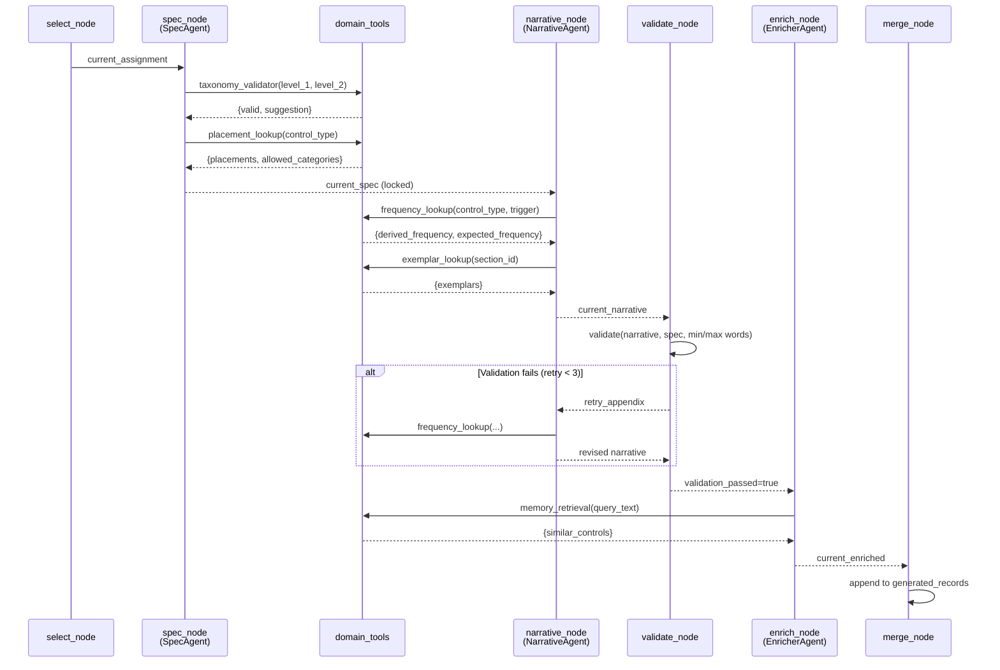

---

## 6. LangGraph Topology

### 6.1 Graph Flowchart

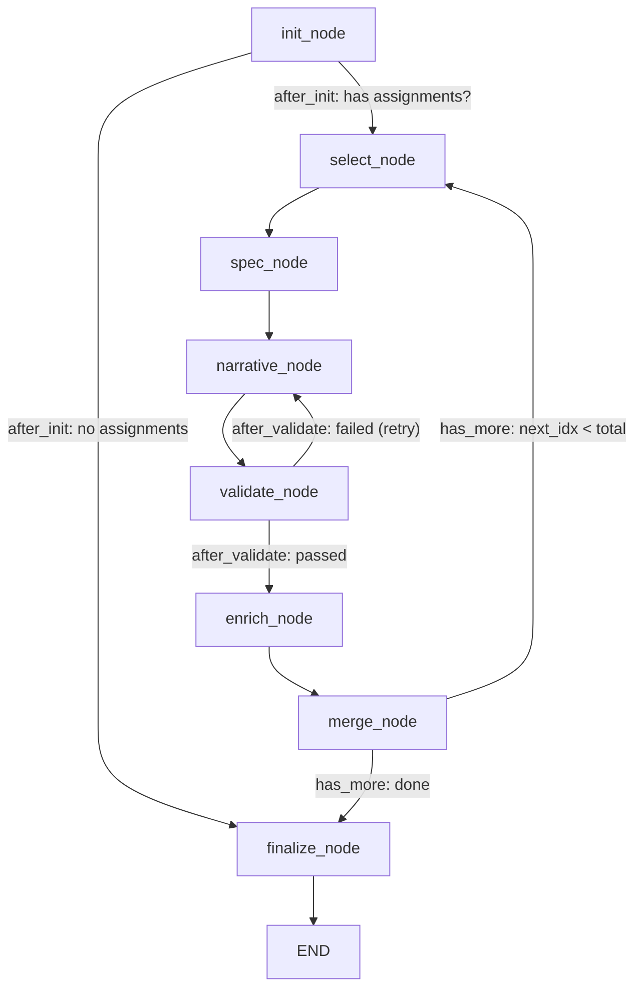

### 6.2 ForgeState TypedDict — Full Field Annotation

| Field | Type | Writer Node(s) | Reducer |
|---|---|---|---|
| `config_path` | `str` | (input) | — |
| `domain_config` | `dict` | `init_node` | — |
| `llm_enabled` | `bool` | `init_node` | — |
| `provider` | `str` | `init_node` | — |
| `ica_tool_calling` | `bool` | `init_node` | — |
| `distribution_config` | `dict` | (input) | — |
| `section_filter` | `str` | (input) | — |
| `target_count` | `int` | (input) | — |
| `assignments` | `list[dict]` | `init_node` | — |
| `current_idx` | `int` | `init_node`, `merge_node` | — |
| `current_assignment` | `dict` | `select_node` | — |
| `current_spec` | `dict` | `spec_node` | — |
| `current_narrative` | `dict` | `narrative_node` | — |
| `current_enriched` | `dict` | `enrich_node` | — |
| `retry_count` | `int` | `select_node` (reset), `validate_node` (increment) | — |
| `validation_passed` | `bool` | `select_node` (reset), `validate_node`, `enrich_node` | — |
| `validation_failures` | `list[str]` | `validate_node` | — |
| `retry_appendix` | `str` | `validate_node` | — |
| `generated_records` | `Annotated[list[dict], add]` | `init_node` (empty), `merge_node` | `operator.add` (append) |
| `tool_calls_log` | `Annotated[list[dict], add]` | `init_node` (empty), `spec_node`, `narrative_node`, `enrich_node` | `operator.add` (append) |
| `plan_payload` | `dict` | `finalize_node` | — |

### 6.3 Conditional Routing Functions

| Function | Read Keys | Return Values | Meaning |
|---|---|---|---|
| `after_init` | `assignments` | `"select"` / `"finalize"` | Skip to finalize if assignment matrix is empty |
| `after_validate` | `validation_passed` | `"enrich"` / `"narrative"` | Retry narrative if validation failed |
| `has_more` | `current_idx`, `assignments` | `"select"` / `"finalize"` | Loop back for next control or finalize |

### 6.4 Event Emission Table

| Node | EventType(s) | Payload Fields |
|---|---|---|
| `init_node` | `PIPELINE_STARTED` | `config_name`, `target` |
| `select_node` | `CONTROL_STARTED` | `index`, `total`, `control_type`, `section` |
| `spec_node` | `AGENT_STARTED`, `AGENT_COMPLETED` or `AGENT_FAILED`, `TOOL_CALLED`*, `TOOL_COMPLETED`* | `agent`, `elapsed`, `tool_calls`, `tool`* |
| `narrative_node` | `AGENT_STARTED`, `AGENT_COMPLETED` or `AGENT_FAILED`, `TOOL_CALLED`*, `TOOL_COMPLETED`* | `agent`, `elapsed`, `tool_calls`, `tool`* |
| `validate_node` | `VALIDATION_PASSED` or `VALIDATION_FAILED`, `AGENT_RETRY`* | `failures`*, `retry`*, `accepted_with_failures`* |
| `enrich_node` | `AGENT_STARTED`, `AGENT_COMPLETED` or `AGENT_FAILED`, `TOOL_CALLED`*, `TOOL_COMPLETED`* | `agent`, `elapsed`, `tool_calls`, `rating`* |
| `merge_node` | `CONTROL_COMPLETED` | `index`, `rating` |
| `finalize_node` | `PIPELINE_COMPLETED` | `total`, `config_name` |

\* emitted conditionally (LLM mode, tool calls present, validation failure)

---

## 7. Worked Trace — CTRL-0401-AUT-001 End-to-End

**Parameters:** Config = `banking_standard.yaml`, target_count = 50, LLM enabled, default distribution.

### 7.1 Profile Load

```json
// Input state
{
  "config_path": "config/profiles/banking_standard.yaml",
  "target_count": 50,
  "llm_enabled": true
}
```

`load_domain_config()` validates the YAML → `DomainConfig` with 25 control types, 17 BUs, 13 process areas.

### 7.2 Assignment Matrix Build (`init_node`)

**Section allocation** uses `risk_profile.multiplier` weights. Section 4.0 (Sourcing and Procurement) has multiplier `2.3`. Total weight across 13 sections ≈ 29.2. Section 4.0 gets `floor(50 × 2.3/29.2)` = **3 controls** (remainder distribution may bump to 4).

**Type distribution** is even across 25 types: `floor(50/25) = 2` each with 0 remainder.

**BU cycling** for section 4.0: `_build_bu_cycles` finds BUs whose `primary_sections` include `"4.0"`. Only BU-015 (Third Party Risk Management) lists `"4.0"`. So the cycle for section 4.0 is `[BU-015]`.

**The row for our traced control:**

```json
{
  "section_id": "4.0",
  "section_name": "Sourcing and Procurement",
  "domain": "sourcing_and_procurement",
  "control_type": "Authorization",
  "business_unit_id": "BU-015",
  "business_unit_name": "Third Party Risk Management",
  "leaf_name": "Sourcing and Procurement – Authorization",
  "hierarchy_id": "4.0.1.1"
}
```

**State after init_node:**
```json
{
  "domain_config": { "...banking_standard..." },
  "llm_enabled": true,
  "provider": "openai",  // # inferred — depends on env
  "assignments": [ "...50 rows...", {"section_id": "4.0", "control_type": "Authorization", "...": "..."} ],
  "current_idx": 0,
  "generated_records": [],
  "tool_calls_log": []
}
```

**Event:** `PIPELINE_STARTED` — `"banking-standard, target=50"`

### 7.3 select_node (for the Authorization in Section 4.0)

Assume this assignment is at index `N` (position depends on round-robin order).

```json
// State after
{
  "current_assignment": {
    "section_id": "4.0",
    "control_type": "Authorization",
    "business_unit_id": "BU-015",
    "business_unit_name": "Third Party Risk Management",
    "hierarchy_id": "4.0.1.1",
    "leaf_name": "Sourcing and Procurement – Authorization"
  },
  "retry_count": 0,
  "validation_passed": false
}
```

**Event:** `CONTROL_STARTED` — `"Authorization in 4.0"`, `index=N+1, total=50`

### 7.4 spec_node (SpecAgent)

**KB reads:** `build_slim_spec_user_prompt` sends `{leaf, control_type, diversity_context}`. Agent calls `placement_lookup("Authorization")` → returns `{placements: [{name: "Preventive", allowed_for_type: true}, ...]}`. Calls `evidence_rules_lookup("Authorization")` → returns evidence criteria from `ControlTypeConfig`.

Using Section 4.0 registry:
- roles: Procurement Analyst, Procurement Manager, Vendor Risk Analyst, Third Party Risk Manager, Contract Manager, Sourcing Specialist, Head of Procurement, Vendor Governance Committee Member
- systems: Vendor Management Platform, Procurement and Requisition System, Contract Lifecycle Management Platform, Third Party Risk Assessment Tool, Accounts Payable System

**State after spec_node:**
```json
{
  "current_spec": {
    "hierarchy_id": "4.0.1.1",
    "leaf_name": "Sourcing and Procurement – Authorization",
    "control_type": "Authorization",
    "selected_level_1": "Preventive",
    "selected_level_2": "Authorization",
    "placement": "Preventive",
    "method": "Manual",
    "who": "Third Party Risk Manager",
    "what_action": "reviews and approves vendor engagement requests",
    "what_detail": "Review and validation of documentation, transaction information...",
    "when": "on new vendor engagement or contract initiation",
    "where_system": "Vendor Management Platform",
    "why_risk": "to mitigate risk of unauthorized vendor onboarding and regulatory non-compliance",
    "evidence": "vendor risk assessment with risk tier classification and sign-off",
    "business_unit_id": "BU-015"
  }
}
```
> Note: LLM output fields above are **# inferred** — actual values depend on model response. Registry-sourced fields (who, where_system, when, evidence) are drawn from Section 4.0 registry.

**Event:** `AGENT_STARTED "SpecAgent"`, `TOOL_CALLED`, `TOOL_COMPLETED`, `AGENT_COMPLETED "SpecAgent (Xs, N tool calls)"`

### 7.5 narrative_node (NarrativeAgent)

**KB reads:** `build_slim_narrative_user_prompt` sends locked spec + constraints. Agent calls `exemplar_lookup("4.0")` → returns the Section 4.0 exemplar (Third Party Due Diligence, 52 words, Strong). Calls `frequency_lookup("Authorization", "on new vendor engagement or contract initiation")` → derived frequency "Other" (event-driven, no keyword match).

**State after narrative_node:**
```json
{
  "current_narrative": {
    "who": "Third Party Risk Manager",
    "what": "reviews and approves vendor engagement requests",
    "when": "on new vendor engagement or contract initiation",
    "where": "Vendor Management Platform",
    "why": "to mitigate risk of unauthorized vendor onboarding and regulatory non-compliance in the sourcing process",
    "full_description": "On new vendor engagement or contract initiation, the Third Party Risk Manager reviews and approves vendor engagement requests within the Vendor Management Platform, verifying that the vendor risk assessment has been completed and the risk tier classification is documented, to mitigate risk of unauthorized vendor onboarding and regulatory non-compliance, with results documented via the vendor risk assessment with risk tier classification and sign-off.",
    "frequency": "Other",
    "evidence": "vendor risk assessment with risk tier classification and sign-off"
  }
}
```
> **# inferred** — full_description fabricated at ~65 words to fit constraints.

**Event:** `AGENT_STARTED "NarrativeAgent"`, `TOOL_CALLED`, `AGENT_COMPLETED`

### 7.6 validate_node (assume pass)

`validate()` checks 6 rules against the narrative:

| Rule | Check | Result |
|---|---|---|
| `MULTIPLE_WHATS` | Action verbs in "what": "reviews", "approves" → roots: `review`, `approv` → 2 ≤ 2 | PASS |
| `VAGUE_WHEN` | "on new vendor engagement..." — no vague terms | PASS |
| `WHO_EQUALS_WHERE` | "Third Party Risk Manager" vs "Vendor Management Platform" — not substrings | PASS |
| `WHY_MISSING_RISK` | "risk" in why text | PASS |
| `WORD_COUNT_OUT_OF_RANGE` | ~65 words, 30 ≤ 65 ≤ 80 | PASS |
| `SPEC_MISMATCH` | who matches spec.who, where matches spec.where_system | PASS |

**State after:** `{"validation_passed": true, "validation_failures": [], "retry_appendix": ""}`

**Event:** `VALIDATION_PASSED`

### 7.7 enrich_node (EnricherAgent)

**KB reads:** `build_enricher_user_prompt` sends validated control + quality ratings. Agent may call `memory_retrieval` (returns empty if memory not configured).

**State after enrich_node:**
```json
{
  "current_enriched": {
    "control_id": "",
    "hierarchy_id": "4.0.1.1",
    "leaf_name": "Sourcing and Procurement – Authorization",
    "control_type": "Authorization",
    "selected_level_1": "Preventive",
    "selected_level_2": "Authorization",
    "business_unit_id": "BU-015",
    "business_unit_name": "Third Party Risk Management",
    "placement": "Preventive",
    "method": "Manual",
    "who": "Third Party Risk Manager",
    "what": "reviews and approves vendor engagement requests",
    "when": "on new vendor engagement or contract initiation",
    "frequency": "Other",
    "where": "Vendor Management Platform",
    "why": "to mitigate risk of unauthorized vendor onboarding...",
    "full_description": "On new vendor engagement or contract initiation, the Third Party Risk Manager reviews and approves vendor engagement requests within the Vendor Management Platform...",
    "quality_rating": "Effective",
    "validator_passed": true,
    "validator_retries": 0,
    "validator_failures": [],
    "evidence": "vendor risk assessment with risk tier classification and sign-off"
  }
}
```

**Event:** `AGENT_STARTED "EnricherAgent"`, `AGENT_COMPLETED "EnricherAgent (...) — Effective"`

### 7.8 merge_node

Appends `current_enriched` to `generated_records` (via `add` reducer). Increments `current_idx`.

**Event:** `CONTROL_COMPLETED "Control N+1 completed — Effective"`

### 7.9 finalize_node (after all 50 controls)

`assign_control_ids()` runs. For our control:
- `type_code = "AUT"` (from `ControlTypeConfig.code`)
- `hierarchy_id = "4.0.1.1"` → `l1=4, l2=0` → prefix `CTRL-0400`
- Sequence = 1 (first Authorization in this section)
- **`control_id = "CTRL-0400-AUT-001"`**

> Note: The expected ID `CTRL-0401-AUT-001` from the spec would require `l2=1` from `hierarchy_id="4.1.x.x"`. The actual code uses `parts[0]=4, parts[1]=0` from `"4.0.1.1"`, producing `CTRL-0400-AUT-001`. The spec's example ID assumes a different hierarchy encoding. **Discrepancy noted in Section 13.**

**Event:** `PIPELINE_COMPLETED "Generated 50 controls for banking-standard"`

### 7.10 Export

`_render_results()` in [modular_tab.py](src/controlnexus/ui/modular_tab.py#L273-L315) renders the controls table, CSV download, and JSON download via `st.download_button`.

---

## 8. Validator and Retry Contract

### 8.1 The 6 Rules

| Rule | Field Checked | Condition for Failure |
|---|---|---|
| `MULTIPLE_WHATS` | `what` | > 2 distinct control-action verb roots (from curated list of 40 roots) |
| `VAGUE_WHEN` | `when` | Contains any of: "periodic", "ad hoc", "as needed", "various", "as required", "on occasion" |
| `WHO_EQUALS_WHERE` | `who`, `where` | Either is a substring of the other (case-insensitive) |
| `WHY_MISSING_RISK` | `why` | None of 17 risk markers present (risk, prevent, mitigate, reduce, ensure, compliance, ...) |
| `WORD_COUNT_OUT_OF_RANGE` | `full_description` | Word count < `min_words` or > `max_words` (config-driven, default 30–80) |
| `SPEC_MISMATCH` | `who`, `where` | Differs from locked spec's `who` or `where_system` |

### 8.2 Retry Loop

- **Cap:** 3 retries (`validate_node` checks `retry_count >= 3`)
- After max retries: control accepted as-is with `accepted_with_failures=True`
- `retry_appendix` construction: `build_retry_appendix(attempt, max_attempts, failures, word_count, min_words, max_words)` produces failure-specific fix instructions

### 8.3 Locked-Field Preservation During Retry

The retry loop re-enters `narrative_node`, not `spec_node`. The `current_spec` is never rewritten. NarrativeAgent receives the `retry_appendix` appended to its user prompt, which includes instructions like "Do not change locked spec values for who and where_system." The validate_node's `SPEC_MISMATCH` rule enforces this.

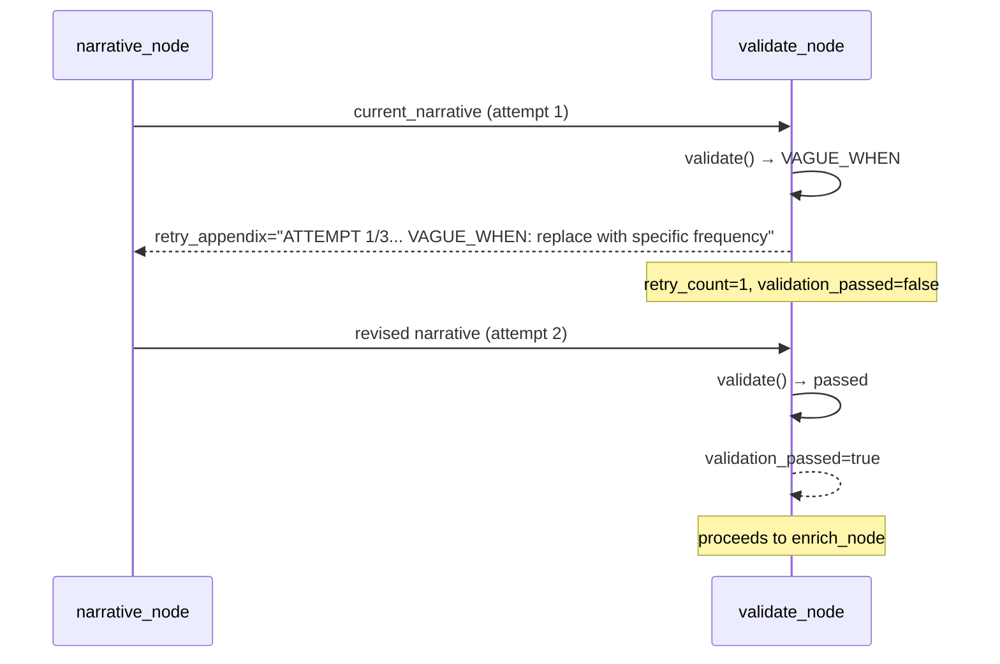

---

## 9. Caching, Transport, and Determinism

### 9.1 Module-Level Caches

Located in [graphs/graph_infra.py](src/controlnexus/graphs/graph_infra.py):

| Cache | What It Caches | Invalidation | Test Isolation |
|---|---|---|---|
| `_emitter` (`EventEmitter`) | Current event emitter instance | `set_emitter()` replaces it; `reset_caches()` does NOT reset it | Must call `set_emitter(EventEmitter())` between tests |
| `_event_loop` (`asyncio.AbstractEventLoop`) | Persistent event loop for httpx connection reuse | `reset_caches()` closes and nullifies it | `reset_caches()` in fixtures |
| `_llm_client_cache` (`dict`) | `{"client": AsyncTransportClient | None}` | `reset_caches()` clears it | `reset_caches()` in fixtures |
| `_agent_cache` (`dict`) | `{name: _Proxy(BaseAgent)}` per agent name | `reset_caches()` clears it | `reset_caches()` in fixtures |

Additionally, `config_input.py` has `_PROFILES_DIR` (module-level) and `@st.cache_data` on `_load_config`.

### 9.2 Transport Priority

`build_client_from_env()` in [core/transport.py](src/controlnexus/core/transport.py#L101-L133) checks environment variables in order:

| Priority | Provider | Env Vars Required | Provider String |
|---|---|---|---|
| 1 | ICA | `ICA_API_KEY` + `ICA_BASE_URL` + `ICA_MODEL_ID` | `"ica"` |
| 2 | OpenAI | `OPENAI_API_KEY` | `"openai"` |
| 3 | Anthropic | `ANTHROPIC_API_KEY` | `"anthropic"` |
| 4 | None | (none) | → deterministic mode |

### 9.3 Fat vs. Slim Prompts

| Agent | ICA (fat prompt) | ICA + XML tools | OpenAI/Anthropic (slim + tools) | Deterministic |
|---|---|---|---|---|
| **SpecAgent** | `build_spec_system_prompt` + `build_spec_user_prompt` (inlines registry, placements, methods, evidence rules) + `_SPEC_TOOLS` (optional hints) | `build_slim_spec_system_prompt` + `build_xml_tool_instructions(_SLIM_SPEC_TOOLS)` | `build_slim_spec_system_prompt` + `_TOOL_HINT_SLIM` + `_SLIM_SPEC_TOOLS` (tool_choice="required") | `build_deterministic_spec()` |
| **NarrativeAgent** | `build_narrative_system_prompt` + `build_narrative_user_prompt` (inlines exemplars) + `_NARRATIVE_TOOLS` | `build_slim_narrative_system_prompt` + `build_xml_tool_instructions(_SLIM_NARRATIVE_TOOLS)` | `build_slim_narrative_system_prompt` + `_TOOL_HINT_SLIM` + `_SLIM_NARRATIVE_TOOLS` (tool_choice="required") | `build_deterministic_narrative()` |
| **EnricherAgent** | `build_enricher_system_prompt` + `_ENRICH_TOOLS` | `build_enricher_system_prompt` + `build_xml_tool_instructions(_SLIM_ENRICH_TOOLS)` | `build_enricher_system_prompt` + `_TOOL_HINT` + `_SLIM_ENRICH_TOOLS` | `build_deterministic_enriched()` |

---

## 10. Relationship Cheat Sheet (As-Is)

```mermaid
flowchart TB
    subgraph ConfigEntities["Config Entities (DomainConfig)"]
        DC["DomainConfig"]
        CT["ControlTypeConfig[]"]
        BU["BusinessUnitConfig[]"]
        PA["ProcessAreaConfig[]"]
        RP["RiskProfileConfig"]
        AFF["AffinityConfig"]
        REG["RegistryConfig"]
        EX["ExemplarConfig[]"]
        PL["PlacementConfig[]"]
        MT["MethodConfig[]"]
        FT["FrequencyTier[]"]
        NC["NarrativeConstraints"]
    end

    subgraph RuntimeState["Runtime State (ForgeState)"]
        FS["ForgeState"]
        ASN["assignments[]"]
        CA["current_assignment"]
        CS["current_spec"]
        CN["current_narrative"]
        CE["current_enriched"]
        GR["generated_records[]"]
        PP["plan_payload"]
    end

    subgraph Agents["Agents"]
        SA["SpecAgent"]
        NA["NarrativeAgent"]
        EA["EnricherAgent"]
        CPA["ConfigProposerAgent"]
    end

    subgraph Tools["Tools (domain_tools)"]
        TV["taxonomy_validator"]
        RL["regulatory_lookup"]
        HS["hierarchy_search"]
        FL["frequency_lookup"]
        MR["memory_retrieval"]
        PLT["placement_lookup"]
        MLT["method_lookup"]
        ERL["evidence_rules_lookup"]
        EXL["exemplar_lookup"]
    end

    subgraph KBSources["KB Sources"]
        YAML["banking_standard.yaml"]
        CHROMA["ChromaDB (optional)"]
        SECTIONS["config/sections/*.yaml"]
    end

    %% Config entity relationships
    DC -->|"direct field"| CT
    DC -->|"direct field"| BU
    DC -->|"direct field"| PA
    DC -->|"direct field"| PL
    DC -->|"direct field"| MT
    DC -->|"direct field"| FT
    DC -->|"direct field"| NC
    PA -->|"direct field"| RP
    PA -->|"direct field"| AFF
    PA -->|"direct field"| REG
    PA -->|"direct field"| EX
    BU -.->|"ID ref: primary_sections"| PA
    BU -.->|"name ref: key_control_types"| CT
    CT -.->|"name ref: placement_categories"| PL
    AFF -.->|"name ref: HIGH/MED/LOW"| CT

    %% KB to Config
    YAML -->|"load_domain_config()"| DC
    SECTIONS -->|"yaml.safe_load()"| PA

    %% Config to Runtime
    DC -->|"state write: init_node"| FS
    DC -->|"build_assignment_matrix()"| ASN

    %% Runtime flow
    ASN -->|"state write: select_node"| CA
    CA -->|"prompt injection"| SA
    SA -->|"state write"| CS
    CS -->|"prompt injection"| NA
    NA -->|"state write"| CN
    CN -->|"state write (if enriched)"| CE
    CE -->|"reducer append"| GR
    GR -->|"assign_control_ids()"| PP

    %% Agent to Tool calls
    SA -->|"tool call"| TV
    SA -->|"tool call"| HS
    SA -->|"tool call"| PLT
    SA -->|"tool call"| MLT
    SA -->|"tool call"| ERL
    SA -->|"tool call"| RL
    NA -->|"tool call"| FL
    NA -->|"tool call"| EXL
    NA -->|"tool call"| RL
    EA -->|"tool call"| TV
    EA -->|"tool call"| FL
    EA -->|"tool call"| MR

    %% Tools read from Config
    TV -.->|"reads"| CT
    TV -.->|"reads"| PL
    RL -.->|"reads"| REG
    RL -.->|"reads"| AFF
    HS -.->|"reads"| REG
    FL -.->|"reads"| FT
    FL -.->|"reads"| CT
    PLT -.->|"reads"| PL
    PLT -.->|"reads"| CT
    MLT -.->|"reads"| MT
    ERL -.->|"reads"| CT
    EXL -.->|"reads"| EX
    MR -.->|"reads"| CHROMA

    %% Wizard agent
    CPA -->|"wizard: enrich mode"| CT
    CPA -->|"wizard: section_autofill"| PA
```

---

## 11. PIVOT — The BU → Process → Risk → Control Model

### 11.1 Target Entity Model

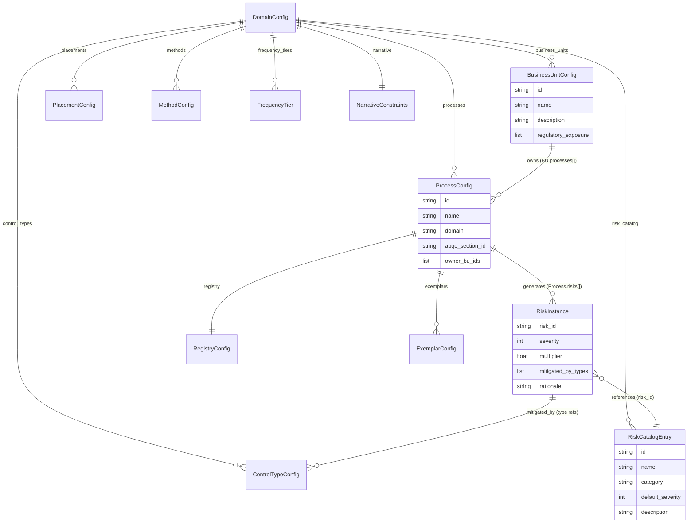

#### Design Decisions

**BU ↔ Process directionality:**

**Opinionated:** BU owns Processes. `BusinessUnitConfig` gains a `processes: list[str]` field referencing `ProcessConfig.id`, and `ProcessConfig` gains an `owner_bu_ids: list[str]` back-reference. The ownership direction is BU → Process because the business-org-chart perspective is the natural starting point for stakeholders building a config: "Which processes does this BU run?" This also matches how `primary_sections` currently works — it attaches sections to BUs. The many-to-many is handled by allowing multiple BUs to reference the same Process ID and the back-reference list on Process. A Process without a BU owner is valid (orphan processes are common in shared-services models).

**Risk origin:**

**Opinionated:** Hybrid (taxonomy + instance). A `risk_catalog` at the DomainConfig level defines risk archetypes (e.g., "Unauthorized Access", "Data Integrity Failure", "Regulatory Non-Compliance") with `default_severity`. Each `ProcessConfig` contains `risks: list[RiskInstance]` where `RiskInstance` references a catalog entry by `risk_id` and overrides `severity` and `multiplier` per-process. This is a hybrid model: the catalog is YAML-defined (like current control types), but instances are contextual. The current `risk_profile.multiplier` maps directly to the sum of `RiskInstance.multiplier` values within a process, preserving backward compatibility with `_build_section_allocation`. A new `RiskAgent` can propose `RiskInstance` entries from BU+Process context, populating the catalog and instances together.

**Risk ↔ Control cardinality:**

**Opinionated:** One-risk-many-controls-weighted-by-severity. Each `RiskInstance` specifies `mitigated_by_types: list[str]` (referencing `ControlTypeConfig.name`) and a `severity` (1–5). The assignment matrix allocates controls per-Risk, with count proportional to `severity × multiplier`. This replaces the current `risk_profile.multiplier → section allocation` with `risk.severity × risk.multiplier → per-risk allocation`, then distributes across `mitigated_by_types`. This integrates naturally: today's `multiplier` on a section becomes the aggregate of per-risk multipliers within that section's processes, and `affinity.HIGH` types become the union of `mitigated_by_types` across that section's risks.

### 11.2 Concept Migration Table

| Current Concept | Fate | New Concept |
|---|---|---|
| `DomainConfig` | **survives** | `DomainConfig` (gains `processes`, `risk_catalog`) |
| `ControlTypeConfig` | **survives** | `ControlTypeConfig` (unchanged) |
| `BusinessUnitConfig` | **transforms** | `BusinessUnitConfig` (loses `primary_sections`, `key_control_types`; gains `processes: list[str]`) |
| `ProcessAreaConfig` | **transforms** | `ProcessConfig` (renamed; loses `risk_profile`, `affinity`; gains `risks: list[RiskInstance]`, `owner_bu_ids`, `apqc_section_id`) |
| `RiskProfileConfig` | **retires** | Replaced by per-risk `RiskInstance.severity` + `RiskInstance.multiplier` |
| `AffinityConfig` | **retires** | Replaced by `RiskInstance.mitigated_by_types` (derived per-risk) |
| `RegistryConfig` | **survives** | `RegistryConfig` (moves to `ProcessConfig.registry`) |
| `ExemplarConfig` | **survives** | `ExemplarConfig` (moves to `ProcessConfig.exemplars`) |
| `FrequencyTier` | **survives** | `FrequencyTier` (unchanged) |
| `NarrativeConstraints` | **survives** | `NarrativeConstraints` (unchanged) |
| `PlacementConfig` | **survives** | `PlacementConfig` (unchanged) |
| `MethodConfig` | **survives** | `MethodConfig` (unchanged) |
| `ForgeState` | **transforms** | `ForgeState` (gains `current_risk`, loses implicit section-first ordering) |
| `ControlAssignment` (dict) | **transforms** | Gains `risk_id`, `risk_severity`, `process_id`; `section_id` becomes derived from `ProcessConfig.apqc_section_id` |
| `FinalControlRecord` (dict) | **transforms** | Gains `risk_id`, `risk_name`, `process_id`, `process_name` |

### 11.2.1 Where BU→Section Coupling Lives Today (and How It Must Change)

| Location | What it encodes | Why it exists | How it must change | Refactor risk |
|---|---|---|---|---|
| `BusinessUnitConfig.primary_sections` | BU is "most involved with" these APQC sections | Drives BU-cycling preference per section in assignment matrix | **Replace with** `BusinessUnitConfig.processes: list[str]`. Section affinity becomes derived: a BU's relevant sections are the `apqc_section_id` values of its processes. | Medium — field rename + migration script; test fixtures need updating |
| `BusinessUnitConfig.key_control_types` | BU's most-relevant control types | Currently unused in assignment matrix (informational only); used in wizard Step 3 UI | **Replace with** derived from `RiskInstance.mitigated_by_types` across the BU's processes. Remove as explicit field. | Low — informational field; can be computed |
| `_build_bu_cycles()` in `forge_modular_helpers.py` | Builds `itertools.cycle` of BUs per section, preferring BUs whose `primary_sections` includes the section | Ensures controls in a section get BUs that "own" that section | **Replace with** BU selection driven by Process ownership: for a given Process, cycle through `owner_bu_ids`. Section is no longer the grouping primitive. | High — core allocation logic change |
| `_next_bu()` in `forge_modular_helpers.py` | Picks next BU from the section's cycle | Round-robin BU assignment per section | **Replace with** BU is determined by the Process's `owner_bu_ids` (possibly round-robin within that list) | High — tightly coupled to `_build_bu_cycles` |
| `_business_unit_quota_for_section()` (not present in current code — mentioned in spec) | N/A — does not exist in current codebase | — | — | N/A |
| `build_spec_user_prompt()` diversity context | Lists all BUs with `suggested_business_unit` from assignment | Gives LLM awareness of BU pool | **Change** `suggested_business_unit` to come from Process ownership rather than section cycling | Low — prompt change only |

> **Why this matters:** *Loosening BU→Section coupling is the highest-leverage change. Today's model assumes sections are the organizing primitive with BUs attached; the new model inverts that. A Process is owned by a BU, produces Risks, and Risks produce Controls. The section becomes metadata on the Process (`apqc_section_id`), not the primary allocation dimension.*

### 11.3 Assignment Matrix — Before and After

#### Current Flow

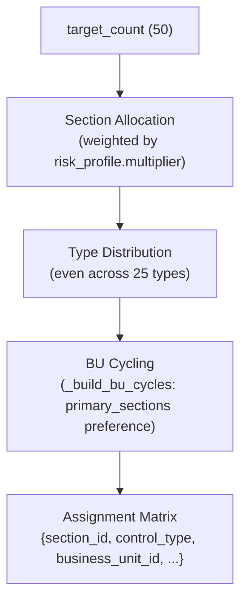

#### Proposed Flow

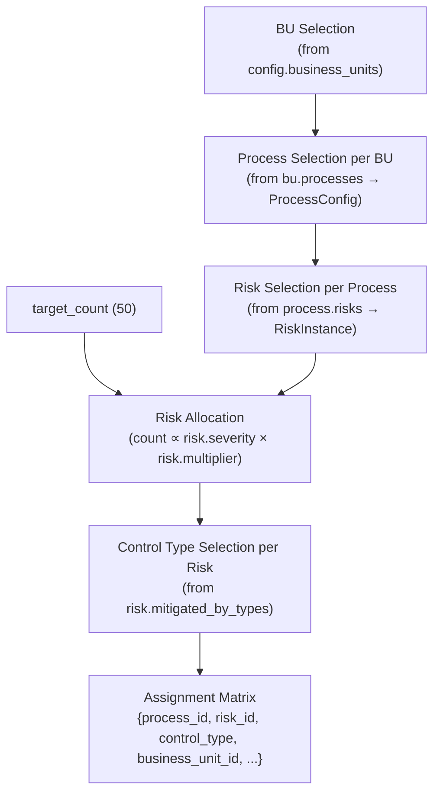

#### Pseudocode for New `build_assignment_matrix()`

```python
def build_assignment_matrix(
    config: DomainConfig,
    target_count: int,
    distribution_config: dict[str, Any] | None = None,
    *,
    process_filter: str | None = None,
) -> list[dict[str, Any]]:
    """Build assignments from BU → Process → Risk → ControlType."""
    
    # 1. Collect all (process, risk) pairs with their effective weights
    weighted_risks: list[tuple[ProcessConfig, RiskInstance, float]] = []
    for process in config.processes:
        if process_filter and process.id != process_filter:
            continue
        for risk in process.risks:
            weight = risk.severity * risk.multiplier
            weighted_risks.append((process, risk, weight))
    
    if not weighted_risks:
        return []
    
    # 2. Allocate target_count across risks proportional to weight
    total_weight = sum(w for _, _, w in weighted_risks)
    risk_counts = _distribute_by_weight_tuples(weighted_risks, target_count, total_weight)
    
    # 3. For each risk allocation, distribute across mitigated_by_types
    assignments: list[dict[str, Any]] = []
    for (process, risk, _), count in risk_counts.items():
        type_names = risk.mitigated_by_types or [config.control_types[0].name]
        type_counts = _distribute_by_weight(type_names, count)
        
        # BU cycling within the process's owner_bu_ids
        bu_ids = process.owner_bu_ids or ["BU-DEFAULT"]
        bu_cycle = itertools.cycle(bu_ids)
        
        for ct_name, ct_count in type_counts.items():
            for _ in range(ct_count):
                bu_id = next(bu_cycle)
                bu = config.get_business_unit(bu_id)
                assignments.append({
                    "process_id": process.id,
                    "process_name": process.name,
                    "section_id": process.apqc_section_id,
                    "section_name": process.name,  # or APQC lookup
                    "domain": process.domain,
                    "risk_id": risk.risk_id,
                    "risk_severity": risk.severity,
                    "control_type": ct_name,
                    "business_unit_id": bu_id,
                    "business_unit_name": bu.name if bu else "Default",
                    "leaf_name": f"{process.name} – {ct_name}",
                    "hierarchy_id": f"{process.apqc_section_id}.1.1",
                })
    
    return assignments[:target_count]
```

#### Changes to ControlAssignment Shape

| Field | Current | New | Status |
|---|---|---|---|
| `section_id` | Primary key for allocation | Derived from `ProcessConfig.apqc_section_id` | **renamed source** |
| `section_name` | From `ProcessAreaConfig.name` | From `ProcessConfig.name` | **renamed source** |
| `domain` | From `ProcessAreaConfig.domain` | From `ProcessConfig.domain` | **renamed source** |
| `control_type` | From type distribution per section | From `RiskInstance.mitigated_by_types` | **changed derivation** |
| `business_unit_id` | From BU cycling per section | From `ProcessConfig.owner_bu_ids` cycling | **changed derivation** |
| `business_unit_name` | From BU lookup | Same | unchanged |
| `leaf_name` | `"{section_name} – {ct}"` | `"{process_name} – {ct}"` | **minor rename** |
| `hierarchy_id` | `"{section_id}.1.1"` | `"{apqc_section_id}.1.1"` | **derived differently** |
| `process_id` | N/A | **NEW** — `ProcessConfig.id` | new |
| `risk_id` | N/A | **NEW** — `RiskInstance.risk_id` | new |
| `risk_severity` | N/A | **NEW** — `RiskInstance.severity` | new |

### 11.4 Graph Topology Changes

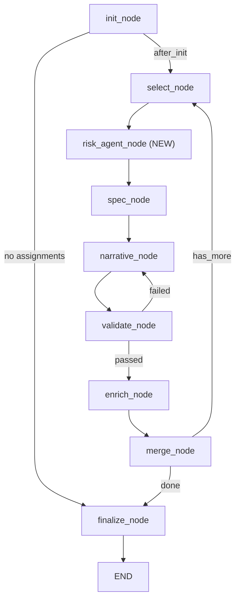

**New node: `risk_agent_node`** — inserted between `select_node` and `spec_node`.

| Aspect | Detail |
|---|---|
| **Purpose** | Resolve the `current_risk` from the assignment's `risk_id`, enriching the spec context with risk-specific information |
| **State reads** | `current_assignment.risk_id`, `domain_config.risk_catalog` |
| **State writes** | `current_risk: dict` (risk catalog entry + instance severity + rationale) |
| **LLM mode** | If risk_id is already resolved from catalog → no LLM call needed. If `risk_id` is "auto" or absent → RiskAgent generates a risk from BU+Process context |
| **Deterministic fallback** | Look up `risk_id` in `config.risk_catalog`, return catalog entry + instance data |

**Node Change Table:**

| Node | Status | Changes |
|---|---|---|
| `init_node` | **modified** | New `build_assignment_matrix()` signature; reads `config.processes` and `config.risk_catalog` |
| `select_node` | unchanged | — |
| `risk_agent_node` | **new** | Resolves `current_risk` from assignment |
| `spec_node` | **modified** | SpecAgent receives `current_risk` in addition to `current_assignment`; risk context injected into prompt |
| `narrative_node` | **modified** | NarrativeAgent `why` field driven by `current_risk.description` |
| `validate_node` | unchanged | — |
| `enrich_node` | unchanged | — |
| `merge_node` | unchanged | — |
| `finalize_node` | **modified** | `assign_control_ids()` may incorporate risk_id in ID scheme |

### 11.5 Agent and Tool Changes

#### Agent Changes

| Agent | Status | Changes |
|---|---|---|
| `SpecAgent` | **modified** | Input gains `current_risk` dict. Prompt includes risk description, severity, and required control characteristics. `why_risk` field pre-populated from risk. |
| `NarrativeAgent` | **modified** | `why` field constrained by risk description. Exemplar lookup keyed by process_id instead of section_id. |
| `EnricherAgent` | unchanged | — |
| `ConfigProposerAgent` | **modified** | New modes: `suggest_risks` (given BU + Process, propose RiskInstances), `suggest_processes` (given BU, propose processes). Existing `section_autofill` becomes `process_autofill`. |
| `RiskAgent` | **new** | See spec below |

#### New Agent: RiskAgent

| Aspect | Detail |
|---|---|
| **Role** | Resolve or generate risk context for a control assignment. |
| **Inputs (state)** | `current_assignment` (including `risk_id`, `process_id`), `domain_config` |
| **Inputs (DomainConfig)** | `config.risk_catalog`, `config.processes[process_id].risks`, `config.processes[process_id].registry` |
| **Outputs** | `current_risk: dict` with `{risk_id, risk_name, risk_category, severity, multiplier, description, mitigated_by_types}` |
| **Locked fields** | `risk_id`, `risk_name`, `severity` (from catalog/instance) |
| **Mutable fields** | `description` (can be enriched by LLM) |
| **Tool calls** | `risk_catalog_lookup` (new tool — retrieves catalog entry by ID), `regulatory_lookup` (existing — contextualize risk with regulatory framework) |
| **Deterministic fallback** | Direct lookup: `config.risk_catalog[risk_id]` merged with `process.risks[matching_instance]` |

#### Tool Changes

| Tool | Status | Changes |
|---|---|---|
| `taxonomy_validator` | unchanged | — |
| `regulatory_lookup` | **modified** | Accepts optional `process_id` in addition to `section_id`; looks up `ProcessConfig.registry.regulatory_frameworks` |
| `hierarchy_search` | **modified** | Accepts `process_id`; returns `ProcessConfig.registry` items |
| `frequency_lookup` | unchanged | — |
| `memory_retrieval` | **modified** | Accepts optional `risk_id` filter in addition to `section_id`; nearest-neighbour by risk context |
| `placement_lookup` | unchanged | — |
| `method_lookup` | unchanged | — |
| `evidence_rules_lookup` | unchanged | — |
| `exemplar_lookup` | **modified** | Accepts `process_id` instead of `section_id`; returns `ProcessConfig.exemplars` |
| `risk_catalog_lookup` | **new** | Looks up `RiskCatalogEntry` by ID; returns `{id, name, category, default_severity, description}` |

### 11.6 DomainConfig and YAML Schema Changes

#### New / Changed Pydantic Classes

```python
# NEW
class RiskCatalogEntry(BaseModel):
    """A risk archetype in the organization's risk taxonomy."""
    id: str
    name: str
    category: str = ""  # e.g., "Operational", "Regulatory", "Financial"
    default_severity: int = 3  # 1-5
    description: str = ""

# NEW
class RiskInstance(BaseModel):
    """A contextualized risk within a specific process."""
    risk_id: str  # references RiskCatalogEntry.id
    severity: int = 3  # 1-5, overrides catalog default
    multiplier: float = 1.0  # replaces RiskProfileConfig.multiplier (per-risk)
    mitigated_by_types: list[str] = Field(default_factory=list)  # ControlTypeConfig.name refs
    rationale: str = ""

# CHANGED (renamed from ProcessAreaConfig)
class ProcessConfig(BaseModel):
    """A business process, owned by one or more BUs."""
    id: str
    name: str
    domain: str = ""
    apqc_section_id: str = ""  # backward-compat link to APQC hierarchy
    owner_bu_ids: list[str] = Field(default_factory=list)  # BusinessUnitConfig.id refs
    risks: list[RiskInstance] = Field(default_factory=list)
    registry: RegistryConfig = Field(default_factory=RegistryConfig)
    exemplars: list[ExemplarConfig] = Field(default_factory=list)

# CHANGED
class BusinessUnitConfig(BaseModel):
    """One business unit."""
    id: str
    name: str
    description: str = ""
    processes: list[str] = Field(default_factory=list)  # ProcessConfig.id refs
    regulatory_exposure: list[str] = Field(default_factory=list)
    # REMOVED: primary_sections, key_control_types

# CHANGED
class DomainConfig(BaseModel):
    name: str = "default"
    description: str = ""
    control_types: list[ControlTypeConfig] = Field(min_length=1)
    business_units: list[BusinessUnitConfig] = Field(default_factory=list)
    processes: list[ProcessConfig] = Field(default_factory=list)  # renamed from process_areas
    risk_catalog: list[RiskCatalogEntry] = Field(default_factory=list)  # NEW
    placements: list[PlacementConfig] = Field(...)
    methods: list[MethodConfig] = Field(...)
    frequency_tiers: list[FrequencyTier] = Field(...)
    narrative: NarrativeConstraints = Field(...)
    quality_ratings: list[str] = Field(...)

# UNCHANGED: ControlTypeConfig, PlacementConfig, MethodConfig, FrequencyTier,
#             NarrativeConstraints, NarrativeField, RegistryConfig, ExemplarConfig

# RETIRED: RiskProfileConfig, AffinityConfig
```

#### Minimal Example YAML

```yaml
name: "community-bank-pivot-demo"
description: "Minimal BU → Process → Risk → Control example."

control_types:
  - name: Authorization
    definition: "Review and approval before allowing an activity to continue."
    code: AUT
    placement_categories: [Preventive]

risk_catalog:
  - id: "RISK-001"
    name: "Unauthorized Vendor Onboarding"
    category: "Operational"
    default_severity: 4
    description: "Risk of onboarding vendors without proper due diligence."

business_units:
  - id: "BU-015"
    name: "Third Party Risk Management"
    processes: ["PROC-VENDOR-MGMT"]
    regulatory_exposure: ["OCC Third Party Risk Management Guidance"]

processes:
  - id: "PROC-VENDOR-MGMT"
    name: "Vendor Management"
    domain: "vendor_management"
    apqc_section_id: "4.0"
    owner_bu_ids: ["BU-015"]
    risks:
      - risk_id: "RISK-001"
        severity: 4
        multiplier: 2.3
        mitigated_by_types: ["Authorization"]
        rationale: "High regulatory scrutiny on third-party engagements."
    registry:
      roles: ["Vendor Risk Analyst", "Third Party Risk Manager"]
      systems: ["Vendor Management Platform"]
      evidence_artifacts: ["vendor risk assessment with sign-off"]
      event_triggers: ["on new vendor engagement"]
      regulatory_frameworks: ["OCC Third Party Risk Management Guidance"]
```

#### Migration Notes

**Can `banking_standard.yaml` be auto-migrated?** Partially.

The transform would:
1. Create one `ProcessConfig` per current `ProcessAreaConfig`, with `apqc_section_id = pa.id`.
2. Synthesize a `RiskCatalogEntry` per section from `risk_profile.rationale`, with `default_severity = risk_profile.inherent_risk`.
3. Create one `RiskInstance` per section pointing to the synthesized catalog entry, with `multiplier = risk_profile.multiplier` and `mitigated_by_types = affinity.HIGH`.
4. Derive `ProcessConfig.owner_bu_ids` from BUs whose `primary_sections` includes the section ID.
5. Convert `BusinessUnitConfig.primary_sections` → `processes` (list of matching `ProcessConfig.id` values).
6. Drop `primary_sections`, `key_control_types`, `risk_profile`, `affinity` from their current locations.

**What cannot be auto-migrated:** Genuine risk-level granularity. The current model has one "risk profile" per section, but the new model expects multiple distinct risks per process. The migration creates one risk per section (1:1), which is semantically correct for backward compatibility but doesn't capture the new model's expressiveness. Users would need to manually split risks.

### 11.7 Wizard Redesign Implications

| Current Step | Fate | New Step | Notes |
|---|---|---|---|
| 0: Template Picker | **survives** | 0: Template Picker | Unchanged |
| 1: Basics | **survives** | 1: Basics | Unchanged |
| 2: Control Types | **survives** | 2: Control Types | Unchanged |
| 3: Business Units | **transforms** | 3: Business Units | Remove `primary_sections` and `key_control_types` multiselects. Add `processes` multiselect (populated after step 4). |
| 4: Process Areas | **transforms + splits** | 4: Processes | Renamed. Registry/exemplar tabs survive. Risk Profile tab → replaced by Risk Instances editor (per-process). Affinity tab → retired (replaced by `mitigated_by_types` on each risk). |
| — | **new** | 5: Risks | New step: define `risk_catalog` entries, then for each Process assign `RiskInstance` entries with severity, multiplier, and mitigated_by_types. AI auto-fill via `ConfigProposerAgent(mode="suggest_risks")`. |
| 5: Review & Export | **survives** | 6: Review & Export | Adds risk summary metrics. Validation gains cross-reference checks for risk_catalog IDs. |

**New step ordering:** Basics → Control Types → Business Units → Processes → Risks → Review & Export

**New ConfigProposerAgent modes needed:**
- `suggest_risks`: Given a Process name, BU context, and control types → propose `RiskCatalogEntry` items + `RiskInstance` assignments
- `process_autofill`: Replaces `section_autofill` — proposes registry, risks, exemplars for a Process
- `suggest_processes`: Given a BU description → propose Process definitions

---

## 12. Relationship Cheat Sheet (To-Be)

```mermaid
flowchart TB
    subgraph ConfigEntities["Config Entities (DomainConfig v2)"]
        DC["DomainConfig"]
        CT["ControlTypeConfig[]"]
        BU["BusinessUnitConfig[]"]
        PROC["ProcessConfig[]"]
        RC["RiskCatalogEntry[]"]
        RI["RiskInstance[]"]
        REG["RegistryConfig"]
        EX["ExemplarConfig[]"]
        PL["PlacementConfig[]"]
        MT["MethodConfig[]"]
        FT["FrequencyTier[]"]
        NC["NarrativeConstraints"]
    end

    subgraph RuntimeState["Runtime State (ForgeState v2)"]
        FS["ForgeState"]
        ASN["assignments[]"]
        CA["current_assignment"]
        CR["current_risk (NEW)"]
        CS["current_spec"]
        CN["current_narrative"]
        CE["current_enriched"]
        GR["generated_records[]"]
        PP["plan_payload"]
    end

    subgraph Agents["Agents"]
        RA["RiskAgent (NEW)"]
        SA["SpecAgent"]
        NA["NarrativeAgent"]
        EA["EnricherAgent"]
        CPA["ConfigProposerAgent"]
    end

    subgraph Tools["Tools"]
        TV["taxonomy_validator"]
        RL["regulatory_lookup"]
        HS["hierarchy_search"]
        FL["frequency_lookup"]
        MR["memory_retrieval"]
        PLT["placement_lookup"]
        MLT["method_lookup"]
        ERL["evidence_rules_lookup"]
        EXL["exemplar_lookup"]
        RCL["risk_catalog_lookup (NEW)"]
    end

    subgraph KBSources["KB Sources"]
        YAML["config YAML"]
        CHROMA["ChromaDB"]
    end

    %% Config relationships
    DC -->|"direct field"| CT
    DC -->|"direct field"| BU
    DC -->|"direct field"| PROC
    DC -->|"direct field"| RC
    DC -->|"direct field"| PL
    DC -->|"direct field"| MT
    DC -->|"direct field"| FT
    DC -->|"direct field"| NC
    BU -->|"ID ref: processes"| PROC
    PROC -->|"back-ref: owner_bu_ids"| BU
    PROC -->|"direct field"| RI
    PROC -->|"direct field"| REG
    PROC -->|"direct field"| EX
    RI -.->|"ID ref: risk_id"| RC
    RI -.->|"name ref: mitigated_by_types"| CT
    CT -.->|"name ref: placement_categories"| PL

    %% KB to Config
    YAML -->|"load_domain_config()"| DC

    %% Config to Runtime
    DC -->|"state write: init_node"| FS
    DC -->|"build_assignment_matrix()"| ASN

    %% Runtime flow
    ASN -->|"select_node"| CA
    CA -->|"risk_agent_node"| CR
    CR -->|"prompt context"| SA
    CA -->|"prompt context"| SA
    SA -->|"state write"| CS
    CS -->|"prompt context"| NA
    NA -->|"state write"| CN
    CN -->|"enrich_node"| CE
    CE -->|"reducer append"| GR
    GR -->|"finalize"| PP

    %% Agent to Tool calls
    RA -->|"tool call"| RCL
    RA -->|"tool call"| RL
    SA -->|"tool call"| TV
    SA -->|"tool call"| PLT
    SA -->|"tool call"| MLT
    SA -->|"tool call"| ERL
    SA -->|"tool call"| HS
    NA -->|"tool call"| FL
    NA -->|"tool call"| EXL
    EA -->|"tool call"| MR

    %% Tools read from Config
    RCL -.->|"reads"| RC
    TV -.->|"reads"| CT
    TV -.->|"reads"| PL
    RL -.->|"reads"| REG
    HS -.->|"reads"| REG
    FL -.->|"reads"| FT
    PLT -.->|"reads"| PL
    MLT -.->|"reads"| MT
    ERL -.->|"reads"| CT
    EXL -.->|"reads"| EX
    MR -.->|"reads"| CHROMA

    %% Wizard
    CPA -->|"suggest_risks"| RI
    CPA -->|"suggest_processes"| PROC
    CPA -->|"enrich"| CT
```

---

## 13. Open Questions and Design Risks

### 13.1 `risk_profile.multiplier` Semantics Survival

The current `multiplier` drives `_distribute_by_weight()` at the section level. In the new model, the aggregate multiplier for a section is `sum(risk.severity * risk.multiplier for risk in process.risks for process in section_processes)`. This preserves the weighting behavior but changes the input shape. **Risk:** If existing YAML profiles are migrated with a single risk per section, the aggregate equals the original multiplier. But if users add multiple risks, the aggregate grows, shifting allocation. The migration must normalize multipliers so aggregates match original values.

### 13.2 Tool Closure Risk-Awareness

`build_domain_tool_executor(config)` closes over a `DomainConfig`. The new model adds `risk_catalog` to DomainConfig, so existing closures automatically gain access. However, tools like `regulatory_lookup` and `hierarchy_search` currently take `section_id` as a parameter. They must be extended to accept `process_id` as well, and the dispatcher must route to `ProcessConfig` instead of (or in addition to) `ProcessAreaConfig`. **Risk:** Tool schemas are embedded in prompt text; changing parameter names requires updating all tool schema dicts and prompt builders simultaneously.

### 13.3 ChromaDB `memory_retrieval` Nearest-Neighbour Key

Currently filters by `section_id`. In the new model, should it filter by `risk_id` (most specific), `process_id` (medium), or `section_id` (broadest)? **Opinionated:** Filter by `process_id` as the primary axis, with `risk_id` as an optional secondary filter. Risk-level filtering is too narrow (few existing controls per risk), while section-level filtering loses the process context.

### 13.4 Testing Strategy

| Test File | Impact | Action |
|---|---|---|
| `test_config.py` | Tests DomainConfig validation | Must add tests for new `ProcessConfig`, `RiskCatalogEntry`, `RiskInstance`, and updated cross-reference validation |
| `test_domain_config.py` | Tests domain config loading | Must update fixtures to new schema; parameterize for old-schema (migration) and new-schema |
| `test_forge_modular_graph.py` | Tests the 8-node graph end-to-end | Must add `risk_agent_node`; update `ForgeState` assertions; update assignment matrix shape |
| `test_domain_tools.py` | Tests tool implementations | Must add `risk_catalog_lookup`; update `regulatory_lookup` and `hierarchy_search` to accept `process_id` |
| `test_tools.py` | Tests tool schemas | Must add new schema; update existing schemas with new parameters |
| `test_validator.py` | Tests 6 validation rules | Unchanged — validator is risk-agnostic |
| `test_agents.py` | Tests agent execution | Must add RiskAgent tests; update SpecAgent/NarrativeAgent input contracts |
| `test_config_proposer.py` | Tests ConfigProposerAgent modes | Must add tests for `suggest_risks`, `process_autofill`, `suggest_processes` modes |
| `test_config_wizard.py` | Tests wizard steps | Must update for new step ordering and removed/added fields |
| `test_models.py` | Tests Pydantic state models | Must update `ControlAssignment` with new fields |
| `conftest.py` fixtures | Provide test DomainConfig instances | Must provide both old-format and new-format fixtures |

### 13.5 Control ID Discrepancy

The worked example in the spec expects `CTRL-0401-AUT-001`. The actual code in `assign_control_ids()` ([forge_modular_helpers.py](src/controlnexus/graphs/forge_modular_helpers.py#L174-L178)) produces `CTRL-0400-AUT-001` for `hierarchy_id="4.0.1.1"` because `parts[0]=4, parts[1]=0` → `f"CTRL-{4:02d}{0:02d}-AUT-{1:03d}"` = `CTRL-0400-AUT-001`. The spec's `0401` would require `hierarchy_id="4.1.x.x"`. This is a documentation/spec discrepancy, not a code bug.

### 13.6 `config_wizard.py` Status

The spec references `config_wizard.py` as in-scope, but this file exists only as `config_wizard.py.bak`. The active wizard implementation is [control_builder.py](src/controlnexus/ui/control_builder.py). This document uses `control_builder.py` as the ground truth.

### 13.7 `_business_unit_quota_for_section()` Non-Existence

The spec mentions `_business_unit_quota_for_section()` as a coupling point. This function does not exist in the current codebase. BU-to-section weighting is handled entirely by `_build_bu_cycles()` and `_next_bu()`.

---

> **Footnotes (Out of Scope)**
>
> ¹ Legacy pipeline: `src/controlnexus/pipeline/orchestrator.py` — the pre-LangGraph generation pipeline. Shares `DomainConfig` but uses `RunConfig` for transport and sizing.
>
> ² Gap analysis pipeline: `src/controlnexus/graphs/analysis_graph.py` and `remediation_graph.py` — consumes existing control registers, not covered here.
>
> ³ regrisk, RCSA tool, Rust/PyO3 — future roadmap items not yet implemented.
