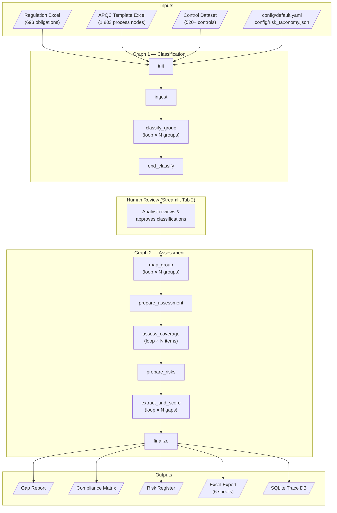
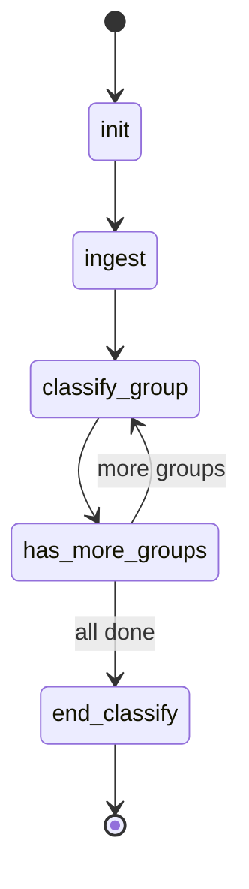
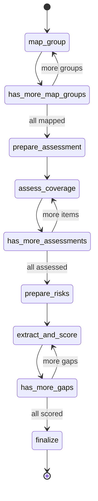
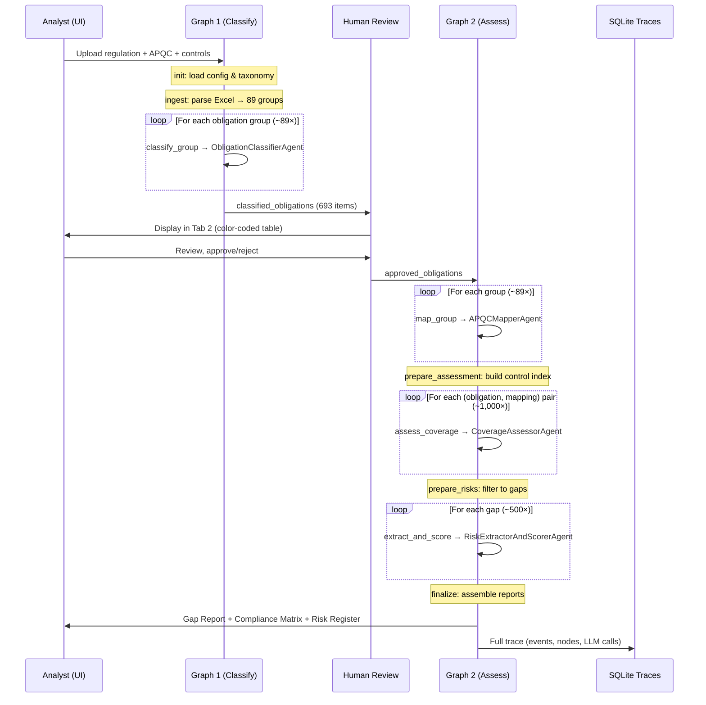

# Architecture Guide — Regulatory Obligation Control Mapper

> A comprehensive walkthrough of the system for someone new to the codebase.
> Covers the agentic workflow, data flow, configuration, tracing, and UI.

---

## Table of Contents

1. [System Overview](#1-system-overview)
2. [High-Level Architecture](#2-high-level-architecture)
3. [Graph 1 — Classification Pipeline](#3-graph-1--classification-pipeline)
4. [Graph 2 — Assessment Pipeline](#4-graph-2--assessment-pipeline)
5. [Agents](#5-agents)
6. [Data Flow](#6-data-flow)
7. [Data Models](#7-data-models)
8. [Ingest Layer](#8-ingest-layer)
9. [Configuration](#9-configuration)
10. [Tracing & Observability](#10-tracing--observability)
11. [UI (Streamlit)](#11-ui-streamlit)
12. [Validation](#12-validation)
13. [Project Structure](#13-project-structure)

---

## 1. System Overview

The Regulatory Obligation Control Mapper is a **multi-agent LLM pipeline** that takes a regulatory document (e.g. Federal Reserve Regulation YY) and automatically:

1. **Classifies** every regulatory obligation by type and criticality
2. **Maps** each obligation to standardised business processes (APQC framework)
3. **Assesses** whether existing internal controls cover each obligation
4. **Scores** the residual risk for any gaps

The pipeline is built on **LangGraph** — a state-machine framework from the LangChain ecosystem. Two separate graphs execute in sequence with a human review checkpoint between them:

| Phase | Graph | Agent | What happens |
|-------|-------|-------|-------------|
| Ingest | Graph 1 | — | Parse regulation Excel, load APQC hierarchy, discover controls |
| Classify | Graph 1 | `ObligationClassifierAgent` | Classify each obligation's category, relationship type, criticality |
| *Human Review* | — | — | Analyst reviews/approves classifications in the UI |
| Map | Graph 2 | `APQCMapperAgent` | Map obligations to APQC processes |
| Assess | Graph 2 | `CoverageAssessorAgent` | Evaluate each obligation–control pair for coverage |
| Score | Graph 2 | `RiskExtractorAndScorerAgent` | Extract and score risks for coverage gaps |
| Finalize | Graph 2 | — | Assemble Gap Report, Compliance Matrix, Risk Register |

### Tech Stack

| Component | Technology |
|-----------|-----------|
| Orchestration | LangGraph ≥ 0.2, LangChain Core ≥ 0.3 |
| LLM Transport | httpx (async), supports OpenAI and IBM Cloud AI (ICA) |
| Data Validation | Pydantic v2 (frozen models) |
| UI | Streamlit ≥ 1.35 |
| Tracing | SQLite (stdlib `sqlite3`) |
| Data I/O | pandas, openpyxl |
| Config | YAML (`default.yaml`) + JSON (`risk_taxonomy.json`) |

### Dual-Mode Execution

The pipeline runs in two modes:

- **LLM mode** — Full prompts sent to an LLM (ICA or OpenAI). Produces high-quality, context-aware results. ~30–60 min for a full regulation.
- **Deterministic mode** — Keyword-based fallbacks. No API keys needed. ~5 min. Useful for testing, demos, or when LLM access is unavailable.

Provider detection order: `ICA_API_KEY` → `OPENAI_API_KEY` → deterministic fallback.

---

## 2. High-Level Architecture



### Key Architectural Decisions

- **Two graphs, not one.** The human review checkpoint between classification and assessment means the UI can save/load intermediate state and let analysts curate results before the expensive assessment phase runs.
- **Loop-based processing.** Each graph uses conditional routing (`has_more_*` nodes) to iterate over items one at a time. This keeps memory bounded and enables per-item tracing.
- **Reducer-based state accumulation.** List fields in state use `Annotated[list, operator.add]` so nodes can *append* results without replacing the entire list.
- **Module-level caching.** The LLM client, agents, and event loop are cached at module scope — one instance per Streamlit session. This avoids recreating connections on every node invocation.

---

## 3. Graph 1 — Classification Pipeline

**Source:** `src/regrisk/graphs/classify_graph.py`
**State:** `src/regrisk/graphs/classify_state.py` → `ClassifyState`



### Nodes

| Node | What it does |
|------|-------------|
| `init` | Loads `default.yaml` config and `risk_taxonomy.json`. Builds the `AgentContext` (LLM client, model name, temperature). Detects whether an LLM provider is available. |
| `ingest` | Parses the regulation Excel into `Obligation` models. Groups them by CFR section (~89 groups for Regulation YY). Loads the APQC hierarchy and discovers control files. Applies scope filtering (all / by subpart / quick sample). |
| `classify_group` | Picks the group at index `classify_idx`. Sends the group's obligations to `ObligationClassifierAgent`. Validates the returned classifications. Appends results to `classified_obligations`. Increments `classify_idx`. |
| `has_more_groups` | Conditional router — returns `"classify_group"` if `classify_idx < len(obligation_groups)`, else `"end_classify"`. |
| `end_classify` | Emits a completion event. No state changes. |

### ClassifyState Fields

```
Input:        regulation_path, apqc_path, controls_dir, config_path, scope_config
Initialised:  pipeline_config, risk_taxonomy, llm_enabled
Ingested:     regulation_name, total_obligations, obligation_groups, apqc_nodes, controls
Loop:         classify_idx
Output:       classified_obligations (list, reducer=add)
Errors:       errors (list, reducer=add)
```

---

## 4. Graph 2 — Assessment Pipeline

**Source:** `src/regrisk/graphs/assess_graph.py`
**State:** `src/regrisk/graphs/assess_state.py` → `AssessState`



### Nodes

| Node | What it does |
|------|-------------|
| `map_group` | Retrieves the obligation group at `map_idx`. Builds an APQC summary text (indented hierarchy, filtered by depth). Sends to `APQCMapperAgent`. Validates mappings. Appends to `obligation_mappings`. |
| `prepare_assessment` | Loads all controls into an index keyed by `hierarchy_id`. For each (obligation, mapping) pair, finds candidate controls using `find_controls_for_apqc()` (exact + descendant match). Produces `assess_items` list. |
| `assess_coverage` | Retrieves the item at `assess_idx`. For each candidate control, calls `CoverageAssessorAgent`. Selects the best assessment (priority: Covered > Partially Covered > Not Covered). Appends to `coverage_assessments`. |
| `prepare_risks` | Filters assessments to gaps only (overall_coverage ∈ {"Not Covered", "Partially Covered"}). Produces `gap_obligations` list. |
| `extract_and_score` | Retrieves the gap at `risk_idx`. Calls `RiskExtractorAndScorerAgent` to extract 1–3 scored risks. Validates risks. Appends to `scored_risks`. |
| `finalize` | Assembles three final reports — **Gap Report**, **Compliance Matrix**, **Risk Register** — from the accumulated state. |

The three `has_more_*` nodes are conditional routers that drive the loops.

### AssessState Fields

```
Carried:      regulation_name, pipeline_config, risk_taxonomy, llm_enabled, apqc_nodes, controls
From review:  approved_obligations, mappable_groups

Map loop:     map_idx, obligation_mappings (reducer=add)
Assess loop:  assess_items, assess_idx, coverage_assessments (reducer=add)
Risk loop:    gap_obligations, risk_idx, scored_risks (reducer=add)

Final:        gap_report, compliance_matrix, risk_register
Errors:       errors (reducer=add)
```

---

## 5. Agents

All agents extend `BaseAgent` (in `src/regrisk/agents/base.py`), which provides:

- `call_llm(system_prompt, user_prompt)` — sends a chat completion request and returns the raw text response. Returns `""` when no LLM client is available (triggering the deterministic path).
- `call_llm_with_tools(messages, tools, tool_executor)` — multi-round tool-calling loop.
- `parse_json(text)` — robust JSON extraction that handles markdown fences and partial responses.

Agents are registered via the `@register_agent` decorator into a global `AGENT_REGISTRY`.

---

### 5.1 ObligationClassifierAgent

**Source:** `src/regrisk/agents/obligation_classifier.py`

**Purpose:** Classifies each regulatory obligation in a section group into a category, relationship type, and criticality tier.

**Prompt summary:** The system prompt instructs the LLM to act as a regulatory compliance analyst using the Promontory/IBM RCM methodology. For each obligation it must determine exactly one obligation category, one relationship type (for actionable categories only), and one criticality tier, then explain the rationale. The user prompt lists all obligations in the group with their citations, title hierarchy, and abstracts.

**Input:**

| Kwarg | Type | Description |
|-------|------|-------------|
| `group` | `dict` | An `ObligationGroup` with its list of obligations |
| `config` | `dict` | Pipeline configuration |
| `regulation_name` | `str` | e.g. "Enhanced Prudential Standards (Regulation YY)" |

**Output:**

```python
{
    "classifications": [
        {
            "citation": "12 CFR 252.34(a)(1)(i)",
            "obligation_category": "Controls",          # one of 5 categories
            "relationship_type": "Constrains Execution", # one of 4 types (or N/A)
            "criticality_tier": "High",                  # High | Medium | Low
            "classification_rationale": "...",
            "section_citation": "...",
            "section_title": "...",
            "subpart": "...",
            "abstract": "..."
        }
    ]
}
```

**Classification taxonomy:**

| Category | When to assign |
|----------|---------------|
| **Attestation** | Requires senior management sign-off, certification, or board approval |
| **Documentation** | Requires maintenance of written policies, procedures, plans, or records |
| **Controls** | Requires evidence of operating processes, controls, systems, or monitoring |
| **General Awareness** | Is principle-based, definitional, or provides general authority |
| **Not Assigned** | General requirement, not directly actionable |

| Relationship Type | Meaning |
|-------------------|---------|
| Requires Existence | A function, committee, role, or process must exist |
| Constrains Execution | HOW a process must be performed (e.g. board approval, independence) |
| Requires Evidence | Documentation, reports, or records must be produced and maintained |
| Sets Frequency | How often an activity must be performed (e.g. quarterly, annually) |

| Criticality | Meaning |
|-------------|---------|
| High | Violation would trigger enforcement action, consent order, or MRA |
| Medium | Supervisory criticism or examination findings |
| Low | Observation or best-practice gap |

**Deterministic fallback:** Keyword matching on the obligation abstract (e.g. "must|shall|require" → Controls/High, "report|document" → Documentation/Medium, "approve|attest|board" → Attestation/High).

---

### 5.2 APQCMapperAgent

**Source:** `src/regrisk/agents/apqc_mapper.py`

**Purpose:** Maps classified obligations to 1–N APQC (American Productivity & Quality Center) business processes at the configured depth level.

**Prompt summary:** The system prompt provides the full APQC hierarchy (up to the configured depth) and instructs the LLM to find 1–`max_mappings` processes that each obligation constrains or requires. Each mapping must include a specific `relationship_detail` describing *what* the regulation requires *of* the process.  The prompt emphasises preferring specific processes over general ones and assigning confidence scores. The user prompt lists all obligations in the group with their classification metadata.

**Input:**

| Kwarg | Type | Description |
|-------|------|-------------|
| `obligations` | `list[dict]` | Classified obligations for this group |
| `apqc_summary` | `str` | Formatted APQC hierarchy text (indented, depth-filtered) |
| `config` | `dict` | Pipeline config (contains `apqc_mapping_depth`, `max_apqc_mappings_per_obligation`) |
| `regulation_name` | `str` | Regulation name |
| `section_citation` | `str` | CFR section citation |
| `section_title` | `str` | Section title |

**Output:**

```python
{
    "mappings": [
        {
            "citation": "12 CFR 252.34(a)(1)(i)",
            "apqc_hierarchy_id": "11.1.1",
            "apqc_process_name": "Establish enterprise risk framework and policies",
            "relationship_type": "Constrains Execution",
            "relationship_detail": "Board must approve liquidity risk tolerance annually.",
            "confidence": 0.92
        }
    ]
}
```

**Deterministic fallback:** A keyword→APQC lookup table maps terms like "liquidity" → `9.7.1`, "capital" → `9.5.1`, "compliance" → `11.2.1`, etc. Default fallback: `11.1.1` with confidence `0.3`.

---

### 5.3 CoverageAssessorAgent

**Source:** `src/regrisk/agents/coverage_assessor.py`

**Purpose:** Evaluates whether a candidate internal control adequately covers a specific regulatory obligation, using a three-layer evaluation methodology.

**Prompt summary:** The system prompt defines three evaluation layers. **Layer 1 (Structural Match)** is pre-computed — controls were found at overlapping APQC nodes. **Layer 2 (Semantic Match)** asks the LLM whether the control's description, purpose, and action substantively address the obligation (rated Full / Partial / None). **Layer 3 (Relationship Match)** checks whether the control satisfies the obligation's specific relationship type — e.g. if the obligation "Sets Frequency", does the control operate at that frequency? (rated Satisfied / Partial / Not Satisfied). The overall coverage is derived from these layers. The user prompt provides full obligation and control details including who/what/when/where/why/evidence fields.

**Input:**

| Kwarg | Type | Description |
|-------|------|-------------|
| `obligation` | `dict` | Classified obligation |
| `control` | `dict \| None` | Candidate control record, or `None` if no structural match |
| `apqc_hierarchy_id` | `str` | The APQC node linking obligation to control |
| `apqc_process_name` | `str` | Name of the APQC process |

**Output:**

```python
{
    "citation": "12 CFR 252.34(a)(1)(i)",
    "apqc_hierarchy_id": "11.1.1",
    "control_id": "CTRL-001",       # or None
    "structural_match": True,
    "semantic_match": "Partial",     # Full | Partial | None
    "semantic_rationale": "...",
    "relationship_match": "Partial", # Satisfied | Partial | Not Satisfied
    "relationship_rationale": "...",
    "overall_coverage": "Partially Covered"
}
```

**Coverage derivation:**

| Condition | Rating |
|-----------|--------|
| Semantic = Full **AND** Relationship = Satisfied | **Covered** |
| Semantic = Partial **OR** Relationship = Partial | **Partially Covered** |
| Semantic = None **OR** Relationship = Not Satisfied **OR** no controls | **Not Covered** |

**Deterministic fallback:** No candidate controls → "Not Covered" (no LLM call). Candidate present but LLM unavailable → "Partially Covered".

---

### 5.4 RiskExtractorAndScorerAgent

**Source:** `src/regrisk/agents/risk_extractor_scorer.py`

**Purpose:** For each coverage gap, extracts 1–3 compliance risks and scores them on a 4×4 impact × frequency matrix using the banking risk taxonomy.

**Prompt summary:** The system prompt instructs the LLM to act as a senior risk analyst. It provides the full risk taxonomy (8 categories with sub-categories), a 4-point impact scale, and a 4-point frequency scale. For each risk the LLM must write a 25–50 word description, classify it into a category/sub-category, and score impact and frequency with rationales. The user prompt provides the obligation, its coverage status, the gap rationale, and the mapped APQC process.

**Input:**

| Kwarg | Type | Description |
|-------|------|-------------|
| `obligation` | `dict` | The gap obligation |
| `coverage_status` | `str` | "Not Covered" or "Partially Covered" |
| `gap_rationale` | `str` | Why the obligation isn't covered |
| `apqc_hierarchy_id` | `str` | Mapped APQC process ID |
| `apqc_process_name` | `str` | Mapped APQC process name |
| `risk_taxonomy` | `dict` | From `config/risk_taxonomy.json` |
| `config` | `dict` | Pipeline config (impact/frequency scales) |
| `risk_counter` | `int` | For sequential risk ID generation |

**Output:**

```python
{
    "risks": [
        {
            "risk_id": "RISK-001",
            "source_citation": "12 CFR 252.34(a)(1)(i)",
            "source_apqc_id": "11.1.1",
            "risk_description": "...",
            "risk_category": "Compliance Risk",
            "sub_risk_category": "Regulatory Compliance Risk",
            "impact_rating": 3,
            "impact_rationale": "...",
            "frequency_rating": 2,
            "frequency_rationale": "...",
            "inherent_risk_rating": "High",
            "coverage_status": "Not Covered"
        }
    ]
}
```

**Scoring scales:**

| Impact (1–4) | Label | Description |
|--------------|-------|-------------|
| 1 | Minor | < 5% annual pre-tax income, non-critical activity |
| 2 | Moderate | 5–25% impact, < 1 day, localised media |
| 3 | Major | 1–2 quarters impact, partial failure, national media |
| 4 | Severe | ≥ 2 quarters, critical failure, cease-and-desist |

| Frequency (1–4) | Label | Description |
|------------------|-------|-------------|
| 1 | Remote | Once every 3+ years |
| 2 | Unlikely | Once every 1–3 years |
| 3 | Possible | Once per year |
| 4 | Likely | Once per quarter or more |

**Inherent risk rating** = impact × frequency:

| Score | Rating |
|-------|--------|
| ≥ 12 | Critical |
| ≥ 8 | High |
| ≥ 4 | Medium |
| < 4 | Low |

**Deterministic fallback:** Scores based on `criticality_tier` — High → impact 3 / freq 2, Medium → 2/2, Low → 1/1.

---

## 6. Data Flow

### End-to-End Sequence



### How State Bridges the Two Graphs

The graphs are separate LangGraph `StateGraph` instances. They are connected through **Streamlit session state** and the **checkpoint system**:

1. **Graph 1** writes `classified_obligations` into its final state.
2. The UI copies the result to `st.session_state` and renders it in Tab 2.
3. The analyst reviews and exports/imports an Excel file (with an "approved" column).
4. **Graph 2** receives `approved_obligations` as input, built from the reviewed classifications.
5. At any point, the user can **save a checkpoint** — a JSON file in `data/checkpoints/` containing all state keys for that stage. This allows resuming after a crash or across sessions.

### Reducer Pattern

State lists that accumulate across loop iterations use LangGraph's reducer mechanism:

```python
classified_obligations: Annotated[list[dict], operator.add]
```

When a node returns `{"classified_obligations": [new_item]}`, LangGraph *appends* `new_item` to the existing list rather than replacing it. This is how results accumulate without each node needing to copy the full list.

---

## 7. Data Models

All models are defined in `src/regrisk/core/models.py` using Pydantic v2 with `frozen=True` (immutable after creation).

### Ingest Models

| Model | Key Fields | Purpose |
|-------|-----------|---------|
| `Obligation` | `citation`, `mandate_title`, `abstract`, `text`, `status`, `title_level_2/3/4/5`, `citation_level_2/3`, `effective_date`, `applicability` | Single regulatory obligation from Excel |
| `ObligationGroup` | `group_id`, `subpart`, `section_citation`, `section_title`, `obligation_count`, `obligations` | Group of obligations sharing the same CFR section |
| `APQCNode` | `pcf_id`, `hierarchy_id`, `name`, `depth` (auto-computed), `parent_id` (auto-computed) | One node in the APQC process hierarchy |
| `ControlRecord` | `control_id`, `hierarchy_id`, `leaf_name`, `full_description`, `who`, `what`, `when`, `frequency`, `where`, `why`, `evidence`, `quality_rating` | An existing internal control |

### Pipeline Artifact Models

| Model | Key Fields | Produced by |
|-------|-----------|-------------|
| `ClassifiedObligation` | `citation`, `abstract`, `obligation_category`, `relationship_type`, `criticality_tier`, `classification_rationale` | `ObligationClassifierAgent` |
| `ObligationAPQCMapping` | `citation`, `apqc_hierarchy_id`, `apqc_process_name`, `relationship_type`, `relationship_detail`, `confidence` | `APQCMapperAgent` |
| `CoverageAssessment` | `citation`, `apqc_hierarchy_id`, `control_id`, `structural_match`, `semantic_match`, `relationship_match`, `overall_coverage` | `CoverageAssessorAgent` |
| `ScoredRisk` | `risk_id`, `source_citation`, `source_apqc_id`, `risk_description`, `risk_category`, `sub_risk_category`, `impact_rating`, `frequency_rating`, `inherent_risk_rating` | `RiskExtractorAndScorerAgent` |

### Final Output Models

| Model | Key Fields |
|-------|-----------|
| `GapReport` | `regulation_name`, `total_obligations`, `classified_counts`, `mapped_obligation_count`, `coverage_summary`, `gaps` |
| `ComplianceMatrix` | `rows` (flat list of dicts linking citation → APQC → control → coverage → risks) |
| `RiskRegister` | `scored_risks`, `total_risks`, `risk_distribution`, `critical_count`, `high_count` |

---

## 8. Ingest Layer

**Source:** `src/regrisk/ingest/`

The ingest layer converts raw Excel files into structured, validated Pydantic models. All ingest operations are **deterministic** — no LLM calls.

### 8.1 Regulation Parser (`regulation_parser.py`)

- Reads the "Requirements" sheet from the regulation Excel file.
- Validates that all 15 expected columns exist (Citation, Mandate Title, Abstract, Text, Status, Title Level 2–5, etc.).
- Extracts `regulation_name` from the first non-empty `mandate_title`.
- Falls back to the "Text" column if "Abstract" is empty.
- **`group_obligations()`** groups obligations by `(Citation Level 2, Citation Level 3)` — e.g. all obligations under "12 CFR 252 Subpart E § 252.34" become one group. For Regulation YY this produces ~89 groups.

### 8.2 APQC Loader (`apqc_loader.py`)

- Reads the "Combined" sheet from the APQC Excel template.
- Computes `depth` from the hierarchy ID dot-count ("11.1.1" → depth 3).
- Computes `parent_id` by stripping the last segment ("11.1.1" → "11.1").
- **`build_apqc_summary()`** generates an indented text representation (2 spaces per level, filtered by `max_depth`) that is included in the APQCMapper's prompt.

### 8.3 Control Loader (`control_loader.py`)

- **`discover_control_files()`** — globs for `section_*__controls.xlsx` files in the control dataset directory.
- **`load_and_merge_controls()`** — reads each file, detects the correct sheet name, deduplicates by `control_id`, cleans NaN values.
- **`build_control_index()`** — indexes controls by `hierarchy_id` into a dict for O(1) lookup.
- **`find_controls_for_apqc()`** — returns controls whose `hierarchy_id` matches the APQC ID exactly or starts with it as a prefix (i.e. exact match + all descendants).

---

## 9. Configuration

### 9.1 Pipeline Config (`config/default.yaml`)

Loaded by `src/regrisk/core/config.py` into a `PipelineConfig` Pydantic model.

| Parameter | Default | Description |
|-----------|---------|-------------|
| `active_statuses` | `["In Force", "Pending"]` | Which obligation statuses to include |
| `control_file_pattern` | `"section_*__controls.xlsx"` | Glob pattern for control files |
| `obligation_categories` | 5 categories | Attestation, Documentation, Controls, General Awareness, Not Assigned |
| `relationship_types` | 4 types + N/A | Requires Existence, Constrains Execution, Requires Evidence, Sets Frequency |
| `criticality_tiers` | 3 tiers | High, Medium, Low |
| `actionable_categories` | 3 categories | Controls, Documentation, Attestation (subset that gets mapped to APQC) |
| `apqc_mapping_depth` | `3` | How deep in the APQC hierarchy to map (1–5) |
| `max_apqc_mappings_per_obligation` | `5` | Max APQC processes per obligation |
| `coverage_thresholds.semantic_match_min_confidence` | `0.6` | Minimum confidence for semantic match |
| `coverage_thresholds.frequency_tolerance` | `1` | Frequency tolerance for relationship match |
| `min_risks_per_gap` | `1` | Min risks to extract per gap |
| `max_risks_per_gap` | `3` | Max risks to extract per gap |
| `impact_scale` | 1–4 | Impact level definitions (Minor → Severe) |
| `frequency_scale` | 1–4 | Frequency level definitions (Remote → Likely) |
| `risk_id_prefix` | `"RISK"` | Prefix for generated risk IDs |

### 9.2 Risk Taxonomy (`config/risk_taxonomy.json`)

Defines 8 top-level risk categories with sub-categories. The taxonomy is injected into the RiskExtractorAndScorerAgent's system prompt.

| Category | Sub-Categories |
|----------|---------------|
| **Credit Risk** | Commercial Credit, Consumer Credit |
| **Operational Risk** | Technology, Info Security, Third Party, Data, Fraud, BCP, Process, Model, People, Change, Execution, Internal Fraud |
| **Market Risk** | Commodity, Counterparty, Foreign Exchange, Equity |
| **Compliance Risk** | Conduct, Regulatory Compliance, Financial Crimes |
| **Strategic Risk** | Capital Adequacy, New Initiatives, Competitive, Business Model |
| **Reputational Risk** | Media, Political, Social |
| **Interest Rate Risk** | Balance Sheet, Basis, Repricing, Yield Curve |
| **Liquidity Risk** | Collateral, Deposit, Funding Gap, Market Liquidity, Contingency |

---

## 10. Tracing & Observability

**Source:** `src/regrisk/tracing/`

The tracing system provides LangSmith-like visibility using a local SQLite database — no external services required.

### 10.1 Database Schema

The trace database lives at `data/traces.db` (WAL mode for concurrent reads). Four tables:

```
┌──────────────┐
│     runs      │  One row per pipeline invocation
├──────────────┤
│ run_id (PK)  │
│ graph_name   │
│ regulation   │
│ status       │
│ config_json  │
│ started/ended│
└──────┬───────┘
       │ 1:N
       ├─────────────────────┬──────────────────────┐
       ▼                     ▼                      ▼
┌──────────────┐  ┌───────────────────┐  ┌──────────────────┐
│    events     │  │ node_executions   │  │    llm_calls      │
├──────────────┤  ├───────────────────┤  ├──────────────────┤
│ event_type   │  │ node_name         │  │ node_name        │
│ stage        │  │ started/completed │  │ agent_name       │
│ message      │  │ duration_ms       │  │ system_prompt    │
│ data_json    │  │ input_summary     │  │ user_prompt      │
│ timestamp    │  │ output_summary    │  │ response_text    │
└──────────────┘  │ error             │  │ model            │
                  └───────────────────┘  │ prompt/completion │
                                         │ _tokens          │
                                         │ latency_ms       │
                                         │ error            │
                                         └──────────────────┘
```

### 10.2 How Tracing Hooks Into the Pipeline

Three hooks capture data with minimal changes to existing code:

1. **Node Decorator** (`tracing/decorators.py`) — `trace_node(db, run_id, node_name)` wraps each graph node. Records entry/exit timing, compact state summaries (type+size, not full data), and errors. Also sets thread-local context so downstream code knows which node is active.

2. **Event Listener** (`tracing/listener.py`) — `SQLiteTraceListener` implements the `EventListener` protocol. Every `PipelineEvent` emitted by the pipeline is persisted to the `events` table. On `PIPELINE_COMPLETED` or `PIPELINE_FAILED`, updates the run status.

3. **Transport Wrapper** (`tracing/transport_wrapper.py`) — `TracingTransportClient` wraps the `AsyncTransportClient`. Intercepts every `chat_completion()` call to capture the full system prompt, user prompt, response text, token counts, and latency. Reads the thread-local trace context to tag each call with its originating node and agent.

### 10.3 Logging

Terminal output is enriched with context:

- **Agent level:** Each `call_llm()` logs the agent name, call number, prompt sizes, response timing, and token counts.
- **Node level:** Visual separators (`━━━`) frame each node execution with `▶ NODE: name` headers and `✔`/`✘` completion summaries with timing.
- **Transport level:** Success lines include `[node=..., agent=...]` context labels.

Noisy third-party loggers (httpx, httpcore, matplotlib, etc.) are silenced to keep output clean.

### 10.4 Tab 5 Trace Viewer

The Streamlit UI (Tab 5) provides a graphical interface to the trace database:

- **Run selector** — dropdown listing all recorded runs.
- **Overview metrics** — 5-column summary (total events, nodes, LLM calls, total tokens, total latency).
- **Event timeline** — chronological table of all pipeline events.
- **Node executions** — table + bar chart showing per-node timing.
- **LLM call inspector** — expandable details for each LLM call with full prompts and responses.
- **Token-by-node chart** — visualisation of token consumption.
- **Maintenance** — purge old runs, delete individual runs.

---

## 11. UI (Streamlit)

**Source:** `src/regrisk/ui/app.py`

The UI is a 5-tab Streamlit application.

### Tab 1: Upload & Configure

- Auto-detects data files from the `data/` folder (regulation Excel, APQC template, control dataset).
- Manual file upload fallback.
- Displays pipeline configuration metrics (APQC depth, max mappings, risk scales).
- **Scope picker** — choose to process all obligations, filter by subpart, or run a quick sample.
- Pre-scans the regulation for subpart/group metadata.
- Shows estimated LLM call count and detected provider (ICA / OpenAI / deterministic).
- "Run Classification" button launches Graph 1.

### Tab 2: Classification Review

- Displays `classified_obligations` from Graph 1 in a color-coded, filterable dataframe.
- **Export for review** — saves an Excel file with an "approved" column (default `True`).
- **Import reviewed** — reads back the Excel, filters to `approved=True`, feeds the approved obligations into Graph 2.
- "Run Mapping & Assessment" button launches Graph 2.

### Tab 3: Mapping Review

- Displays `obligation_mappings` — citation, APQC process, confidence score, relationship detail.
- Export/import for further review.

### Tab 4: Results

- **Gap Report** summary — counts by category, coverage status distribution.
- **Compliance Matrix** heatmap.
- **Gap list** — obligations with gaps.
- **Risk Register** — scored risks with distribution summary.
- **Excel export** — download a comprehensive workbook (6 sheets).

### Tab 5: Traceability

- SQLite trace viewer (see Section 10.4).
- Data lineage chain showing how each artifact connects.

### Checkpoint System

**Source:** `src/regrisk/ui/checkpoint.py`

Checkpoints persist pipeline state to JSON files at three stages:

| Stage | Label | What's Saved |
|-------|-------|-------------|
| `classified` | Classification | `classified_obligations`, `obligation_groups`, `regulation_name`, etc. |
| `mapped` | APQC Mapping | All of the above + `obligation_mappings`, `mappable_groups` |
| `assessed` | Full Assessment | All of the above + `coverage_assessments`, `scored_risks`, `gap_report`, `compliance_matrix`, `risk_register` |

Checkpoint files are saved to `data/checkpoints/` with the naming pattern:
```
{stage}_{regulation_name}_{timestamp}.json
```

Each checkpoint includes a `_meta` dict with `stage`, `timestamp`, and `keys_saved`. Users can load any checkpoint to resume from that point.

---

## 12. Validation

**Source:** `src/regrisk/validation/validator.py`

Deterministic validators check each pipeline artifact after LLM generation. Every validator returns `(is_valid: bool, failures: list[str])` where each failure has a typed code:

### Classification Validation

| Check | Failure Code |
|-------|-------------|
| Category not in valid set | `INVALID_CATEGORY` |
| Actionable category missing relationship type | `MISSING_RELATIONSHIP_TYPE` |
| Criticality not High/Medium/Low | `INVALID_CRITICALITY` |
| Empty citation | `MISSING_CITATION` |

### Mapping Validation

| Check | Failure Code |
|-------|-------------|
| Empty APQC hierarchy ID | `MISSING_APQC_ID` |
| Empty relationship detail | `MISSING_RELATIONSHIP_DETAIL` |
| Confidence not in 0.0–1.0 | `INVALID_CONFIDENCE` |
| Empty citation | `MISSING_CITATION` |

### Coverage Validation

| Check | Failure Code |
|-------|-------------|
| Invalid coverage status | `INVALID_COVERAGE_STATUS` |
| Invalid semantic match rating | `INVALID_SEMANTIC_MATCH` |

### Risk Validation

| Check | Failure Code |
|-------|-------------|
| Description not 20–60 words | `WORD_COUNT` |
| Impact rating not 1–4 | `INVALID_IMPACT_RATING` |
| Frequency rating not 1–4 | `INVALID_FREQUENCY_RATING` |

### Inherent Risk Rating Formula

```
score = impact_rating × frequency_rating

score ≥ 12 → Critical
score ≥ 8  → High
score ≥ 4  → Medium
score < 4  → Low
```

---

## 13. Project Structure

```
.
├── config/
│   ├── default.yaml                 # Pipeline configuration (categories, scales, thresholds)
│   └── risk_taxonomy.json           # 8 risk categories with sub-categories
│
├── data/
│   ├── checkpoints/                 # Saved pipeline state (JSON)
│   └── Control Dataset/             # Input control Excel files
│
├── doc/
│   └── ARCHITECTURE.md              # ← You are here
│
├── src/regrisk/
│   ├── agents/
│   │   ├── base.py                  # BaseAgent ABC, AgentContext, call_llm, registry
│   │   ├── obligation_classifier.py # Phase 2: classify obligations by category/type/criticality
│   │   ├── apqc_mapper.py           # Phase 3: map obligations to APQC processes
│   │   ├── coverage_assessor.py     # Phase 4: evaluate control coverage (3-layer)
│   │   └── risk_extractor_scorer.py # Phase 5: extract and score residual risks
│   │
│   ├── core/
│   │   ├── config.py                # PipelineConfig (Pydantic), YAML/JSON loaders
│   │   ├── events.py                # EventType enum, PipelineEvent, EventEmitter
│   │   ├── models.py                # All Pydantic models (frozen, immutable)
│   │   └── transport.py             # AsyncTransportClient (httpx), provider auto-detect
│   │
│   ├── export/
│   │   └── excel_export.py          # Excel report generation (6-sheet workbook)
│   │
│   ├── graphs/
│   │   ├── classify_graph.py        # Graph 1 builder: init → ingest → classify (loop) → end
│   │   ├── classify_state.py        # ClassifyState TypedDict
│   │   ├── assess_graph.py          # Graph 2 builder: map → assess → score → finalize
│   │   └── assess_state.py          # AssessState TypedDict
│   │
│   ├── ingest/
│   │   ├── regulation_parser.py     # Parse regulation Excel → Obligation → ObligationGroup
│   │   ├── apqc_loader.py           # Parse APQC Excel → APQCNode hierarchy
│   │   └── control_loader.py        # Discover, merge, index control files
│   │
│   ├── tracing/
│   │   ├── db.py                    # TraceDB: SQLite wrapper (4 tables, WAL mode)
│   │   ├── decorators.py            # trace_node decorator, thread-local context
│   │   ├── listener.py              # SQLiteTraceListener (EventListener → SQLite)
│   │   └── transport_wrapper.py     # TracingTransportClient (captures LLM calls)
│   │
│   ├── ui/
│   │   ├── app.py                   # Streamlit 5-tab application
│   │   └── checkpoint.py            # Save/load/list checkpoint JSON files
│   │
│   └── validation/
│       └── validator.py             # Deterministic artifact validators
│
├── tests/
│   ├── conftest.py                  # Shared fixtures
│   ├── test_classify_graph.py       # Graph 1 integration tests
│   ├── test_assess_graph.py         # Graph 2 integration tests
│   ├── test_ingest.py               # Ingest layer tests
│   ├── test_models.py               # Pydantic model tests
│   ├── test_tracing.py              # Tracing subsystem tests (20 tests)
│   └── test_validator.py            # Validation tests
│
├── pyproject.toml                   # Dependencies, project metadata, entry points
└── README.md                        # Quick-start guide
```

---

## Appendix: Typical Run Numbers (Regulation YY)

| Metric | Value |
|--------|-------|
| Total obligations | ~693 |
| Obligation groups | ~89 |
| APQC nodes loaded | ~1,803 |
| Controls loaded | ~520 |
| Classification LLM calls | ~89 (one per group) |
| Mapping LLM calls | ~89 (one per group) |
| Coverage assessment LLM calls | ~1,000 (one per obligation×control pair) |
| Risk scoring LLM calls | ~500 (one per gap) |
| **Total LLM calls** | **~1,700** |
| Deterministic mode runtime | ~5 min |
| LLM mode runtime (ICA/OpenAI) | ~30–60 min |
