# ControlNexus — Technical Flow Diagram

Hybrid source-led risk and control mapping. Two parallel entry paths
(**Regulation-Led** and **Policy/Procedure-Led**) converge into one
governed pipeline. Every decision point shows the **context** the agent
consults before acting.

---

## 1. Mermaid Flowchart — Decision Points with Context

```mermaid
flowchart TB
    classDef start fill:#0b3d91,color:#fff,stroke:#0b3d91,font-weight:bold
    classDef regPath fill:#e3f2fd,color:#0d47a1,stroke:#1976d2,stroke-width:2px
    classDef polPath fill:#f3e5f5,color:#4a148c,stroke:#7b1fa2,stroke-width:2px
    classDef shared fill:#f5f5f5,color:#1a1a1a,stroke:#616161,stroke-width:1px
    classDef decision fill:#fff8e1,color:#5d4037,stroke:#f9a825,stroke-width:2px
    classDef ctx fill:#fffde7,color:#5c4700,stroke:#caa334,stroke-width:1px,stroke-dasharray:3 2
    classDef obj fill:#e8f5e9,color:#1b5e20,stroke:#388e3c,stroke-width:1px,font-style:italic
    classDef review fill:#ffebee,color:#7a1f29,stroke:#c0506a,stroke-width:2px
    classDef output fill:#e0f2f1,color:#004d40,stroke:#00897b,stroke-width:2px

    START["Source Workbook<br/>uploaded to data/"]:::start

    %% ── Dispatcher ───────────────────────────────────────────────
    DISP{{"Ingest Dispatcher<br/>detect_source_inventory()"}}:::decision
    DISP_CTX["<b>Context consulted</b><br/>• Sheet names in workbook<br/>• scope_config.source_mode<br/>• File name heuristics"]:::ctx

    START --> DISP
    DISP_CTX -.-> DISP

    %% ═══════════════════════════════════════════════════════════════
    %% REGULATION-LED PATH (left column)
    %% ═══════════════════════════════════════════════════════════════
    subgraph REG["REGULATION-LED PATH"]
        direction TB
        REG_PARSE["regulation_parser<br/>reads 'Requirements' sheet"]:::regPath
        REG_GROUP["group_obligations()<br/>by Citation Level 2 / 3"]:::regPath
        REG_OBJ["Obligation<br/>source_type = Regulatory_Obligation<br/>source_id = citation"]:::obj
        REG_PARSE --> REG_GROUP --> REG_OBJ
    end

    %% ═══════════════════════════════════════════════════════════════
    %% POLICY-LED PATH (right column)
    %% ═══════════════════════════════════════════════════════════════
    subgraph POL["POLICY / PROCEDURE-LED PATH"]
        direction TB
        POL_PARSE["policy_parser<br/>reads 'Source_Inventory' sheet"]:::polPath
        POL_NORM["_normalize_source_type()<br/>Policy / Standard / Procedure"]:::polPath
        POL_GROUP["group_policy_obligations()<br/>by parent_source_id"]:::polPath
        POL_OBJ["Obligation<br/>source_type = Policy / Procedure<br/>parent_source_id, source_metadata"]:::obj
        POL_PARSE --> POL_NORM --> POL_GROUP --> POL_OBJ
    end

    DISP -->|Sheet 'Requirements'<br/>or source_mode=regulation| REG_PARSE
    DISP -->|Sheet 'Source_Inventory'<br/>or source_mode=policy| POL_PARSE

    %% ═══════════════════════════════════════════════════════════════
    %% CONVERGENCE — same pipeline downstream
    %% ═══════════════════════════════════════════════════════════════
    REG_OBJ --> CONV(("Same downstream<br/>pipeline"))
    POL_OBJ --> CONV
    CONV:::shared

    %% ── Layer 2: Classification ──────────────────────────────────
    CLS{{"ObligationClassifier<br/>+ source_type prompt branch"}}:::decision
    CLS_CTX["<b>Context consulted</b><br/>• source_type guidance fragment<br/>• Section title, subpart<br/>• Mandate title, abstract<br/>• Existing classification taxonomy<br/>  (5 categories, 4 relationships,<br/>  3 criticality tiers)"]:::ctx
    CLS_OUT["ClassifiedObligation<br/>category, relationship_type,<br/>criticality, rationale"]:::obj

    CONV --> CLS
    CLS_CTX -.-> CLS
    CLS --> CLS_OUT

    %% ── Layer 3: APQC Mapping ────────────────────────────────────
    MAP{{"APQCMapper<br/>+ source_type prompt branch"}}:::decision
    MAP_CTX["<b>Context consulted</b><br/>• APQC hierarchy summary<br/>• Business unit (policy mode)<br/>• Regulatory links (policy mode)<br/>• Keyword fallback dict<br/>• Reg: prefer L3-L4 specificity<br/>• Policy: prefer L2-L3 families<br/>• Procedure: prefer L4-L5"]:::ctx
    MAP_OUT["ObligationAPQCMapping<br/>apqc_hierarchy_id,<br/>relationship_type, confidence"]:::obj

    CLS_OUT --> MAP
    MAP_CTX -.-> MAP
    MAP --> MAP_OUT

    %% ── Layer 4: Coverage Decision ───────────────────────────────
    COV{{"CoverageAssessor<br/>structural + semantic + relationship"}}:::decision
    COV_CTX["<b>Context consulted</b><br/>• Existing ControlRecord at APQC node<br/>• Control who/what/when/frequency<br/>• Relationship type from classification<br/>• Source-type framing"]:::ctx

    MAP_OUT --> COV
    COV_CTX -.-> COV

    COV_DEC{Coverage outcome?}:::decision
    COV --> COV_DEC

    COV_OBJ_FULL["CoverageAssessment<br/>overall_coverage = Covered"]:::obj
    COV_OBJ_PART["CoverageAssessment<br/>overall_coverage = Partial"]:::obj
    COV_OBJ_GEN["CoverageAssessment<br/>overall_coverage = Not Covered<br/>requires_control_generation = True"]:::obj

    COV_DEC -->|Control found<br/>+ semantic Full| COV_OBJ_FULL
    COV_DEC -->|Control found<br/>+ semantic Partial| COV_OBJ_PART
    COV_DEC -->|No control AND<br/>source_type ∈ Policy/Procedure| COV_OBJ_GEN
    COV_DEC -->|No control AND<br/>source_type = Regulation| COV_OBJ_PART

    %% ── Layer 4b: Control Improver (only on policy-led gaps) ─────
    IMP{{"ControlImprover<br/>change_type = new"}}:::decision
    IMP_CTX["<b>Context consulted</b><br/>• Procedure step text (the 'what')<br/>• Business unit (the 'who')<br/>• Policy frequency (the 'when')<br/>• Evidence reference if provided<br/>• ControlRecord 15-field schema"]:::ctx
    IMP_OBJ["ProposedControlImprovement<br/>15-field control,<br/>flagged as proposed"]:::obj

    COV_OBJ_GEN --> IMP
    IMP_CTX -.-> IMP
    IMP --> IMP_OBJ

    %% ── Layer 5: Risk Extraction ─────────────────────────────────
    RISK{{"RiskExtractorScorer<br/>+ source_type prompt branch"}}:::decision
    RISK_CTX["<b>Context consulted</b><br/>• Approved risk taxonomy<br/>• Impact + Frequency 1-4 scales<br/>• Coverage status<br/>• Risk theme hint (policy mode)<br/>• Framing branch:<br/>  Reg → noncompliance / fines<br/>  Policy → breach / audit finding<br/>  Procedure → execution failure"]:::ctx
    RISK_OBJ["ScoredRisk<br/>category, sub_category,<br/>impact × frequency,<br/>inherent_rating"]:::obj

    COV_OBJ_PART --> RISK
    COV_OBJ_GEN --> RISK
    RISK_CTX -.-> RISK
    RISK --> RISK_OBJ

    %% ── Layer 6: Deterministic Review (NOT LLM) ──────────────────
    REV{{"core/review.py<br/>14 deterministic rules<br/>NO LLM"}}:::decision
    REV_CTX["<b>Context consulted</b><br/>• source_metadata.source_owner<br/>• Effective_Date / Review_Date<br/>• confidence values<br/>• mapping fanout count<br/>• coverage status<br/>• has_improvement_proposal flag<br/>• regulation_links presence<br/>• inherent_risk_rating<br/>• classification category<br/>• parent_source_id presence"]:::ctx

    COV_OBJ_FULL --> REV
    COV_OBJ_PART --> REV
    IMP_OBJ --> REV
    RISK_OBJ --> REV
    REV_CTX -.-> REV

    REV_DEC{needs_review?}:::decision
    REV --> REV_DEC

    AUTO["Auto-Accept<br/>needs_review = False"]:::shared
    HRQ["Human Review Queue<br/>needs_review = True<br/>+ list of reason codes"]:::review

    REV_DEC -->|No reasons fired| AUTO
    REV_DEC -->|≥1 reason fired| HRQ

    %% ── Layer 7: Output ──────────────────────────────────────────
    WRITER["excel_export.py<br/>writes workbook"]:::shared
    AUTO --> WRITER
    HRQ -->|after reviewer<br/>resolution| WRITER

    OUT_LEG["7 Legacy Sheets<br/>Summary, Classified Obligations,<br/>APQC Mappings, Coverage,<br/>Gaps, Risk Register,<br/>Proposed Improvements"]:::output
    OUT_NEW["5 New Additive Sheets<br/>Source Inventory,<br/>Policy/Procedure Inventory,<br/>Needs Review Queue,<br/>Metadata Dictionaries, Run Log"]:::output

    WRITER --> OUT_LEG
    WRITER --> OUT_NEW

    %% ── Feedback loop ────────────────────────────────────────────
    HRQ -. corrections .-> CLS
    HRQ -. corrections .-> MAP
    HRQ -. corrections .-> IMP
    HRQ -. rule tuning .-> REV
```



---

## 2. ASCII Block Diagram — Two Paths, One Pipeline

```
╔═══════════════════════════════════════════════════════════════════════════╗
║                       SOURCE WORKBOOK (data/)                              ║
║                    + scope_config.source_mode                              ║
╚════════════════════════════════════╤══════════════════════════════════════╝
                                     │
                          ┌──────────▼──────────┐
                          │  INGEST DISPATCHER  │
                          │  detect by sheet    │
                          │   name heuristic    │
                          └─────┬────────┬──────┘
                                │        │
              ┌─────────────────┘        └──────────────────┐
              │                                             │
              ▼                                             ▼
┌────────────────────────────────┐         ┌────────────────────────────────┐
│   REGULATION-LED PATH          │         │   POLICY / PROCEDURE-LED PATH  │
│   (sheet: Requirements)        │         │   (sheet: Source_Inventory)    │
├────────────────────────────────┤         ├────────────────────────────────┤
│ 1. regulation_parser           │         │ 1. policy_parser               │
│    • 15 columns                │         │    • Source_ID, Source_Type,   │
│    • Citation, Mandate, Text   │         │      Source_Owner, BU,         │
│    • Citation Level 2/3        │         │      Effective/Review Date,    │
│                                │         │      Parent_Source_ID,         │
│ 2. group_obligations()         │         │      Procedure_Step,           │
│    bucket by section           │         │      Regulation_Links          │
│                                │         │                                │
│ 3. Stamp:                      │         │ 2. _normalize_source_type()    │
│    source_type =               │         │    Policy_Requirement |        │
│      Regulatory_Obligation     │         │    Standard | Procedure_Step   │
│    source_id = citation        │         │                                │
│                                │         │ 3. group_policy_obligations()  │
│                                │         │    bucket by parent policy     │
│                                │         │    (procedures kept with       │
│                                │         │     parent for context)        │
│                                │         │                                │
│ Context consulted:             │         │ Context consulted:             │
│  - Excel column map            │         │  - Source_Type column          │
│  - Citation regex              │         │  - controlled vocabulary set   │
│                                │         │  - parent-child resolution     │
└──────────────────┬─────────────┘         └─────────────┬──────────────────┘
                   │                                      │
                   │       SAME Obligation MODEL          │
                   └──────────────────┬───────────────────┘
                                      │
                                      ▼
╔═══════════════════════════════════════════════════════════════════════════╗
║                  SHARED DOWNSTREAM PIPELINE                                ║
║         (LangGraph nodes unchanged; agent classes unchanged;               ║
║          source_type discriminator selects prompt branch)                  ║
╚════════════════════════════════════╤══════════════════════════════════════╝
                                     ▼
┌───────────────────────────────────────────────────────────────────────────┐
│  LAYER 2 — CLASSIFICATION                                                 │
│  Agent: ObligationClassifierAgent (+ classifier_guidance branch)          │
├───────────────────────────────────────────────────────────────────────────┤
│  CONTEXT IN  →  source_type, section_title, subpart, abstract,            │
│                 5 categories, 4 relationship types, 3 criticality tiers   │
│  DECISION    →  category × relationship × criticality + rationale         │
│  OUTPUT      →  ClassifiedObligation                                      │
│  REVIEW IF   →  category = "Not Assigned"                                 │
└───────────────────────────────────────────────────────────────────────────┘
                                     │
                                     ▼
┌───────────────────────────────────────────────────────────────────────────┐
│  LAYER 3 — APQC MAPPING                                                   │
│  Agent: APQCMapperAgent (+ mapper_guidance branch)                        │
├───────────────────────────────────────────────────────────────────────────┤
│  CONTEXT IN  →  APQC hierarchy summary, business_unit, regulation_links,  │
│                 keyword fallback dict, depth preference per source_type   │
│                 ┌─────────────────────────────────────────────┐           │
│                 │ Reg       → L3-L4 specificity               │           │
│                 │ Policy    → L2-L3 process families          │           │
│                 │ Procedure → L4-L5 leaf processes            │           │
│                 └─────────────────────────────────────────────┘           │
│  DECISION    →  one or more (apqc_id, relationship, confidence) tuples    │
│  OUTPUT      →  ObligationAPQCMapping (many-to-many)                      │
│  REVIEW IF   →  confidence < 0.5  OR  fanout > 3                          │
│                  OR (regulation_links present AND confidence < 0.6)       │
└───────────────────────────────────────────────────────────────────────────┘
                                     │
                                     ▼
┌───────────────────────────────────────────────────────────────────────────┐
│  LAYER 4 — COVERAGE ASSESSMENT  →  conditional CONTROL GENERATION         │
│  Agents: CoverageAssessorAgent → ControlImprovementAgent                  │
├───────────────────────────────────────────────────────────────────────────┤
│  CONTEXT IN  →  ControlRecord at APQC node (if any), 15-field schema,     │
│                 procedure step text, business_unit, evidence_reference    │
│                                                                           │
│  DECISION TREE:                                                           │
│  ┌─────────────────────────────────────────────────────────────────┐     │
│  │ Control found at node?                                          │     │
│  │  ├─ YES + semantic Full         → Covered          (no risk)    │     │
│  │  ├─ YES + semantic Partial      → Partial   ─┐                  │     │
│  │  ├─ NO  + Reg source_type       → Partial   ─┤→  RiskExtractor  │     │
│  │  └─ NO  + Policy/Procedure type → Not Covered + GENERATE        │     │
│  │                                       │                          │     │
│  │                                       ▼                          │     │
│  │                            ControlImprover (change_type=new)     │     │
│  │                            outputs ProposedControl labeled       │     │
│  │                            as PROPOSED, owner = NOT invented     │     │
│  └─────────────────────────────────────────────────────────────────┘     │
│  REVIEW IF   →  semantic = Partial  OR  pending_control_generation        │
│                  OR (relationship_type = Requires Evidence AND no         │
│                      evidence_reference present)                          │
└───────────────────────────────────────────────────────────────────────────┘
                                     │
                                     ▼
┌───────────────────────────────────────────────────────────────────────────┐
│  LAYER 5 — RISK EXTRACTION (only when coverage ≠ Covered)                 │
│  Agent: RiskExtractorAndScorerAgent (+ risk_guidance branch)              │
├───────────────────────────────────────────────────────────────────────────┤
│  CONTEXT IN  →  Approved risk taxonomy (config/risk_taxonomy.json),       │
│                 Impact 1-4 scale, Frequency 1-4 scale, coverage_status,   │
│                 risk_theme hint (policy mode)                             │
│                 ┌─────────────────────────────────────────────┐           │
│                 │ Reg       → noncompliance / fines / MRA     │           │
│                 │ Policy    → breach / audit finding          │           │
│                 │ Procedure → execution failure / data issue  │           │
│                 └─────────────────────────────────────────────┘           │
│  DECISION    →  1-3 risks per obligation; impact × frequency              │
│                 → Critical (≥12), High (≥8), Medium (≥4), Low (<4)        │
│  OUTPUT      →  ScoredRisk (no category outside taxonomy)                 │
│  REVIEW IF   →  inherent = Critical  AND  coverage = Not Covered          │
└───────────────────────────────────────────────────────────────────────────┘
                                     │
                                     ▼
┌───────────────────────────────────────────────────────────────────────────┐
│  LAYER 6 — DETERMINISTIC REVIEW (core/review.py)         ★ NO LLM ★       │
├───────────────────────────────────────────────────────────────────────────┤
│  Pure-Python rules table. Every artifact (mapping, coverage, risk)        │
│  receives needs_review (bool) + needs_review_reasons (list[str]).         │
│                                                                           │
│   Rule code                          │ Trigger                            │
│  ────────────────────────────────────┼──────────────────────────────────  │
│   missing_source_owner               │ owner blank AND non-Regulatory     │
│   low_mapping_confidence             │ confidence < 0.5                   │
│   excessive_mapping_fanout           │ > 3 mappings per source            │
│   coverage_partially_covered         │ overall_coverage = Partial         │
│   pending_control_generation         │ Not Covered AND Policy/Procedure   │
│                                      │   AND no improvement proposal      │
│   policy_lifecycle_breach            │ effective > today OR review < today│
│   orphan_procedure                   │ Procedure_Step with no parent      │
│   procedure_contradicts_policy       │ procedure rel_type ≠ parent rel    │
│   missing_evidence_artifact          │ Requires Evidence AND no evidence  │
│   critical_residual_risk             │ Critical AND Not Covered           │
│   weak_regulatory_traceability       │ regulation_links present AND       │
│                                      │   mapping confidence < 0.6         │
│   ambiguous_control_owner            │ multiple owner candidates          │
│   low_extraction_confidence          │ source_confidence < 0.7            │
│   unclassified_requirement           │ category = "Not Assigned"          │
│                                                                           │
│  DECISION    →  any rule fires ⇒ route to Human Review Queue              │
│                  no rules fire ⇒ Auto-Accept                              │
└──────────────────────┬────────────────────────────────────────────────────┘
                       │                                          ▲
        ┌──────────────┴──────────────┐                           │
        ▼                             ▼                           │
┌──────────────┐           ┌────────────────────┐    corrections  │
│ Auto-Accept  │           │ Human Review Queue │ ────────────────┘
└──────┬───────┘           └─────────┬──────────┘
       │                             │ (reviewer resolves reasons,
       │                             │  edits artifacts; rule tuning
       │                             │  also feeds back into Layer 6)
       └──────────────┬──────────────┘
                      ▼
┌───────────────────────────────────────────────────────────────────────────┐
│  LAYER 7 — OUTPUT WRITER (excel_export.py)                                │
├───────────────────────────────────────────────────────────────────────────┤
│  PRESERVED (legacy, do not break consumers):                              │
│   1. Summary                          5. Gaps                             │
│   2. Classified Obligations           6. Risk Register                    │
│   3. APQC Mappings                    7. Proposed Improvements            │
│   4. Coverage Assessment                                                  │
│                                                                           │
│  ADDITIVE (new, hybrid model):                                            │
│   • Source Inventory       — every source row + source_type + lifecycle   │
│   • Policy/Procedure Inv.  — parent-child tree view                       │
│   • Needs Review Queue     — every artifact with needs_review = True      │
│   • Metadata Dictionaries  — controlled vocabularies used in run          │
│   • Run Log                — LangGraph node timings (from tracing DB)     │
└───────────────────────────────────────────────────────────────────────────┘
```

---

## 3. How to Read These Diagrams

| Visual element | Meaning |
|---|---|
| **Blue boxes** (`REGULATION-LED PATH`) | Steps that only run for regulation workbooks |
| **Purple boxes** (`POLICY-LED PATH`) | Steps that only run for policy/procedure workbooks |
| **Grey boxes** | Shared downstream pipeline — runs for both paths identically |
| **Yellow diamonds** | Decision points where an agent or rule chooses a branch |
| **Dashed yellow notes** | The **context** the agent consults at that decision — what grounds its reasoning |
| **Green italic boxes** | Structured output objects produced by each layer |
| **Red boxes** | Human review surface |
| **Teal boxes** | Final business output |
| **Dotted feedback arrows** | Reviewer corrections that influence future runs |

The **two coloured columns at the top diverge by sheet name** (`Requirements` vs `Source_Inventory`); they **converge into one shared pipeline** at the `Same downstream pipeline` node. From that point on every box runs identically — only the `source_type` discriminator and the in-prompt guidance fragment vary.

---

## 4. Where Each Box Lives in Code

| Box | File / Symbol |
|---|---|
| Ingest Dispatcher | [src/regrisk/graphs/classify_graph.py](../src/regrisk/graphs/classify_graph.py) — `ingest_node` |
| `regulation_parser` | [src/regrisk/ingest/regulation_parser.py](../src/regrisk/ingest/regulation_parser.py) |
| `policy_parser` | [src/regrisk/ingest/policy_parser.py](../src/regrisk/ingest/policy_parser.py) |
| Source-type guidance fragments | [src/regrisk/agents/source_type_prompts.py](../src/regrisk/agents/source_type_prompts.py) |
| ObligationClassifier | [src/regrisk/agents/obligation_classifier.py](../src/regrisk/agents/obligation_classifier.py) |
| APQCMapper | [src/regrisk/agents/apqc_mapper.py](../src/regrisk/agents/apqc_mapper.py) |
| CoverageAssessor | [src/regrisk/agents/coverage_assessor.py](../src/regrisk/agents/coverage_assessor.py) |
| ControlImprover | [src/regrisk/agents/control_improver.py](../src/regrisk/agents/control_improver.py) |
| RiskExtractorScorer | [src/regrisk/agents/risk_extractor_scorer.py](../src/regrisk/agents/risk_extractor_scorer.py) |
| Deterministic review rules | [src/regrisk/core/review.py](../src/regrisk/core/review.py) |
| Excel writer | [src/regrisk/export/excel_export.py](../src/regrisk/export/excel_export.py) |
| `Obligation` model + source-type fields | [src/regrisk/core/models.py](../src/regrisk/core/models.py) |
| Source-type enums + review reason codes | [src/regrisk/core/constants.py](../src/regrisk/core/constants.py) |
