# ControlNexus Architecture v3 — Mermaid Diagrams

> **Companion to** [Architecture-v3.md](../Architecture-v3.md).
> All diagrams reflect the implemented state after the BU → Process → Risk → Control pivot,
> two-tier risk taxonomy, DomainProfile packaging, and policy-first mode routing.

---

## 1. High-Level Pipeline

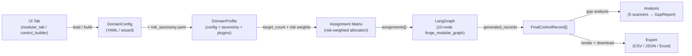

---

## 2. Entity Model (DomainConfig v3)

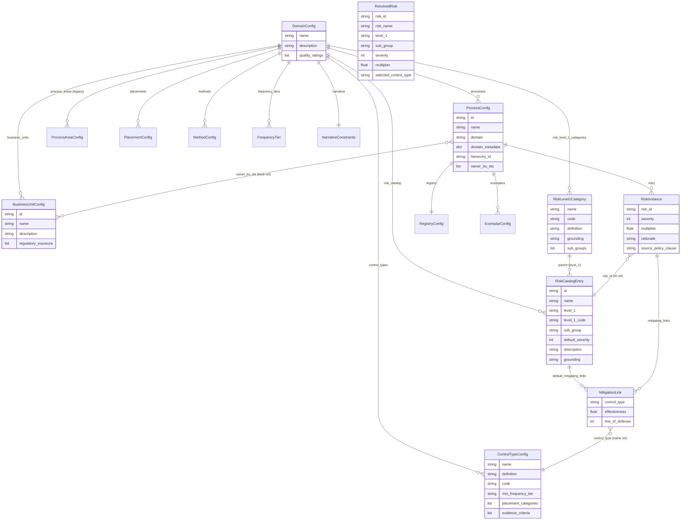

---

## 3. ForgeState (Runtime — v3)

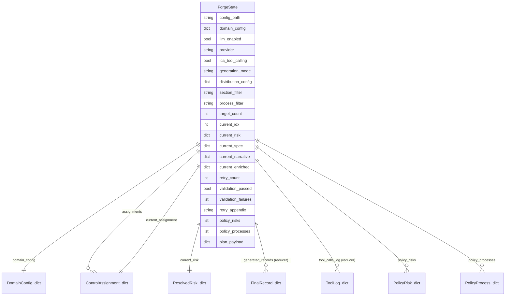

---

## 4. Graph Topology (10-Node — v3)

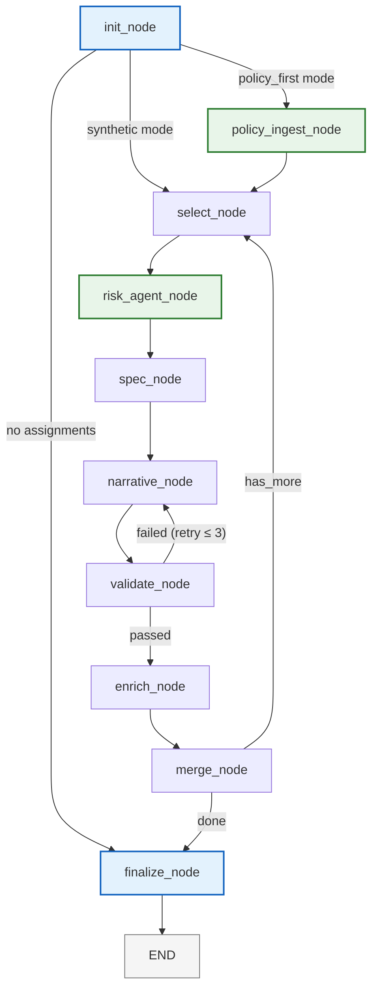

---

## 5. Agent Sequence — One Control's Journey

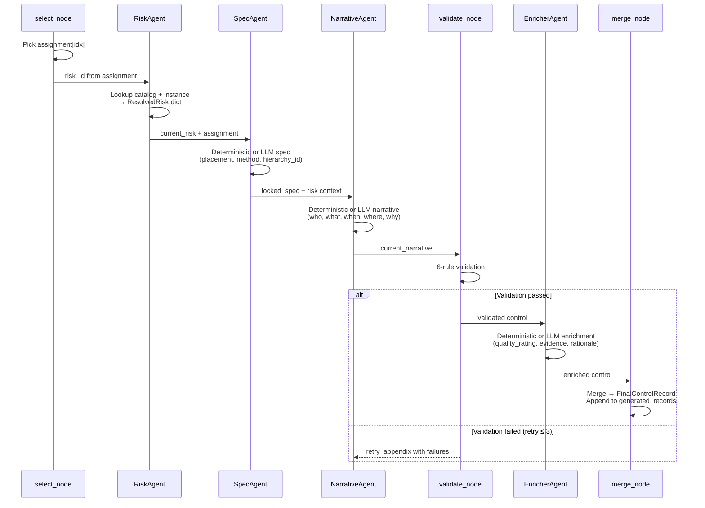

---

## 6. Two-Tier Risk Taxonomy

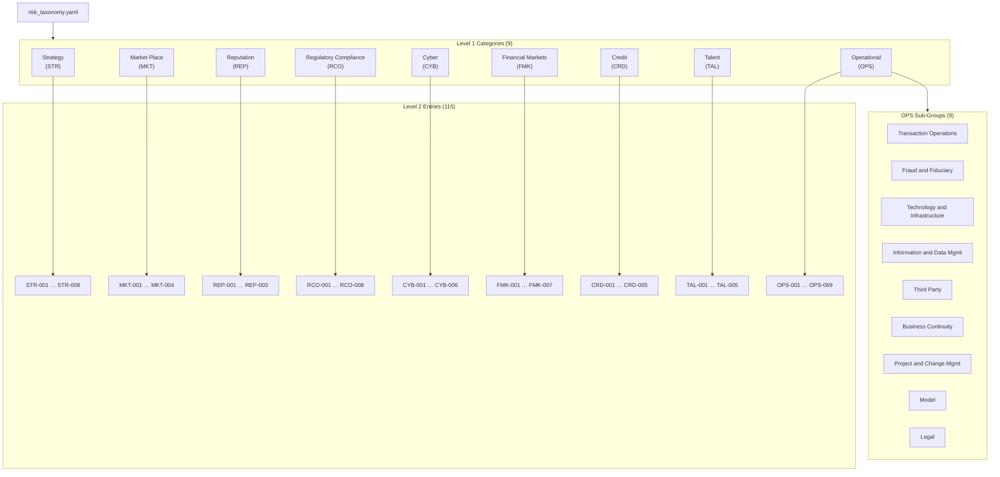

---

## 7. Assignment Matrix — Risk-Weighted Allocation

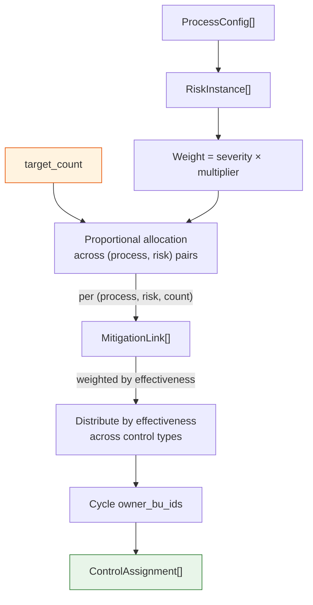

---

## 8. DomainProfile Packaging

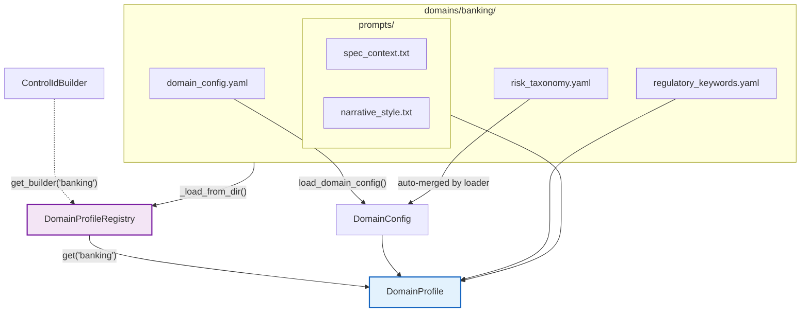

---

## 9. Generation Mode Routing

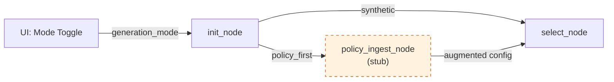

---

## 10. Analysis Pipeline — 5 Scanners → GapReport

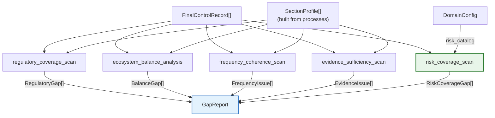

---

## 11. Relationship Cheat Sheet (v3 — Complete)

```mermaid
flowchart TB
    subgraph ConfigEntities["Config Entities (DomainConfig v3)"]
        DC["DomainConfig"]
        CT["ControlTypeConfig[]"]
        BU["BusinessUnitConfig[]"]
        PROC["ProcessConfig[]"]
        L1C["RiskLevel1Category[]"]
        RC["RiskCatalogEntry[]"]
        ML["MitigationLink[]"]
        RI["RiskInstance[]"]
        REG["RegistryConfig"]
        EX["ExemplarConfig[]"]
        PL["PlacementConfig[]"]
        MT["MethodConfig[]"]
        FT["FrequencyTier[]"]
        NC["NarrativeConstraints"]
    end

    subgraph DomainLayer["Domain Profile Layer"]
        DPR["DomainProfileRegistry"]
        DP["DomainProfile"]
        CIB["ControlIdBuilder"]
    end

    subgraph RuntimeState["Runtime State (ForgeState v3)"]
        FS["ForgeState"]
        ASN["assignments[]"]
        CA["current_assignment"]
        CR["current_risk"]
        CS["current_spec"]
        CN["current_narrative"]
        CE["current_enriched"]
        GR["generated_records[]"]
        PP["plan_payload"]
        GM["generation_mode"]
    end

    subgraph Agents["Agents (8)"]
        PIA["PolicyIngestionAgent"]
        RA["RiskAgent"]
        SA["SpecAgent"]
        NA["NarrativeAgent"]
        EA["EnricherAgent"]
        CPA["ConfigProposerAgent"]
        DA["DifferentiationAgent"]
        AR["AdversarialReviewer"]
    end

    subgraph Tools["Tool Belt (10)"]
        TV["taxonomy_validator"]
        RL["regulatory_lookup"]
        HS["hierarchy_search"]
        FL["frequency_lookup"]
        MR["memory_retrieval"]
        PLT["placement_lookup"]
        MLT["method_lookup"]
        ERL["evidence_rules_lookup"]
        EXL["exemplar_lookup"]
        RCL["risk_catalog_lookup"]
    end

    subgraph Analysis["Analysis (5 scanners)"]
        S1["regulatory_coverage"]
        S2["ecosystem_balance"]
        S3["frequency_coherence"]
        S4["evidence_sufficiency"]
        S5["risk_coverage"]
    end

    subgraph KBSources["KB Sources"]
        YAML["config YAML"]
        RTAX["risk_taxonomy.yaml"]
        CHROMA["ChromaDB"]
    end

    %% Config structure
    DC --> CT
    DC --> BU
    DC --> PROC
    DC --> L1C
    DC --> RC
    DC --> PL
    DC --> MT
    DC --> FT
    DC --> NC
    L1C -->|"parent"| RC
    RC --> ML
    ML -.->|"name ref"| CT
    PROC --> RI
    PROC --> REG
    PROC --> EX
    PROC -.->|"owner_bu_ids"| BU
    RI -.->|"risk_id"| RC
    RI --> ML

    %% Domain Profile layer
    YAML -->|"load_domain_config()"| DC
    RTAX -->|"auto-merged"| DC
    DPR -->|"get(name)"| DP
    DP --> DC
    DP --> CIB

    %% Config to Runtime
    DC -->|"init_node"| FS
    DC -->|"build_assignment_matrix()"| ASN

    %% Runtime flow
    GM -->|"after_init routing"| PIA
    ASN -->|"select_node"| CA
    CA -->|"risk_agent_node"| CR
    CR -->|"prompt context"| SA
    SA -->|"state write"| CS
    CS -->|"prompt context"| NA
    NA -->|"state write"| CN
    CN -->|"enrich_node"| CE
    CE -->|"reducer append"| GR
    GR -->|"finalize"| PP

    %% Agent to Tool calls
    RA --> RCL
    RA --> RL
    SA --> TV
    SA --> PLT
    SA --> MLT
    SA --> ERL
    SA --> HS
    NA --> FL
    NA --> EXL
    EA --> MR

    %% Tools read from Config
    RCL -.->|"reads"| RC
    TV -.->|"reads"| CT
    RL -.->|"reads"| REG
    FL -.->|"reads"| FT
    PLT -.->|"reads"| PL
    MLT -.->|"reads"| MT
    ERL -.->|"reads"| CT
    EXL -.->|"reads"| EX
    MR -.->|"reads"| CHROMA

    %% Analysis
    GR -->|"gap analysis"| S1
    GR --> S2
    GR --> S3
    GR --> S4
    GR --> S5
    RC -.->|"risk catalog"| S5

    %% Wizard
    CPA -->|"suggest_risks"| RI
    CPA -->|"suggest_processes"| PROC
    PIA -->|"policy extraction"| RI
```

---

## 12. FinalControlRecord Lineage

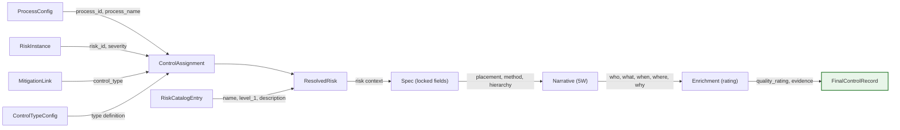
