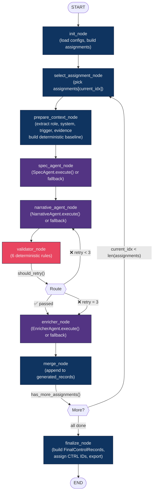
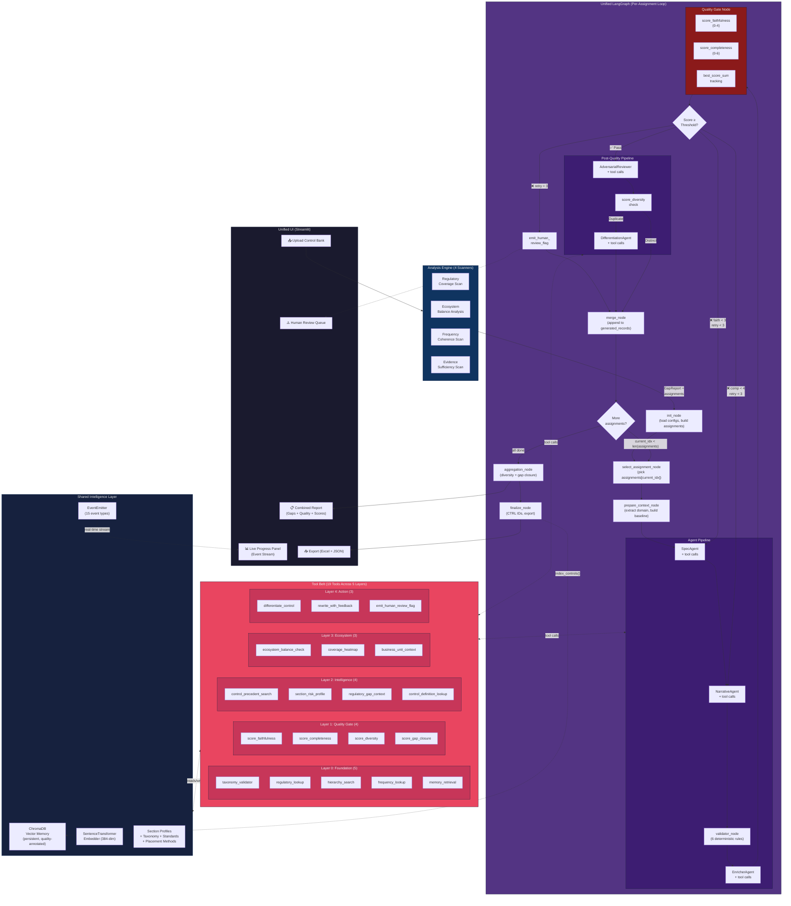

# ControlNexus: Future Architecture & Tool-Calling Vision

> **Scope**: This document describes where ControlNexus is heading — not where it is today.
> It builds on top of the hybrid tool-calling integration described in `analysis-tab-workflow-and-tool-calling.md`.
> The migration plan is organized into five phases, each building on the previous.

---

## Table of Contents

### Part I: Current State & Vision
- [1. ControlForge Today: Current Architecture Inventory](#1-controlforge-today-current-architecture-inventory)
  - [1.1 The Monolithic Orchestrator](#11-the-monolithic-orchestrator)
  - [1.2 The 3-Phase Pipeline](#12-the-3-phase-pipeline)
  - [1.3 Agent Prompt Architecture (Fat Prompts)](#13-agent-prompt-architecture-fat-prompts)
  - [1.4 The Unused Infrastructure](#14-the-unused-infrastructure)
  - [1.5 The Remediation Graph (Broken)](#15-the-remediation-graph-broken)
- [2. Current vs Target: The Migration at a Glance](#2-current-vs-target-the-migration-at-a-glance)
  - [2.1 Architectural Comparison Table](#21-architectural-comparison-table)
  - [2.2 Mermaid Diagram: Current ControlForge Architecture](#22-mermaid-diagram-current-controlforge-architecture)
  - [2.3 Mermaid Diagram: Target ControlForge Architecture](#23-mermaid-diagram-target-controlforge-architecture)
- [3. The Unified Analysis Loop](#3-the-unified-analysis-loop)

### Part II: The 4-Phase Migration Plan
- [4. Phase 1 — ControlForge StateGraph Foundation](#4-phase-1--controlforge-stategraph-foundation)
- [5. Phase 2 — Tool-Calling Integration](#5-phase-2--tool-calling-integration)
- [6. Phase 3 — Event Backbone & Real-Time UI](#6-phase-3--event-backbone--real-time-ui)
- [7. Phase 4 — Advanced Tool Layers & Memory Intelligence](#7-phase-4--advanced-tool-layers--memory-intelligence)

### Part III: Cross-Cutting Concerns
- [8. Agent Specialization and Tool Affinity](#8-agent-specialization-and-tool-affinity)
- [9. Mermaid Diagram: The Target Unified Architecture](#9-mermaid-diagram-the-target-unified-architecture)

### Part IV: Future Directions
- [10. Future Direction A: Multi-Bank Federated Control Intelligence](#10-future-direction-a-multi-bank-federated-control-intelligence)
- [11. Future Direction B: Regulatory Horizon Scanning](#11-future-direction-b-regulatory-horizon-scanning)
- [12. Future Direction C: Autonomous Control Lifecycle Management](#12-future-direction-c-autonomous-control-lifecycle-management)
- [13. Future Direction D: Adversarial Stress Testing as a Service](#13-future-direction-d-adversarial-stress-testing-as-a-service)
- [14. Future Direction E: Cross-Framework Harmonization Engine](#14-future-direction-e-cross-framework-harmonization-engine)
- [15. Phased Prioritization Matrix](#15-phased-prioritization-matrix)

---

## 1. ControlForge Today: Current Architecture Inventory

Before describing where we're going, we need a precise map of where we are. This section documents the current ControlForge implementation in full technical detail — what works, what's unused, and what's broken.

### 1.1 The Monolithic Orchestrator

ControlForge's entire control generation pipeline lives in a single class: `Orchestrator` in `pipeline/orchestrator.py` (~950 lines). It is **not** a LangGraph graph. It's a traditional Python class that coordinates agents through direct `await agent.execute()` calls wrapped in `asyncio.gather()` with a `Semaphore` for concurrency control.

```python
class Orchestrator:
    def __init__(self, run_config: RunConfig, project_root: Path):
        self.run_config = run_config
        self.project_root = project_root

    async def execute_planning(self, config_dir, *, verbose, progress_callback, preloaded_nodes):
        # Phase 1: deterministic defaults (sequential)
        # Phase 2: LLM enrichment (parallel async)
        # Phase 3: finalization (sequential)
        ...
```

The orchestrator is invoked from the ControlForge tab's `_execute_pipeline()` function in `ui/controlforge_tab.py`, which builds a `RunConfig` from Streamlit widget values and calls `await orchestrator.execute_planning(...)`. The UI shows a blocking spinner during execution — there is no streaming, no progress feedback, and no event emission.

**Key limitation:** The orchestrator pre-computes **all context** for every agent before any LLM call is made. This means every agent receives a fat prompt with 2–5 KB of pre-computed JSON, regardless of whether the agent needs all that information. There is no mechanism for an agent to request additional context mid-execution.

### 1.2 The 3-Phase Pipeline

The orchestrator executes in three strictly sequential phases:

**Phase 1: Deterministic Defaults (Sequential)**

For each assignment in the target matrix (Leaf × Type × BU):
1. Load YAML configs: taxonomy (25 control types, 17 BUs), section profiles (13 sections), standards (5W definitions, phrase banks), placement methods (L1/L2 taxonomy).
2. Select scope: filter APQC hierarchy to target sections → extract leaf nodes.
3. Allocate controls: distribute target count across sections using risk multipliers from section profiles (`SectionProfile.risk_profile.multiplier`), weighted by policy/procedure node density.
4. Distribute types: spread 25 control types across the target count (even distribution with normalization).
5. Build assignment matrix: for each assignment, extract domain-specific nouns (role, system, trigger, evidence artifact) from the section registry by cycling through the registry lists with modular indexing.
6. Build deterministic baseline: for each assignment, construct a complete `spec`, `narrative`, and `enriched` dict using template strings and registry values. These are the fallback outputs if the LLM is unavailable.

```python
# Example: deterministic baseline for one control
spec = {
    "hierarchy_id": "4.1.2.3",
    "leaf_name": "Wire Transfer Approval",
    "selected_level_1": "Preventive",
    "control_type": "Authorization",
    "placement": "Detective",     # from exemplar or default
    "method": "Manual",           # from exemplar or default
    "who": "Accounting Manager",  # from registry.roles[idx % len(roles)]
    "what_action": "Performs authorization checks for Wire Transfer Approval",
    "when": "monthly",            # from registry.event_triggers[idx % len(triggers)]
    "where_system": "Treasury Platform",  # from registry.systems[idx % len(systems)]
    "why_risk": "Operational and compliance risk mitigation",  # from risk_profile.rationale
    "evidence": "Transaction approval log with Accounting Manager sign-off, retained in Treasury Platform",
}
```

**Phase 2: Async LLM Enrichment (Parallel)**

If LLM credentials are detected (ICA, OpenAI, or Anthropic), the orchestrator runs all Phase 1 items through three agents in parallel with bounded concurrency:

```python
max_workers = max(1, self.run_config.concurrency.max_parallel_controls)
semaphore = asyncio.Semaphore(max_workers)

async def _bounded_enrich(item):
    async with semaphore:
        result = await self._llm_enrich_single(item, spec_agent, narrative_agent, enricher_agent, ...)
        item["llm_result"] = result

await asyncio.gather(*[_bounded_enrich(item) for item in prepared])
```

For each control, `_llm_enrich_single()` runs:

1. **SpecAgent** — receives the leaf node, control type, type definition, full domain registry, placement definitions, taxonomy constraints, and a diversity context including all 17 available business units. Returns a locked specification (14 fields). If it fails, the deterministic fallback from Phase 1 is used.

2. **NarrativeAgent** (retry loop, up to 3 attempts) — receives the locked spec, 5W standards, phrase bank, exemplar controls from the section profile, regulatory frameworks, and optionally a retry appendix containing previous failure codes. The validator checks 6 deterministic rules after each attempt:
   - `MULTIPLE_WHATS` — more than 2 distinct action verbs in `what`
   - `VAGUE_WHEN` — contains "periodic", "ad hoc", "as needed", etc.
   - `WHO_EQUALS_WHERE` — `who` and `where` are substrings of each other
   - `WHY_MISSING_RISK` — `why` lacks risk marker words
   - `WORD_COUNT_OUT_OF_RANGE` — `full_description` outside 30–80 words
   - `SPEC_MISMATCH` — `who` or `where` differs from locked spec

   If validation fails and retries remain, `build_retry_appendix()` generates targeted instructions (e.g., "Your 'when' field contained a vague term. Replace with a specific frequency like 'monthly'") that are appended to the user prompt for the next attempt.

3. **EnricherAgent** — receives the validated control, rating criteria, and an empty nearest-neighbors list (ChromaDB is not wired). Returns a refined `full_description` and a `quality_rating` (Strong/Effective/Satisfactory/Needs Improvement/Weak).

**Phase 3: Finalization (Sequential)**

For each control, merge LLM results with deterministic fallbacks (LLM takes precedence where it produced output). Then:
- Build deterministic control IDs: `CTRL-{section}{subsection}-{TYPE_CODE}-{sequence}` (e.g., `CTRL-0401-AUT-003`)
- Derive `frequency` from `when` text using ordered regex rules
- Construct final `FinalControlRecord` Pydantic objects (22 fields)
- Export to Excel (19 columns) and JSON

### 1.3 Agent Prompt Architecture (Fat Prompts)

Each agent receives a massive pre-computed JSON payload as its user prompt. This is the "fat prompt" pattern — everything the agent could possibly need is dumped into the prompt upfront.

**SpecAgent user prompt (typical ~4 KB):**
```json
{
  "leaf": {"hierarchy_id": "4.1.2.3", "name": "Wire Transfer Approval"},
  "control_type": "Authorization",
  "control_type_definition": "An activity where approval or sign-off is required to allow...",
  "domain_registry": {
    "roles": ["Accounting Manager", "Vendor Risk Analyst", "...12 more..."],
    "systems": ["Treasury Platform", "Third Party Risk Tool", "...8 more..."],
    "data_objects": ["Transaction records", "Approval matrices", "..."],
    "evidence_artifacts": ["Transaction approval log", "..."],
    "event_triggers": ["monthly", "quarterly", "upon transaction initiation"],
    "regulatory_frameworks": ["SOX", "BSA/AML", "OCC Risk Management"]
  },
  "control_placement_definitions": {"Preventive": "...", "Detective": "...", "Contingency Planning": "..."},
  "control_method_definitions": {"Manual": "...", "Automated": "...", "Semi-Automated": "..."},
  "taxonomy_constraints": {
    "selected_level_1": "Preventive",
    "level_1_options": ["Preventive", "Detective", "Contingency Planning"],
    "level_2_by_level_1": {"Preventive": ["Authorization", "Segregation of Duties", "..."], "...": "..."},
    "type_definition": "An activity where approval or sign-off is required..."
  },
  "diversity_context": {
    "available_business_units": [{"business_unit_id": "BU-001", "name": "Retail Banking", "...": "..."}, "...16 more..."],
    "suggested_business_unit": {"business_unit_id": "BU-003", "name": "Commercial Banking", "...": "..."}
  },
  "constraints": [
    "You MUST choose exactly one who from the domain_registry roles.",
    "You MUST choose exactly one where_system from the domain_registry systems.",
    "The evidence MUST include not just a named artifact, but also the specific who/role sign-off and where/system name.",
    "...7 more constraint lines..."
  ]
}
```

**The problem with fat prompts:** Every agent receives all 17 business units, all roles, all systems, all taxonomy constraints, and all placement definitions — even if the agent only needs one piece of that data. This wastes tokens, dilutes the agent's attention, and makes it impossible for the agent to request clarification or additional context mid-generation. A Reconciliation control for section 4.0 doesn't need the roles from section 11.0, but the prompt includes them anyway.

**NarrativeAgent user prompt (typical ~3 KB):**
```json
{
  "locked_spec": {"who": "Accounting Manager", "where_system": "Treasury Platform", "...": "..."},
  "five_w_standards": {"WHO": "Identifies the individual...", "WHAT": "...", "...": "..."},
  "phrase_bank": {"action_verbs": ["Reviews", "Validates", "Monitors", "Reconciles", "..."], "timing_phrases": ["..."]},
  "exemplars": [{"control_type": "Authorization", "placement": "Detective", "full_description": "...", "...": "..."}],
  "regulatory_context": ["SOX", "BSA/AML", "OCC Risk Management"],
  "constraints": [
    "Use exactly one primary action in WHAT.",
    "WHEN must be specific and avoid vague terms.",
    "Word count for full_description must be between 30 and 80 words.",
    "Do not change locked spec values for who and where_system."
  ]
}
```

### 1.4 The Unused Infrastructure

The codebase contains significant infrastructure that is **fully implemented but completely disconnected** from the ControlForge pipeline:

| Component | File(s) | Status | What It Does |
|-----------|---------|--------|--------------|
| **5 Tool Schemas** | `tools/schemas.py` | ✅ Implemented, ❌ Unused | OpenAI function-calling JSON schemas for `taxonomy_validator`, `regulatory_lookup`, `hierarchy_search`, `frequency_lookup`, `memory_retrieval` |
| **5 Tool Implementations** | `tools/implementations.py` | ✅ Implemented, ❌ Unused | Pure Python read-only functions. `configure_tools()` sets module-level context. All 5 tools work correctly (tested). |
| **Tool Execution Layer** | `tools/nodes.py` | ✅ Implemented, ❌ Unused | `TOOL_MAP` dispatch table, `execute_tool_call()`, `tool_node()` for LangGraph integration |
| **EventEmitter** | `core/events.py` | ✅ Implemented, ❌ Unused | 15 event types (`PIPELINE_STARTED`, `AGENT_STARTED`, `VALIDATION_PASSED`, etc.), `PipelineEvent` dataclass, `EventEmitter` fan-out dispatcher |
| **ChromaDB Memory** | `memory/store.py` | ✅ Implemented, ❌ Unused by ControlForge | `ControlMemory` with `index_controls()`, `query_similar()`, `check_duplicate()`, `compare_runs()`. Uses `SentenceTransformerEmbedder` (384-dim, all-MiniLM-L6-v2). |
| **AdversarialReviewer** | `agents/adversarial.py` | ✅ Implemented, ❌ Unwired | Red-teams controls for weaknesses. Has deterministic fallback. Never called by orchestrator or graph. |
| **DifferentiationAgent** | `agents/differentiator.py` | ✅ Implemented, ❌ Unwired | Rewrites near-duplicate controls. Has deterministic fallback (prepend "Additionally,"). Never called. |
| **Evaluation Harness** | `evaluation/harness.py`, `scorers.py` | ✅ Implemented, ❌ Not wired to pipeline | `run_eval()` batch function, 4 scorers (Faithfulness 0–4, Completeness 0–6, Diversity 0–1, Gap Closure delta). Works correctly but only callable from the standalone Evaluation tab. |
| **RemediationState.messages** | `graphs/state.py` | ✅ Defined, ❌ Never populated | `Annotated[list[dict], add]` field ready for tool-calling message history. No agent writes to it. |

This infrastructure represents the foundation for the migration. The tool schemas are defined, the implementations are tested, the execution layer is wired — the only missing piece is the connection from **agents** to **tools** and from **tools** to the **evaluation scorers**.

### 1.5 The Remediation Graph (Broken)

A LangGraph `StateGraph` exists in `graphs/remediation_graph.py` for gap remediation (separate from ControlForge). It has correct topology but broken internals:

```
START → planner → router → spec_agent → narrative_agent → validator
                                                              |
                                     +------------------------+
                                     |            |           |
                                  enricher    narrative    merge
                                     |       (retry≤3)   (fallback)
                                     v
                                quality_gate → merge → export → END
```

**Bug 1: Single-assignment processing.** `router_node()` always picks `assignments[0]`. There is no loop edge — if 6 assignments exist, only the first is processed. The graph needs a loop from `merge_node` back to `router_node`, with `current_idx` tracking progress.

**Bug 2: Frequency narratives fail validation.** The frequency-fix narrative ("The control owner updates the control frequency to monthly...") is only ~23 words, which fails the 30-word minimum rule. Three retries produce the same text. The fallback skips the enricher, so merge produces an incomplete record.

**Bug 3: Stub internals.** All agent nodes return hardcoded templates. `narrative_agent_node()` returns `" ".join(["word"] * 40)` for the default path. No real agent is called. The `quality_gate_node()` routes everything to `"merge"` with a `# TODO: Phase 9+ will route to adversarial_reviewer` comment.

The remediation graph is not used by ControlForge at all — ControlForge uses the orchestrator directly. However, the graph's `RemediationState` TypedDict and conditional routing patterns (`should_retry`, `quality_check`) are the design template for the ControlForge graph we'll build in Phase 1.

---

## 2. Current vs Target: The Migration at a Glance

### 2.1 Architectural Comparison Table

| Dimension | Current ControlForge | Target Architecture |
|-----------|---------------------|---------------------|
| **Orchestration** | `Orchestrator` class with `asyncio.gather()` + `Semaphore` in `pipeline/orchestrator.py` | LangGraph `StateGraph` with typed state, conditional edges, fan-out/fan-in |
| **Agent invocation** | Direct `await agent.execute(**fat_kwargs)` with pre-computed context | Graph nodes invoke agents via tool-calling message loop; agents request context on-demand |
| **Context delivery** | Fat prompts: 2–5 KB JSON per agent, all context pre-computed and dumped | On-demand via tool calls: `taxonomy_validator`, `regulatory_lookup`, `frequency_lookup`, etc. |
| **Validation** | External retry loop in `_llm_enrich_single()` (3 attempts, `build_retry_appendix`) | Graph conditional edges route back to agent nodes; quality gates use multi-dimensional scorers rather than 6-rule validator |
| **Events** | `EventEmitter` exists with 15 event types — **completely unwired**. UI shows blocking spinner. | Full event backbone: each node emits `AGENT_STARTED`, `PROGRESS`, `VALIDATION_PASSED/FAILED`. UI shows real-time activity feed. |
| **Tool calling** | 5 tools built in `tools/` — **0 used** by any agent | 5 foundation + 4 quality gate + 4 intelligence + 3 ecosystem + 3 autonomous = **19 tools** |
| **Memory** | `ControlMemory` exists with ChromaDB — **unused by ControlForge** | Memory-informed generation via `control_precedent_search`, cross-run diversity via persistent ChromaDB |
| **Adversarial review** | `AdversarialReviewer` agent exists — **unwired**, never called | Full quality gate loop: adversarial review after quality gate pass, diversity check, differentiation if needed |
| **DifferentiationAgent** | Agent exists — **unwired**, never called | Triggered automatically by `score_diversity` when near-duplicates detected |
| **UI feedback** | Blocking Streamlit spinner → results dump | `st.status()` containers streaming agent cards, tool call logs, quality scores, retry indicators |
| **Assignment processing** | `asyncio.gather()` processes all assignments in parallel | LangGraph loop processes each assignment through full agent pipeline; `Send()` API for batch parallelism in Phase 4 |

---

## 3. The Unified Analysis Loop

After the hybrid integration is complete, the Analysis tab absorbs the Evaluation tab's responsibilities. The user experience becomes a single, continuous flow:

```
Upload → Analyze → Identify Gaps → Remediate → Score → Verify → Export
                                        ↑                    |
                                        └────────────────────┘
                                          (agent-driven loop)
```

The inner loop is the critical change. Today, remediation runs once and produces output. In the target architecture, remediation runs, scores itself, and loops if quality gates fail. The agent decides when the control is good enough — not the user.

**What the user sees:**

- A single "Analyze & Remediate" button.
- A live progress panel showing agent activity, tool calls, and quality scores in real time.
- A final report that includes both gap analysis and quality evaluation in one view.
- No separate Evaluation tab. No JSON uploading. No manual comparison.

**What happens underneath:**

1. Upload triggers `run_analysis()` (4 scanners, gap report).
2. Gap report is fed to the unified LangGraph.
3. For each gap assignment, the graph runs: `spec_agent → narrative_agent → enricher_agent → [quality_gate] → adversarial_reviewer → [quality_gate] → differentiator (if needed)`.
4. Quality gates are tool calls to the evaluation scorers. They happen between agent steps, not after the pipeline.
5. If a quality gate fails, the graph loops back to the relevant agent with the failure reasons as context.
6. Once all controls pass quality gates, gap closure is computed as a final tool call — measuring how much the overall ecosystem score improved.
7. The event backbone streams every step to the UI.

---

# Part II: The 4-Phase Migration Plan

---

## 4. Phase 1 — ControlForge StateGraph Foundation

**Goal:** Replace the monolithic `Orchestrator` class with a LangGraph `StateGraph` that processes controls through the same agent sequence, but as composable graph nodes with typed state and conditional routing. No tool calling yet — Phase 1 preserves the current agent invocation style while moving to graph-native orchestration.

**Depends on:** Nothing. This is the foundation.

### 4.1 The ControlForgeState TypedDict

The state definition reuses the established patterns from `AnalysisState` and `RemediationState` in `graphs/state.py`. The critical design choice is the `Annotated[list, add]` reducer on `generated_records`, which enables parallel-safe list accumulation when we add fan-out in Phase 4.

```python
class ControlForgeState(TypedDict, total=False):
    """State for the ControlForge generation graph."""

    # ── Run metadata ──
    run_id: str
    config_dir: str

    # ── Loaded configuration (set by init_node) ──
    taxonomy_catalog: dict[str, Any]           # 25 control types + 17 BUs
    section_profiles: dict[str, Any]           # 13 section profiles
    standards_cfg: dict[str, Any]              # 5W defs, phrase bank, quality ratings
    placement_methods_cfg: dict[str, Any]      # L1/L2 taxonomy + placement rules
    type_definitions: dict[str, str]           # control_type → definition text
    taxonomy_constraints: dict[str, Any]       # level_1_options, level_2_by_level_1, reverse map
    business_unit_map: dict[str, Any]          # bu_id → BusinessUnitProfile

    # ── Assignment matrix (set by init_node) ──
    assignments: list[dict[str, Any]]          # full Leaf × Type × BU matrix
    section_allocation: dict[str, int]         # controls per section

    # ── Iteration tracking ──
    current_idx: int                           # index into assignments
    current_assignment: dict[str, Any]         # assignments[current_idx] + prepared context

    # ── Per-control pipeline state ──
    current_spec: dict[str, Any]               # SpecAgent output (locked 14 fields)
    current_narrative: dict[str, Any]          # NarrativeAgent output (5W + full_description)
    current_validation: dict[str, Any]         # ValidationResult.model_dump()
    current_enriched: dict[str, Any]           # EnricherAgent output (refined + quality_rating)
    retry_count: int                           # 0–3 validation retries
    validation_passed: bool
    quality_gate_passed: bool

    # ── Per-control quality scores (Phase 3, but field defined in Phase 1) ──
    current_faithfulness: int                  # 0–4 from score_faithfulness
    current_completeness: int                  # 0–6 from score_completeness
    best_score_sum: int                        # max(faith + complete) across retries
    best_attempt: dict[str, Any]               # narrative that produced best_score_sum

    # ── Accumulated outputs ──
    generated_records: Annotated[list[dict[str, Any]], add]  # parallel-safe
    per_control_scores: Annotated[list[dict[str, Any]], add] # per-control eval scores

    # ── LLM infrastructure ──
    messages: Annotated[list[dict[str, Any]], add]  # tool-calling message history (Phase 2)
    llm_enabled: bool

    # ── Final output ──
    eval_report: dict[str, Any]                # aggregated EvalReport (Phase 3)
    plan_payload: dict[str, Any]               # JSON plan metadata for export
```

**Key design decisions:**

- `current_idx` + `assignments` enables a loop edge from `merge_node` back to `select_assignment_node`, fixing the remediation graph's single-assignment bug.
- `best_score_sum` + `best_attempt` track the highest-quality attempt across retries (Phase 3). Even in Phase 1, we define the fields so the state type doesn't change later.
- `per_control_scores` uses the `add` reducer so quality gate results can accumulate in parallel if we use `Send()` in Phase 4.
- `messages` is reserved for Phase 2's tool-calling message history. In Phase 1, it remains empty.

### 4.2 Graph Topology: Node-by-Node



**Nodes:**

| Node | Purpose | Ports From |
|------|---------|------------|
| `init_node` | Load all YAML configs, build assignment matrix, detect LLM credentials | Orchestrator Phase 1 (`execute_planning` lines 124–260) |
| `select_assignment_node` | Pick `assignments[current_idx]`, increment `current_idx`, reset per-control state | Orchestrator's `for assignment in assignments` loop |
| `prepare_context_node` | Extract role, system, trigger, evidence from registry; build deterministic baseline (spec + narrative + enriched) | Orchestrator Phase 1 inner loop (lines 557–660) |
| `spec_agent_node` | Call `SpecAgent.execute()` if LLM enabled; else use Phase 1 baseline spec | `_llm_enrich_single()` lines 769–810 |
| `narrative_agent_node` | Call `NarrativeAgent.execute()` with locked spec, standards, exemplars, retry appendix | `_llm_enrich_single()` lines 814–850 |
| `validator_node` | Run `validate(narrative, spec)` — 6 deterministic rules. Increment `retry_count` on failure. | `_llm_enrich_single()` inner loop (lines 840–848) |
| `enricher_node` | Call `EnricherAgent.execute()` with validated control and rating criteria | `_llm_enrich_single()` lines 870–890 |
| `merge_node` | Append enriched record to `generated_records`; reset per-control state fields | Orchestrator Phase 3 record assembly (lines 720–760) |
| `finalize_node` | Build `FinalControlRecord` objects, assign CTRL IDs, derive frequencies, export Excel + JSON | Orchestrator Phase 3 finalization (lines 720–770) |

### 4.3 Porting the Orchestrator: What Maps Where

The mapping from orchestrator code to graph nodes:

| Orchestrator Method | Lines | Target Node | Notes |
|---------------------|-------|-------------|-------|
| `execute_planning()` config loading | 124–150 | `init_node` | Load taxonomy, profiles, standards, placement methods |
| `select_scope()` + hierarchy loading | 150–210 | `init_node` | Filter APQC hierarchy, extract leaves |
| `_build_type_distribution()` | 350–380 | `init_node` | Even distribution of 25 types |
| `_build_section_allocation()` | 390–430 | `init_node` | Risk-weighted allocation across sections |
| `_deterministic_map_with_bu()` | 445–520 | `init_node` | Build full Leaf × Type × BU assignment matrix |
| Phase 1 inner loop (deterministic defaults) | 557–660 | `prepare_context_node` | One invocation per assignment: extract registry values, build baseline |
| `_llm_enrich_single()` — SpecAgent | 775–810 | `spec_agent_node` | Call spec agent or use baseline |
| `_llm_enrich_single()` — NarrativeAgent + retry | 814–850 | `narrative_agent_node` + `validator_node` + conditional edge | Retry loop becomes graph edge loop |
| `_llm_enrich_single()` — EnricherAgent | 870–890 | `enricher_node` | Call enricher or use baseline |
| Phase 3 — merge and finalize | 720–770 | `merge_node` + `finalize_node` | Build records, assign IDs, export |
| `build_client_from_env()` | 557 | `init_node` | Set `llm_enabled` in state |
| `_bounded_enrich()` + `asyncio.gather()` | 700–720 | Replaced by graph loop (Phase 1) or `Send()` (Phase 4) | Sequential in Phase 1 |

**What the graph does NOT port:** The `PlanningResult` dataclass return value. Instead, the graph stores equivalent metadata in `plan_payload` state field, and the ControlForge tab reads it from the final state.

### 4.4 The Assignment Loop (Fixing the Single-Assignment Bug)

The current remediation graph processes only `assignments[0]` because there's no loop edge. The ControlForge graph fixes this with two mechanisms:

**Mechanism 1: `current_idx` state tracking**

```python
def select_assignment_node(state: ControlForgeState) -> dict[str, Any]:
    idx = state.get("current_idx", 0)
    assignments = state["assignments"]
    current = assignments[idx]
    return {
        "current_assignment": current,
        "current_idx": idx,  # NOT incremented here — merge_node does it
        "retry_count": 0,
        "validation_passed": False,
        "current_spec": {},
        "current_narrative": {},
        "current_enriched": {},
    }
```

**Mechanism 2: Conditional edge from `merge_node`**

```python
def has_more_assignments(state: ControlForgeState) -> str:
    """Conditional edge: loop back or finalize."""
    idx = state.get("current_idx", 0) + 1  # next index
    total = len(state.get("assignments", []))
    if idx < total:
        return "select_assignment"
    return "finalize"
```

```python
# In build_controlforge_graph():
graph.add_conditional_edges("merge", has_more_assignments, {
    "select_assignment": "select_assignment",
    "finalize": "finalize",
})
```

`merge_node` increments `current_idx` by 1 before returning, so the next `select_assignment_node` call picks the next assignment.

### 4.5 Deterministic Fallbacks in Graph Nodes

Every agent node must support the no-LLM path. The pattern:

```python
def spec_agent_node(state: ControlForgeState) -> dict[str, Any]:
    if not state.get("llm_enabled", False):
        # Use the deterministic baseline computed by prepare_context_node
        return {"current_spec": state["current_assignment"]["baseline_spec"]}

    # Build agent context from state
    spec_agent = _get_spec_agent(state)
    try:
        spec = await spec_agent.execute(
            leaf=...,
            control_type=...,
            # ... same kwargs as current orchestrator
        )
        return {"current_spec": spec}
    except Exception:
        # Fallback to deterministic baseline
        return {"current_spec": state["current_assignment"]["baseline_spec"]}
```

This preserves the orchestrator's guarantee: **the pipeline produces useful output without any API keys**.

### 4.6 Wiring into the ControlForge Tab

In `ui/controlforge_tab.py`, the `_execute_pipeline()` function currently calls:

```python
orchestrator = Orchestrator(run_config, project_root)
result = await orchestrator.execute_planning(config_dir, verbose=True, ...)
```

After Phase 1, this becomes:

```python
from controlnexus.graphs.controlforge_graph import build_controlforge_graph

graph = build_controlforge_graph()
compiled = graph.compile()
initial_state = {
    "run_id": run_config.run_id,
    "config_dir": str(config_dir),
    "assignments": [],  # init_node populates this
    "generated_records": [],
    "per_control_scores": [],
    "messages": [],
    "current_idx": 0,
}
final_state = await compiled.ainvoke(initial_state)
```

The result extraction reads from `final_state` instead of `PlanningResult`:

```python
generated_records = final_state["generated_records"]
plan_payload = final_state["plan_payload"]
llm_enabled = final_state.get("llm_enabled", False)
```

**Important:** The `Orchestrator` class is **not deleted**. It remains available for CLI usage and testing. The graph is a new codepath for the UI.

### 4.7 Verification Criteria

1. **Field-by-field parity:** Run the graph with `llm_enabled=False` (no API keys). Compare output `FinalControlRecord` fields against the current orchestrator's deterministic output for the same `RunConfig`. Every field must match — control IDs, placements, methods, descriptions, frequencies.
2. **LLM parity:** Run with LLM enabled. The agent nodes call the same `SpecAgent`, `NarrativeAgent`, `EnricherAgent` with the same kwargs. Output quality should be statistically equivalent (same faithfulness/completeness score distributions when evaluated with `run_eval()`).
3. **Loop correctness:** For a target count of 100 controls, verify that `generated_records` contains exactly 100 items and `current_idx` equals 100 at graph exit.
4. **Retry correctness:** Inject a deliberately bad NarrativeAgent response (word count = 20). Verify that the graph retries up to 3 times with `build_retry_appendix()` output appended to the prompt.
5. **Regression:** All 258 existing tests pass. No changes to agent implementations, validator, or config loaders.

---

## 5. Phase 2 — Tool-Calling Integration

**Goal:** Wire the 5 existing foundation tools into agents so they can request context on-demand rather than receiving fat prompts. This requires changes to the transport layer, the base agent class, and the agent context model. Agent prompts are slimmed to remove pre-computed context that tools now provide.

**Depends on:** Phase 1 (graph-native orchestration).

### 5.1 Transport Layer Changes

`AsyncTransportClient.chat_completion()` in `core/transport.py` currently accepts only `messages`, `temperature`, and `max_tokens`. It needs a `tools` parameter for the OpenAI function-calling protocol:

```python
async def chat_completion(
    self,
    messages: list[dict[str, Any]],
    *,
    temperature: float = 0.2,
    max_tokens: int = 1400,
    tools: list[dict[str, Any]] | None = None,          # NEW
    tool_choice: str | dict[str, Any] | None = None,     # NEW
) -> dict[str, Any]:
    payload: dict[str, Any] = {
        "model": self.model,
        "messages": messages,
        "temperature": temperature,
        "max_tokens": max_tokens,
    }
    if tools:
        payload["tools"] = tools
    if tool_choice is not None:
        payload["tool_choice"] = tool_choice
    # ... existing retry logic unchanged ...
```

The response handling must also recognize `tool_calls` in the assistant message:

```python
# In the response, choices[0].message may contain:
# {
#   "role": "assistant",
#   "content": null,
#   "tool_calls": [
#     {"id": "call_abc", "type": "function", "function": {"name": "taxonomy_validator", "arguments": "{...}"}}
#   ]
# }
```

The transport doesn't need to interpret tool calls — it just passes them through. The interpretation happens in the agent's tool-calling loop.

### 5.2 The Tool-Calling Loop in BaseAgent

`BaseAgent` in `agents/base.py` gets a new method alongside the existing `call_llm()`:

```python
async def call_llm_with_tools(
    self,
    messages: list[dict[str, Any]],
    tools: list[dict[str, Any]],
    tool_executor: Callable[[str, dict], dict[str, Any]],
    *,
    max_tool_rounds: int = 5,
    temperature: float | None = None,
    max_tokens: int | None = None,
) -> dict[str, Any]:
    """Multi-turn LLM call with tool execution loop.

    Sends messages to the LLM. If the response contains tool_calls,
    executes each tool, appends tool results as ToolMessages, and
    re-sends. Repeats until the LLM returns a content-only response
    or max_tool_rounds is reached.

    Returns the final assistant message (content-only, no tool_calls).
    """
    effective_temp = temperature if temperature is not None else self.context.temperature
    effective_max = max_tokens if max_tokens is not None else self.context.max_tokens
    current_messages = list(messages)

    for round_idx in range(max_tool_rounds):
        response = await self.context.client.chat_completion(
            messages=current_messages,
            temperature=effective_temp,
            max_tokens=effective_max,
            tools=tools,
        )

        assistant_msg = response["choices"][0]["message"]
        current_messages.append(assistant_msg)

        tool_calls = assistant_msg.get("tool_calls", [])
        if not tool_calls:
            # LLM returned content-only response — we're done
            return assistant_msg

        # Execute each tool call and append results
        for tc in tool_calls:
            fn = tc["function"]
            tool_name = fn["name"]
            arguments = json.loads(fn["arguments"])
            result = tool_executor(tool_name, arguments)
            current_messages.append({
                "role": "tool",
                "tool_call_id": tc["id"],
                "content": json.dumps(result),
            })

    # max_tool_rounds exhausted — return last assistant message
    return current_messages[-1] if current_messages else {}
```

**Key design choices:**
- `max_tool_rounds=5` prevents infinite tool-calling loops (distinct from the validation retry limit of 3). A typical agent makes 1–2 tool calls per turn.
- `tool_executor` is a callable that maps tool names to implementations — in practice, this is `execute_tool_call()` from `tools/nodes.py`.
- The method returns the raw assistant message dict so the calling agent can extract either text content or structured JSON.
- The existing `call_llm()` method is unchanged — agents that don't use tools keep working.

### 5.3 Extending AgentContext

```python
@dataclass
class AgentContext:
    """Shared runtime context passed to every agent."""

    client: AsyncTransportClient | None = None
    model: str = ""
    temperature: float = 0.2
    max_tokens: int = 1400
    timeout_seconds: int = 120
    # NEW: tool-calling support
    tools: list[dict[str, Any]] = field(default_factory=list)       # OpenAI tool schemas
    tool_executor: Callable[[str, dict], dict] | None = None        # maps name → implementation
```

When `tools` is non-empty and `tool_executor` is set, agents can use `call_llm_with_tools()`. When either is missing, agents fall back to `call_llm()`. This makes the transition non-breaking.

### 5.4 Current Tool Inventory (5 Foundation Tools)

After Phase 2, these 5 tools are wired and callable by agents through the tool-calling loop:

| Tool | Purpose | Input | Used By | Implementation |
|------|---------|-------|---------|----------------|
| `taxonomy_validator` | Validate (level_1, level_2) pair against placement config | `level_1: str, level_2: str` | SpecAgent, EnricherAgent | Returns `{valid: bool, suggestion: {correct_level_1: str}}` |
| `regulatory_lookup` | Get regulatory themes + applicable types for a section | `framework: str, section_id: str` | SpecAgent, NarrativeAgent | Returns `{framework, required_themes, applicable_types, domain}` |
| `hierarchy_search` | Find APQC leaf nodes matching a keyword in a section | `section_id: str, keyword: str` | SpecAgent | Returns `{leaves: [...], available_roles, available_systems}` |
| `frequency_lookup` | Get expected frequency for a control type + trigger | `control_type: str, trigger: str` | NarrativeAgent, EnricherAgent | Returns `{derived_frequency, expected_frequency, reasoning}` |
| `memory_retrieval` | Query ChromaDB for semantically similar controls | `query_text: str, section_id: str, n: int` | NarrativeAgent, DifferentiationAgent | Returns `{similar_controls: [{document, score, metadata}]}` |

These tools are **read-only** — they look up data from YAML configs, section profiles, and ChromaDB memory. They are already implemented and tested in `tools/implementations.py`. The only new code is the wiring: setting `context.tools` and `context.tool_executor` in the graph's agent nodes.

### 5.5 Agent Prompt Slimming Strategy

The migration from fat prompts to tool-calling is **hybrid, not binary**. We keep critical context in the prompt and make optional lookups tool-callable:

**SpecAgent — What stays in prompt:**
- `leaf` (hierarchy_id + name) — the agent must know what it's generating for
- `control_type` — the assigned type
- `constraints` list — hard rules the agent must follow

**SpecAgent — What becomes a tool call:**
- `domain_registry.roles/systems/triggers/evidence_artifacts` → agent calls `hierarchy_search(section_id, keyword)` to get domain-specific nouns relevant to the control being generated, rather than receiving ALL roles for the entire section
- `taxonomy_constraints` (level_1_options, level_2_by_level_1, reverse map) → agent calls `taxonomy_validator(level_1, level_2)` to validate its choice before locking it
- `diversity_context.available_business_units` (all 17 BUs) → agent calls `business_unit_context(bu_id)` for the suggested BU only
- `control_type_definition` → agent calls `control_definition_lookup(control_type)` when it needs the canonical definition

**NarrativeAgent — What stays in prompt:**
- `locked_spec` — the spec values the agent must preserve
- `constraints` list — hard rules
- `retry_appendix` — failure feedback from previous attempts

**NarrativeAgent — What becomes a tool call:**
- `five_w_standards` + `phrase_bank` → these are static reference data; the agent can call `control_definition_lookup()` for the type definition and `frequency_lookup()` for timing guidance
- `exemplars` → agent calls `control_precedent_search(control_type, section_id)` to find high-quality exemplars from memory (Phase 5), or `memory_retrieval(query_text)` as a Phase 2 interim
- `regulatory_context` → agent calls `regulatory_lookup(framework, section_id)` for relevant regulatory themes

**Estimated token savings:** The SpecAgent prompt drops from ~4 KB to ~1.5 KB. The NarrativeAgent prompt drops from ~3 KB to ~1 KB. The savings scale with the number of controls generated — at 100 controls, this saves ~500 KB of input tokens.

**Trade-off: latency.** Each tool call adds one LLM round-trip. A SpecAgent that makes 2 tool calls now requires 3 LLM calls instead of 1. The latency increase is mitigated by:
1. Tool calls are fast (pure Python, <1ms execution).
2. The LLM's context window is smaller per call, so each round-trip is faster.
3. The agent can be more targeted — it processes less irrelevant information.

### 5.6 configure_tools() Wiring in the Graph

The `init_node` in the ControlForge graph must call `configure_tools()` from `tools/implementations.py` to set the module-level context that tool implementations read from:

```python
def init_node(state: ControlForgeState) -> dict[str, Any]:
    config_dir = Path(state["config_dir"])

    # Load configs (same as current orchestrator)
    taxonomy_catalog = load_taxonomy_catalog(config_dir / "taxonomy.yaml")
    section_profiles = load_section_profiles(config_dir=config_dir, section_ids=...)
    placement_methods_cfg = load_placement_methods(config_dir / "placement_methods.yaml")
    standards_cfg = load_standards(config_dir / "standards.yaml")

    # Configure tool context (NEW)
    configure_tools(
        placement_config=placement_methods_cfg,
        section_profiles=section_profiles,
        memory=None,     # Phase 5 will pass ControlMemory instance
        bank_id="",      # Phase 5 will pass org-specific bank_id
    )

    # ... rest of init (build assignments, etc.) ...
```

Each agent node then creates an `AgentContext` with the tool schemas and executor:

```python
from controlnexus.tools.schemas import TOOL_SCHEMAS
from controlnexus.tools.nodes import execute_tool_call

def spec_agent_node(state: ControlForgeState) -> dict[str, Any]:
    # Filter tools to SpecAgent's affinity set
    spec_tools = [s for s in TOOL_SCHEMAS if s["function"]["name"] in {
        "taxonomy_validator", "hierarchy_search",
    }]

    agent_ctx = AgentContext(
        client=_get_client(state),
        model=_get_model(state),
        tools=spec_tools,
        tool_executor=execute_tool_call,
    )
    spec_agent = SpecAgent(agent_ctx)
    # ... invoke with slimmed kwargs ...
```

### 5.7 Verification Criteria

1. **Tool call traces:** Run with LLM enabled. Verify that agent response messages contain `tool_calls` entries. Verify that tool results appear in the message history.
2. **Prompt size reduction:** Measure input token counts before and after prompt slimming. SpecAgent should drop from ~4 KB to ~1.5 KB per invocation.
3. **Output quality:** Run `run_eval()` on the output. Compare faithfulness_avg and completeness_avg against the pre-tool-calling baseline. Quality should be equivalent or improved.
4. **Fallback correctness:** Remove API keys. Verify the pipeline still produces correct deterministic output (agents fall back to `call_llm()` which triggers the no-LLM fallback path).
5. **Tool accuracy:** Log all tool calls. Verify that tool arguments are valid (no `taxonomy_validator` calls with empty strings, no `frequency_lookup` calls with non-existent control types).
6. **Regression:** All existing tests pass. New tests cover `call_llm_with_tools()` loop with mock tool execution.

---

## 6. Phase 3 — Event Backbone & Real-Time UI

**Goal:** Wire the existing `EventEmitter` (15 event types, currently all unused) into the graph so every agent turn, tool call, and quality gate emits events that the UI renders in real time. Also introduce LangGraph `Send()` for parallel assignment processing.

**Depends on:** Phase 2 (tool-calling infrastructure).

### 6.1 EventEmitter Integration Points

The `EventEmitter` in `core/events.py` is already fully implemented. It has 15 event types, a `PipelineEvent` immutable dataclass, and a fan-out `emit()` dispatcher. The only missing piece is **someone calling it**.

Each graph node wraps its logic with event emissions:

```python
def spec_agent_node(state: ControlForgeState) -> dict[str, Any]:
    ctrl_id = state["current_assignment"]["hierarchy_id"]
    emitter = _get_emitter(state)

    emitter.emit(PipelineEvent(
        event_type=EventType.AGENT_STARTED,
        stage="SpecAgent",
        message=f"Generating specification for {ctrl_id}",
        data={"control_id": ctrl_id, "control_type": state["current_assignment"]["control_type"]},
        run_id=state.get("run_id", ""),
    ))

    try:
        spec = await _execute_spec_agent(state)
        emitter.emit(PipelineEvent(
            event_type=EventType.AGENT_COMPLETED,
            stage="SpecAgent",
            message=f"Specification locked for {ctrl_id}",
            data={"control_id": ctrl_id, "spec_summary": {"who": spec.get("who"), "where": spec.get("where_system")}},
        ))
        return {"current_spec": spec}
    except Exception as exc:
        emitter.emit(PipelineEvent(
            event_type=EventType.AGENT_FAILED,
            stage="SpecAgent",
            message=f"SpecAgent failed for {ctrl_id}: {exc}",
            data={"control_id": ctrl_id, "error": str(exc)},
        ))
        return {"current_spec": state["current_assignment"]["baseline_spec"]}
```

**Quality gate events are particularly important** because they provide the per-control score visibility the user needs:

```python
def quality_gate_node(state: ControlForgeState) -> dict[str, Any]:
    # ... scoring logic ...

    if passed:
        emitter.emit(PipelineEvent(
            event_type=EventType.VALIDATION_PASSED,
            message=f"Quality gate passed: faith={faith_score}/4, comp={comp_score}/6",
            data={"faithfulness": faith_score, "completeness": comp_score},
        ))
    else:
        retry = state.get("retry_count", 0)
        emitter.emit(PipelineEvent(
            event_type=EventType.AGENT_RETRY,
            message=f"Quality gate failed (attempt {retry + 1}/3): {faith_failures + comp_failures}",
            data={"faithfulness": faith_score, "completeness": comp_score, "failures": faith_failures + comp_failures, "retry": retry + 1},
        ))

    return {# ... state updates ...}
```

### 6.2 Event → UI Mapping

| Event Type | Trigger | UI Effect |
|------------|---------|-----------|
| `PIPELINE_STARTED` | Graph execution begins | Show progress panel, start timer |
| `STAGE_STARTED` | `init_node` begins loading configs | Update progress bar: "Loading configuration..." |
| `STAGE_COMPLETED` | `init_node` finishes, assignments built | Show: "N assignments ready for processing" |
| `AGENT_STARTED` | Any agent node begins (Spec, Narrative, Enricher, Reviewer) | Show agent card in activity feed with spinner |
| `AGENT_COMPLETED` | Agent returns successfully | Update agent card: show output summary (who/where for Spec, word count for Narrative) |
| `AGENT_FAILED` | Agent hit exception (falling back to deterministic) | Show error in red in activity feed |
| `AGENT_RETRY` | Quality gate failed, routing back to agent | Show retry count + specific failure tags (e.g., "⚠️ Retry 2/3: generic_role, no_action_verb") |
| `VALIDATION_PASSED` | Quality gate passed | Green checkmark on control row |
| `VALIDATION_FAILED` | Quality gate failed after 3 retries | Yellow flag: "Human review needed" with failure reasons |
| `PROGRESS` | Tool call executed within agent | Show tool call in activity feed: "🔧 taxonomy_validator(Preventive, Authorization) → valid" |
| `WARNING` | Near-duplicate detected, retry ceiling approaching | Yellow indicator in activity feed |
| `EXPORT_STARTED` | `finalize_node` begins writing Excel | Show: "Exporting N controls..." |
| `EXPORT_COMPLETED` | Output file ready | Enable download button, show file size |
| `PIPELINE_COMPLETED` | Graph execution finished | Show final stats: total controls, pass rate, avg scores, duration |

### 6.3 Event Payload for Tool Calls

Every tool call emits a `PROGRESS` event with structured data that the UI can render:

```python
# Inside call_llm_with_tools(), after each tool execution:
emitter.progress(
    f"Tool: {tool_name}",
    run_id=state.get("run_id", ""),
    tool_name=tool_name,
    tool_input=arguments,                # e.g., {"level_1": "Preventive", "level_2": "Authorization"}
    tool_output=result,                  # e.g., {"valid": true, "suggestion": null}
    agent=self.name,                     # "SpecAgent"
    control_id=state.get("current_assignment", {}).get("hierarchy_id", ""),
    duration_ms=round(elapsed_ms, 1),
)
```

The UI renders these as a real-time activity feed showing exactly what the pipeline is doing — which agent called which tool, what it returned, and what the agent did with the result.

### 6.4 Real-Time Progress Panel Design

The current ControlForge tab uses `st.spinner("Running pipeline...")` — a blocking animation with zero visibility. The target UI uses Streamlit's `st.status()` containers for streaming updates:

```python
# In controlforge_tab.py, replacing the spinner:
with st.status("Generating controls...", expanded=True) as status:
    events_container = st.empty()
    events_log = []

    def event_listener(event: PipelineEvent):
        events_log.append(event)
        # Render last N events in the container
        with events_container.container():
            for e in events_log[-20:]:
                _render_event_card(e)

    emitter = EventEmitter(listeners=[event_listener])

    # Inject emitter into graph execution
    final_state = await compiled.ainvoke(initial_state, config={"emitter": emitter})

    status.update(label="Generation complete!", state="complete")
```

Each event type gets a distinct visual treatment:
- `AGENT_STARTED` → Agent name with spinner icon
- `AGENT_COMPLETED` → Agent name with checkmark, output summary
- `AGENT_RETRY` → Yellow warning badge with failure tags
- `VALIDATION_PASSED` → Green checkmark tile with scores
- `VALIDATION_FAILED` → Red flag tile with failure reasons
- `PROGRESS` (tool call) → Monospace text showing tool name + I/O

### 6.5 LangGraph Send() for Parallel Fan-Out

The current orchestrator uses `asyncio.gather()` with a `Semaphore` for parallel control generation. In Phase 1, the graph processes controls sequentially (one assignment at a time via the loop edge). In Phase 4, we restore parallelism using LangGraph's `Send()` API:

```python
from langgraph.constants import Send

def dispatch_assignments(state: ControlForgeState) -> list[Send]:
    """Fan-out: dispatch each assignment to a parallel subgraph."""
    assignments = state["assignments"]
    max_parallel = state.get("max_parallel", 1)
    # Batch assignments into chunks of max_parallel
    return [
        Send("process_single_assignment", {"assignment": a, "idx": i, **shared_context})
        for i, a in enumerate(assignments)
    ]
```

This dispatches each assignment to a **subgraph** that runs the spec → narrative → validator → enricher → quality gate → merge pipeline. Results accumulate in `generated_records` via the `add` reducer (parallel-safe by design).

**Why defer to Phase 4:** Parallel execution makes debugging harder. With sequential processing in Phases 1–3, we can trace each control's journey through the graph. Once correctness is verified and the event backbone provides visibility, parallel execution is safe.

### 6.6 Verification Criteria

1. **Event emission:** Run the pipeline. Verify that every event type in the mapping (Section 8.2) fires at the appropriate point. Count events — should be at least `N_assignments × 4` (AGENT_STARTED × 3 agents + VALIDATION_PASSED/FAILED).
2. **UI rendering:** Visual inspection. The status container should show a scrolling feed of agents, tool calls, and scores. No Streamlit errors from rapid state updates.
3. **Parallel correctness (Send):** Generate 50 controls with `max_parallel=5`. Verify all 50 appear in `generated_records`. Verify no duplicate control IDs. Verify `per_control_scores` has 50 entries.
4. **Event ordering:** In parallel mode, events from different controls may interleave, but events within one control should be ordered (AGENT_STARTED before AGENT_COMPLETED for the same control).
5. **Regression:** All tests pass. New tests for `Send()` fan-out and event emission counts.

---

## 7. Phase 4 — Advanced Tool Layers & Memory Intelligence

**Goal:** Extend agents beyond foundation tools and quality gates with three new tool layers (intelligence, ecosystem awareness, autonomous actions) and integrate ChromaDB memory for quality-informed generation and cross-run diversity tracking.

**Depends on:** Phases 2–3 (tool-calling infrastructure + quality gate scoring).

### 7.1 Tool Layer 2: Intelligence Tools

These tools extend the agent's ability to reason about control quality beyond what the foundation tools and quality gates provide.

#### `control_precedent_search`

```json
{
  "name": "control_precedent_search",
  "description": "Search the memory store for high-quality controls (faithfulness ≥ 3, completeness ≥ 5) that match a given context. Returns exemplar controls the agent can reference when writing.",
  "parameters": {
    "control_type": "string",
    "section_id": "string",
    "risk_theme": "string (optional)"
  }
}
```

**Why:** The current `memory_retrieval` tool returns similar controls by embedding distance. It doesn't filter by quality. An agent could retrieve a poorly written control and mimic it. `control_precedent_search` adds a quality floor — only return controls that previously scored well. This creates a virtuous cycle: good controls inform future generation, which produces more good controls.

**Implementation:** Extend `ControlMemory.query_similar()` to accept metadata filters for `faithfulness >= N` and `completeness >= N`. Requires the memory metadata extension (Section 9.5).

#### `section_risk_profile`

```json
{
  "name": "section_risk_profile",
  "description": "Get the risk profile and affinity matrix for a section. Returns inherent risk level, regulatory intensity, expected control type distribution, registered roles, and registered systems.",
  "parameters": {
    "section_id": "string"
  }
}
```

**Why:** Section profiles are currently dumped into prompts as text blobs (the `domain_registry` dict in the SpecAgent prompt is ~2 KB). With this tool, the agent can request exactly the section context it needs. For multi-section remediation, this prevents prompt bloat.

**Implementation:** Wraps `_section_profiles.get(section_id)` and serializes the `SectionProfile` dataclass to a clean dict. Trivial implementation — the data is already loaded by `configure_tools()`.

#### `regulatory_gap_context`

```json
{
  "name": "regulatory_gap_context",
  "description": "For a specific regulatory gap, return the gap details, the framework requirements, the current coverage level, and exemplar controls from other sections that address the same framework.",
  "parameters": {
    "framework": "string",
    "section_id": "string"
  }
}
```

**Why:** When remediating a regulatory gap, the agent currently receives only the framework name and severity. With this tool, it gets the full context — what coverage exists, what's missing, and how other sections handled the same framework. This dramatically improves first-pass quality and reduces the retry rate.

**Implementation:** Composes `regulatory_lookup()` + `regulatory_coverage_scan()` results + a cross-section memory search. The tool orchestrates multiple existing functions into a single coherent response.

#### `control_definition_lookup`

```json
{
  "name": "control_definition_lookup",
  "description": "Get the canonical definition for a control type from the taxonomy. Returns the full definition text, including what the control should include.",
  "parameters": {
    "control_type": "string"
  }
}
```

**Why:** The taxonomy YAML contains detailed definitions for all 25 control types (e.g., "Reconciliation: Comparison of features, transactions, activities, or data to validate accuracy and completeness of financial records and transactions"). These definitions are loaded by `load_taxonomy_catalog()` but **never surfaced to agents**. With this tool, an agent can look up exactly what a control type means before generating content for it.

**Implementation:** Reads from the `type_definitions` dict (already computed in `init_node`). Simple key-value lookup, zero computation.

### 7.2 Tool Layer 3: Ecosystem Awareness Tools

These tools give agents awareness of the entire control bank — not just the single control they're working on.

#### `ecosystem_balance_check`

```json
{
  "name": "ecosystem_balance_check",
  "description": "Check if adding a control of a given type improves or worsens the section's control type balance against the affinity matrix. Returns current distribution, expected distribution, and whether the proposed type helps.",
  "parameters": {
    "section_id": "string",
    "proposed_control_type": "string"
  }
}
```

**Why:** The balance analysis scanner (`ecosystem_balance_analysis`) runs after all controls are generated in the Analysis tab. But the SpecAgent writing the control has no awareness of the ecosystem's current balance. With this tool, the SpecAgent can check whether proposing an "Authorization" control actually helps the section or just adds to an already over-represented type. This prevents remediation from creating new balance problems while fixing existing gaps.

**Implementation:** Wraps the `ecosystem_balance_analysis()` math for a single proposed addition. Reads current control-type distribution from the session state (existing controls + generated so far in this run).

#### `coverage_heatmap`

```json
{
  "name": "coverage_heatmap",
  "description": "Get the current coverage status across all 4 scanner dimensions for a section. Returns regulatory coverage %, balance health, frequency coherence, and evidence sufficiency.",
  "parameters": {
    "section_id": "string"
  }
}
```

**Why:** Agents remediating a gap need to understand the full health of a section, not just the specific gap they're assigned. A section might have a regulatory gap but also terrible frequency coherence — knowing this lets the agent write a control that addresses multiple issues simultaneously.

**Implementation:** Runs the 4 scanners scoped to a single section, returns the per-dimension scores. Potentially expensive (runs 4 scanners), so results should be cached per section per run.

#### `business_unit_context`

```json
{
  "name": "business_unit_context",
  "description": "Get the business unit profile including primary sections, key control types, and regulatory exposure.",
  "parameters": {
    "business_unit_id": "string"
  }
}
```

**Why:** The taxonomy YAML contains 17 business unit profiles with detailed regulatory exposure information. Currently the SpecAgent receives all 17 BU profiles in the `diversity_context` (adding ~1 KB to the prompt). With this tool, the agent looks up only the BU it's generating for.

**Implementation:** Reads from `business_unit_map[business_unit_id]` (already loaded in graph state). Simple dict lookup.

### 7.3 Tool Layer 4: Autonomous Action Tools

These tools don't just read — they write. They allow agents to take actions that currently require manual pipeline orchestration.

#### `differentiate_control`

```json
{
  "name": "differentiate_control",
  "description": "Given a control that is a near-duplicate (diversity score > 0.92 similarity), rewrite it to be semantically distinct while preserving WHO, WHERE, control type, and WHY. This wraps the DifferentiationAgent.",
  "parameters": {
    "control": "object — the control fields (who, what, when, where, why, full_description)",
    "existing_description": "string — the existing control description to differentiate from"
  }
}
```

**Why:** Currently, the DifferentiationAgent is a standalone agent that's never called. With this tool, any agent that checks diversity and finds a duplicate can immediately trigger differentiation — the AdversarialReviewer can call this tool directly during its review.

**Implementation:** Wraps `DifferentiationAgent.execute()`. The tool invokes the agent's LLM call internally.

#### `rewrite_with_feedback`

```json
{
  "name": "rewrite_with_feedback",
  "description": "Rewrite a control based on specific quality failure feedback. Takes the original control and a list of failure tags, returns a revised control that addresses each failure.",
  "parameters": {
    "control": "object — the current control fields",
    "failures": "array of strings — failure tags from scoring tools (e.g., 'generic_role', 'no_action_verb')",
    "spec": "object — the locked specification to maintain faithfulness"
  }
}
```

**Why:** When a quality gate fails, the current architecture's retry mechanism (via `build_retry_appendix()`) simply appends text to the same prompt. With this tool, the agent can request a **focused** rewrite that specifically addresses each failure tag with a dynamically constructed prompt. The prompt maps each failure tag to specific rewrite instructions:
- `generic_role` → "Replace 'Control Owner' with a specific role title from the section registry."
- `no_action_verb` → "Start the WHAT field with a specific action verb: Reviews, Validates, Reconciles, Monitors..."
- `no_real_frequency` → "Replace the timing with a specific frequency: Daily, Weekly, Monthly, Quarterly, Semi-Annual, or Annual."

**Implementation:** A new targeted agent prompt that maps each failure tag to specific rewrite instructions. Preserves the locked spec values.

#### `emit_human_review_flag`

```json
{
  "name": "emit_human_review_flag",
  "description": "Flag a control for human review with a reason. The control will be included in the output but marked as requiring manual verification.",
  "parameters": {
    "control_id": "string",
    "reason": "string — why this control needs human review",
    "best_attempt_score": "object — the highest quality scores achieved across retries"
  }
}
```

**Why:** Not everything can be automated. When an agent hits the retry ceiling and still can't produce a passing control, it needs a graceful exit path. This tool marks the control rather than dropping it, and includes the reasoning so the human reviewer knows exactly what to check.

**Implementation:** Writes to a `human_review_queue` list in session state. The UI renders these as a review panel with the reason, best scores achieved, and failure tags.

### 7.4 Memory as a Shared Intelligence Layer

The ChromaDB memory store (`memory/store.py`) is currently a write-only vault. Controls are indexed but only queried by the dormant `memory_retrieval` tool. In Phase 5, memory becomes the connective tissue between runs, agents, and evaluation.

#### Memory-Informed Generation

When `control_precedent_search` retrieves high-quality exemplar controls, it creates a few-shot learning context. Instead of relying on static exemplars from section YAML files, the agent sees production-quality examples from the system's own best output:

```
Here is an exemplar Authorization control that scored 4/4 faithfulness 
and 6/6 completeness for section 5.0:

WHO: Credit Risk Manager
WHAT: Reviews and approves all commercial loan applications exceeding 
$1M against the credit risk appetite framework and underwriting 
guidelines before disbursement.
WHEN: Upon each commercial loan application submission exceeding $1M.
WHERE: Credit Risk Management Platform (CRMP)
WHY: To mitigate credit risk exposure from large commercial loans 
and ensure adherence to the institution's risk appetite framework.
```

The quality floor rises over time: as more high-scoring controls populate memory, `control_precedent_search` returns progressively better exemplars, which in turn produce better first-pass outputs, which reduce the retry rate.

### 7.5 Memory Metadata Schema Extension

Extend the ChromaDB metadata to include quality scores from the evaluation pipeline:

```python
metadata = {
    # Existing fields
    "section_id": "4.0",
    "control_type": "Reconciliation",
    "business_unit_id": "BU-003",
    "run_id": "run_20250130_001",
    "hierarchy_id": "4.1.2.3",
    # NEW: quality scores from the quality gate
    "faithfulness": 4,
    "completeness": 5,
    "diversity_score": 0.87,
    # NEW: human review tracking
    "human_reviewed": True,
    "review_outcome": "approved",  # approved | rejected | revised
}
```

This metadata is set by the `aggregation_node` when it calls `memory.index_controls()` at the end of the pipeline. It enables quality-filtered queries:

```python
# control_precedent_search implementation:
results = memory.query_similar(
    bank_id=bank_id,
    text=query_text,
    n=5,
    section_filter=section_id,
    where={"faithfulness": {"$gte": 3}, "completeness": {"$gte": 5}},  # ChromaDB metadata filter
)
```

**ChromaDB persistence:** ControlForge currently uses ephemeral ChromaDB (`chromadb.Client()`). Phase 5 switches to persistent storage:

```python
client = chromadb.PersistentClient(path=os.environ.get("CHROMA_PERSIST_DIR", "/data/chromadb"))
```

This enables cross-run memory — controls from previous runs inform current generation.

### 7.6 Verification Criteria

1. **Intelligence tools:** Verify `control_precedent_search` returns only controls with faithfulness ≥ 3 and completeness ≥ 5. Inject low-quality controls into memory and verify they are excluded.
2. **Ecosystem tools:** Call `ecosystem_balance_check(section_id="4.0", proposed_control_type="Authorization")`. Verify the response correctly reports the current distribution and whether Authorization is over- or under-represented.
3. **Autonomous tools:** Call `differentiate_control` with two near-duplicate descriptions. Verify the output is semantically distinct (cosine similarity < 0.92) while preserving WHO, WHERE, and control type.
4. **Memory persistence:** Generate controls in run A. Start a new run B. Verify `control_precedent_search` returns controls from run A.
5. **Quality metadata:** After pipeline completion, query ChromaDB and verify that metadata includes `faithfulness` and `completeness` scores for all indexed controls.
6. **Cross-run diversity:** Generate 50 controls in run A, then 50 more in run B for the same sections. Verify `score_diversity` in run B considers controls from run A, preventing convergence.
7. **Regression:** All tests pass. New tests for each intelligence, ecosystem, and autonomous tool.

---

# Part III: Cross-Cutting Concerns

---

## 8. Agent Specialization and Tool Affinity

Not every agent needs every tool. The target architecture assigns **tool affinity** — a recommended set of tools for each agent:

### SpecAgent

| Tool | Why |
|------|-----|
| `taxonomy_validator` | Verify the (level_1, level_2) pair before locking it |
| `hierarchy_search` | Find the right APQC leaf node for the spec |
| `section_risk_profile` | Understand the section's risk context |
| `control_definition_lookup` | Get the canonical definition of the chosen control type |
| `ecosystem_balance_check` | Verify the proposed type improves balance |

The SpecAgent establishes the foundation. Its tools are about **correctness** — making sure the spec doesn't violate taxonomy rules or create balance problems.

### NarrativeAgent

| Tool | Why |
|------|-----|
| `regulatory_lookup` | Get regulatory themes to weave into the description |
| `frequency_lookup` | Determine the right frequency for the WHEN field |
| `control_precedent_search` | Find high-quality exemplars to emulate |
| `score_completeness` | Self-check the 5W fields before returning |
| `control_definition_lookup` | Reference the control type definition for accurate language |

The NarrativeAgent writes the control. Its tools are about **quality** — ensuring the description is complete, specific, and uses domain-appropriate language.

### EnricherAgent

| Tool | Why |
|------|-----|
| `regulatory_gap_context` | Understand the full gap context for enrichment |
| `business_unit_context` | Tailor the narrative to the business unit |
| `memory_retrieval` | Find related controls for cross-referencing |
| `score_completeness` | Verify enrichment actually improved the score |

The EnricherAgent adds depth. Its tools are about **context** — pulling in information that makes the control operationally realistic.

### AdversarialReviewer

| Tool | Why |
|------|-----|
| `score_faithfulness` | Quantitatively verify spec adherence |
| `score_completeness` | Quantitatively verify field quality |
| `score_diversity` | Check for near-duplication |
| `rewrite_with_feedback` | Request targeted rewrite of failing controls |

The AdversarialReviewer is the quality gatekeeper. Its tools are about **verification** — catching problems and triggering fixes.

### DifferentiationAgent

| Tool | Why |
|------|-----|
| `memory_retrieval` | Find the most similar existing controls to differentiate from |
| `score_diversity` | Verify the rewrite is actually more distinct |
| `control_definition_lookup` | Ensure differentiation doesn't drift from the control type definition |

The DifferentiationAgent resolves duplicates. Its tools are about **distinctness** — ensuring each control adds unique value to the ecosystem.

---

## 9. Mermaid Diagram: The Target Unified Architecture

This diagram shows the complete target-state system — **not just ControlForge**, but the unified Analysis + ControlForge loop with all tool layers, quality gates, memory, and the event backbone connected.



**Key differences from the Section 3.3 simplified diagram:**
- Shows the full init → select → prepare → agent → quality gate → retry/merge → loop → aggregate → finalize flow
- Shows the `current_idx` loop back from `merge_node` to `select_assignment_node`
- Separates the 19 tools into their 5 layers
- Shows the event backbone connecting to the UI's live progress panel
- Shows the memory store receiving quality-annotated controls at finalization

---

# Part IV: Future Directions

---

## 10. Future Direction A: Multi-Bank Federated Control Intelligence

**Vision:** ControlNexus manages control banks for multiple institutions. Each bank's controls are isolated in ChromaDB collections, but aggregate patterns are visible across the federation.

**What this enables:**
- **Cross-institution benchmarking.** "Your Retail Banking section 5.0 has 40% fewer Detective controls than the federation median."
- **Anonymized exemplar sharing.** High-scoring controls from Bank A (scrubbed of identifying detail) become exemplars for Bank B's generation.
- **Regulatory gap early warning.** If 3 out of 5 banks in the federation have weak BSA/AML coverage in section 3.0, that becomes a systemic signal.

**New tools this unlocks:**
- `federation_benchmark` — Compare a bank's control profile against anonymized federation statistics.
- `cross_bank_exemplar` — Surface high-quality controls from other banks (anonymized) as generation inputs.
- `systemic_gap_alert` — Identify regulatory gaps common across multiple banks.

**Architecture implications:** A central vector store (multi-tenant ChromaDB or Pinecone) with bank-level access isolation. Each bank's data is encrypted at rest with bank-specific keys. Aggregate statistics are computed via secure aggregation — no bank sees another bank's raw data.

---

## 11. Future Direction B: Regulatory Horizon Scanning

**Vision:** ControlNexus doesn't just analyze existing controls against current regulations. It monitors the regulatory landscape and proactively identifies upcoming requirements.

**What this enables:**
- **Proactive remediation.** "A new OCC guidance on AI model risk management goes into effect in Q3. Your section 7.0 currently has no controls addressing AI model governance."
- **Impact assessment.** "This proposed FDIC rule would affect 12 of your existing controls. Here's how each one needs to change."
- **Compliance timeline tracking.** "You have 3 regulatory deadlines in the next 90 days. 2 are covered, 1 has a gap."

**New tools this unlocks:**
- `regulatory_horizon_scan` — Query a regulatory change database for upcoming rules relevant to a section.
- `impact_assessment` — Given a regulatory change, identify affected controls and required modifications.
- `compliance_deadline_tracker` — Surface upcoming compliance deadlines and their readiness status.

**Architecture implications:** An external data pipeline that ingests regulatory feeds (Federal Register, OCC bulletins, FDIC notices, SEC releases). NLP extraction identifies relevant changes. A staging area holds pending regulations with their effective dates and affected domains.

---

## 12. Future Direction C: Autonomous Control Lifecycle Management

**Vision:** ControlNexus doesn't just generate controls — it manages their entire lifecycle from creation through testing to retirement.

**What this enables:**
- **Control testing orchestration.** "This Reconciliation control was last tested 14 months ago. The testing cycle requires annual validation. Auto-generate a testing plan."
- **Control aging and retirement.** "This control was created for a regulatory requirement that was superseded 6 months ago. Flag for retirement review."
- **Version management.** "This control was revised 3 times. Show the version history, score trajectories, and the specific failure tags that triggered each revision."

**New tools this unlocks:**
- `control_lifecycle_status` — Get the current lifecycle stage (draft, active, testing, under_review, retired) and next expected action.
- `generate_test_plan` — For a given control, generate a testing plan based on the control type, frequency, and regulatory requirements.
- `version_compare` — Compare two versions of a control and explain what changed and why.
- `retirement_assessment` — Assess whether a control should be retired based on regulatory relevance, test results, and ecosystem impact.

**Architecture implications:** A persistent database (beyond ChromaDB) for control lifecycle metadata — dates, versions, test results, reviewer notes. Integration with GRC platforms (Archer, ServiceNow GRC) for operational workflow.

---

## 13. Future Direction D: Adversarial Stress Testing as a Service

**Vision:** The AdversarialReviewer becomes an external-facing capability. Other systems can submit controls for adversarial review via API.

**What this enables:**
- **Pre-submission quality checks.** Before a control owner submits a new control to the GRC system, they send it through ControlNexus for adversarial review.
- **Batch quality audits.** An internal audit team submits their entire control inventory for automated quality assessment.
- **Continuous monitoring.** Controls are periodically re-evaluated as the scoring criteria, regulations, or taxonomy evolves.

**New tools this unlocks:**
- `adversarial_review_api` — Accepts a control + spec, returns weaknesses, quality scores, and rewrite suggestions.
- `batch_quality_audit` — Accept N controls, score all 4 dimensions, return aggregate report + per-control details.
- `drift_detection` — Compare a control's current score to its historical scores. Alert if quality has drifted.

**Architecture implications:** A REST API layer (FastAPI) wrapping the evaluation tools. Authentication via API keys scoped to bank IDs. Rate limiting to prevent abuse. Webhook callbacks for batch processing.

### API Design Sketch

```
POST /api/v1/review
{
  "control": { "who": "...", "what": "...", ... },
  "spec": { "who": "...", "where_system": "..." },
  "dimensions": ["faithfulness", "completeness", "diversity"]
}

Response:
{
  "scores": {
    "faithfulness": { "score": 3, "max": 4, "failures": ["where_mismatch"] },
    "completeness": { "score": 5, "max": 6, "failures": ["no_risk_word"] }
  },
  "overall_assessment": "Needs Improvement",
  "rewrite_suggestions": [
    { "field": "why", "issue": "no_risk_word", "guidance": "Add risk context..." }
  ]
}
```

---

## 14. Future Direction E: Cross-Framework Harmonization Engine

**Vision:** Financial institutions are subject to overlapping regulatory frameworks (SOX, Basel III, CCAR, BSA/AML, GDPR, etc.). A single control often satisfies requirements from multiple frameworks. ControlNexus becomes the engine that maps controls to frameworks and identifies harmonization opportunities.

**What this enables:**
- **Multi-framework mapping.** "This one Reconciliation control satisfies SOX section 404(b), Basel III operational risk requirements, and CCAR stress testing documentation needs."
- **Redundancy elimination.** "You have 3 controls across different sections that all address the same BSA/AML transaction monitoring requirement. Consolidate to 1 control with 3 framework mappings."
- **Gap-across-frameworks analysis.** "You're 90% covered for SOX but only 60% for CCAR. Here are the specific CCAR gaps."

**New tools this unlocks:**
- `framework_map` — Given a control, identify all regulatory frameworks it satisfies.
- `harmonization_opportunities` — Across the entire bank, find controls that could be consolidated.
- `cross_framework_gap_analysis` — Run gap analysis simultaneously against N frameworks.
- `framework_coverage_matrix` — Generate a matrix showing control × framework coverage.

**Architecture implications:** An enriched regulatory knowledge base that maps specific regulatory requirements to control attributes (control type, frequency, evidence requirements). Potentially an LLM-assisted mapping that reads regulatory text and identifies control requirements, with human-in-the-loop validation.

---

## 15. Phased Prioritization Matrix

The priority matrix is now aligned to the 5-phase migration plan from Part II. Each row maps to specific sections and phases in this document.

| Capability | Impact | Complexity | Document Section | Migration Phase |
|-----------|--------|------------|-----------------|-----------------|
| **StateGraph Foundation** | 🔴 Critical | Medium | §5 — Phase 1 | **Phase 1** — Foundation |
| **ControlForgeState TypedDict** | 🔴 Critical | Low | §5.1 | **Phase 1** |
| **Assignment loop fix** | 🔴 Critical | Low | §5.4 | **Phase 1** |
| **Deterministic fallbacks** | 🟡 High | Low | §5.5 | **Phase 1** |
| **Transport tools parameter** | 🔴 Critical | Low | §6.1 | **Phase 2** — Tool-Calling |
| **call_llm_with_tools() loop** | 🔴 Critical | Medium | §6.2 | **Phase 2** |
| **5 Foundation tools wiring** | 🟡 High | Low | §6.4, §6.6 | **Phase 2** |
| **Agent prompt slimming** | 🟡 High | Medium | §6.5 | **Phase 2** |
| **Quality gate node** | 🔴 Critical | Medium | §7.2 | **Phase 3** — Quality Gates |
| **Scorer tool schemas** | 🟡 High | Low | §7.1 | **Phase 3** |
| **Retry routing (faith vs comp)** | 🟡 High | Low | §7.3 | **Phase 3** |
| **Best-score tracking** | 🟡 High | Low | §7.5 | **Phase 3** |
| **AdversarialReviewer wiring** | 🟡 High | Medium | §7.6 | **Phase 3** |
| **DifferentiationAgent wiring** | 🟢 Medium | Medium | §7.7 | **Phase 3** |
| **Aggregation node** | 🟡 High | Medium | §7.8 | **Phase 3** |
| **EventEmitter integration** | 🟡 High | Low | §8.1 | **Phase 4** — Events & UI |
| **Real-time progress panel** | 🟡 High | Medium | §8.4 | **Phase 4** |
| **Send() parallel fan-out** | 🟢 Medium | Medium | §8.5 | **Phase 4** |
| **Intelligence tools (4)** | 🟢 Medium | Low–Med | §9.1 | **Phase 5** — Advanced |
| **Ecosystem tools (3)** | 🟢 Medium | Medium | §9.2 | **Phase 5** |
| **Action tools (3)** | 🟡 High | Medium | §9.3 | **Phase 5** |
| **Memory intelligence** | 🟡 High | Medium | §9.4–9.5 | **Phase 5** |
| **Model evaluation / A/B testing** | 🟢 Medium | Low | §12 | **Post-Phase 5** |
| **Direction A: Multi-Bank** | 🟢 Medium | High | §13 | **Strategic** |
| **Direction B: Regulatory Horizon** | 🟡 High | Very High | §14 | **Strategic** |
| **Direction C: Lifecycle Mgmt** | 🟢 Medium | High | §15 | **Strategic** |
| **Direction D: Stress Testing API** | 🟡 High | Medium | §16 | **Strategic** |
| **Direction E: Cross-Framework** | 🔴 Critical (long-term) | Very High | §17 | **Strategic** |

### Reading the Matrix

- **Phase 1** (Foundation): Replace the monolithic `Orchestrator` with a LangGraph `StateGraph`. Same agents, same output, graph-native orchestration. Fix the assignment loop. Preserve the no-LLM fallback path. This is the structural prerequisite for everything else.

- **Phase 2** (Tool-Calling): Wire the 5 existing foundation tools. Extend the transport layer and `BaseAgent` with tool-calling support. Slim agent prompts by moving optional context to tool calls. The agents become tool-using agents instead of prompt-stuffed agents.

- **Phase 3** (Quality Gates): Wrap the 4 evaluation scorers as tools. Add the quality gate node with faith/completeness thresholds. Implement retry routing (faithfulness failures → SpecAgent, completeness failures → NarrativeAgent). Wire AdversarialReviewer and DifferentiationAgent. The pipeline now self-evaluates and self-corrects.

- **Phase 4** (Events & UI): Connect the existing `EventEmitter` to graph nodes. Build the real-time progress panel in the ControlForge tab. Introduce `Send()` for parallel assignment processing. The pipeline becomes observable — every agent turn, tool call, and quality decision is visible in real time.

- **Phase 5** (Advanced): Add intelligence tools (precedent search, risk profiles), ecosystem tools (balance check, coverage heatmap), and action tools (differentiate, rewrite). Integrate ChromaDB as a persistent, quality-annotated memory store. The pipeline becomes aware of the full control ecosystem.

- **Strategic** (Post-Phase 5): Multi-bank federation, regulatory horizon scanning, lifecycle management, adversarial stress testing API, cross-framework harmonization. These require ControlNexus to evolve from a control generation tool into a platform.

Each phase builds on the previous. Phase 1 is achievable with the existing codebase and no new dependencies. Phase 5 activates all the unused infrastructure (tools, events, memory, agents) that is already implemented. The strategic directions require new infrastructure.

That is what it means to live up to the name.
